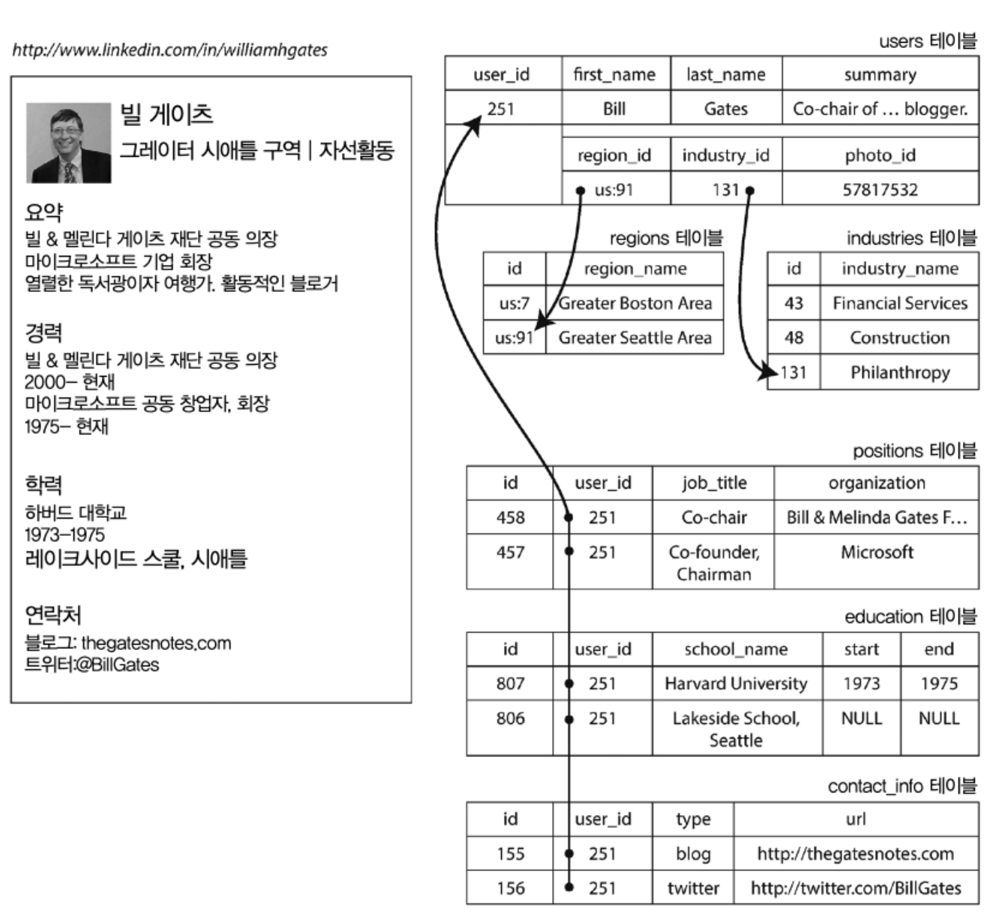
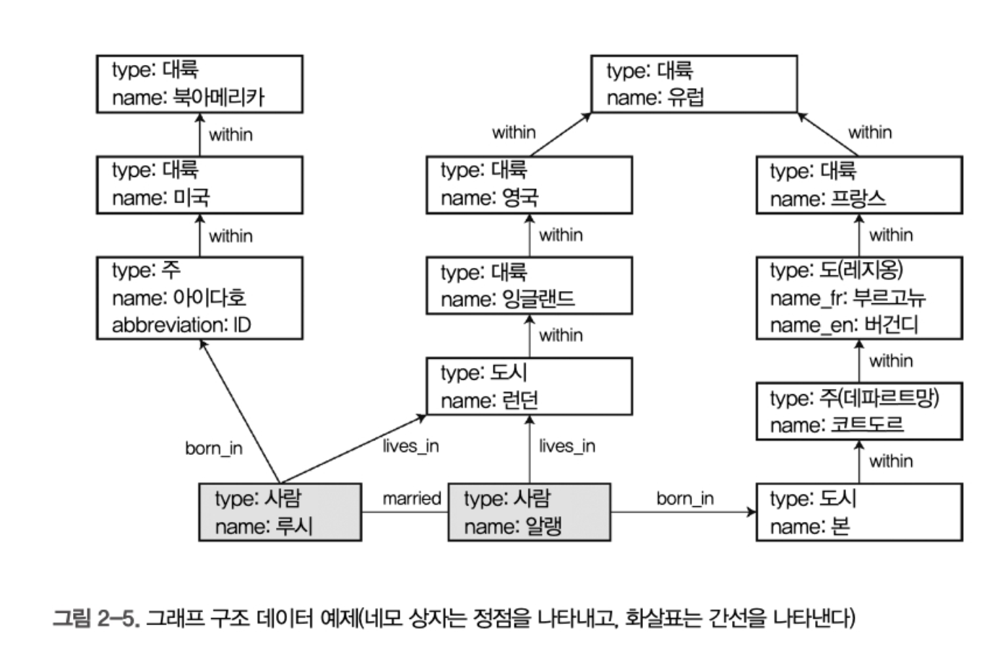

# 2장 데이터 모델과 질의 언어

대부분 애플리케이션은 하나의 데이터 모델을 다른 데이터 모델 위에 계층을 둬서 만든다. 각 계층의 핵심적인 문제는 다음 하위 계층 관점에서 데이터 모델을 표현하는 방법이다.

예를들면

* 애플리케이션 개발자는 실 사물을 보고 객체나 데이터 구조, 그리고 데이터 구조를 다루는 API를 모델링함
* 데이터 구조 저장시 JSON, XML, 테이블,  그래프 모델 같은 모델로 표현
* DB를 개발하는 엔지니어는 위 데이터를 메모리나 디스크 또는 네트워크 상의 바이트 단위로 표현하는 방법을 결정한다. 이 표현은 다양한 방법으로 데이터를 질의 탐색 조작 처리할 수 잇게 한다
* 하드웨어 엔지니어는 전류, 빛의 파동, 자기장 등의 관점에서 바이트를 표현하는 방법을 알아냇다.

즉, 우리가 애플리케이션에서 다루는 데이터가 **다양한 계층을 거치면서 서로 다른 방식으로 표현되고 처리**되는 과정이 데이터 모델의 계층적 추상화이다.

관계형, 도큐먼트형, 그래프형 중 하나의 데이터 모델링도 어렵다. 그러나 데이터 모델은 데이터 모델 위에서 SW가 할 수 있는 일과 없는 일에 지대한 영향을 주므로, 적합한 데이터 모델을 선택하는 작업은 상당히 중요하다

## 관계형 모델과 문서 모델

관계형 모델의 목표는 정리된 인터페이스 뒤로 구현 세부 사항을 숨기는 것.

### NoSQL

NoSQL은 다음과 같은 이유들로 인해 채택이 된다. 

* 대규모 데이터셋이나 매우 높은 쓰기 처리량 달성을 RDBMS보다 쉽게 할 수 있는 확장성의 필요
* 상용 DB보다 무료 오픈소스 소프트웨어
* RDB에서 지원하지 않는 특수 질의 동작
* RDB 스키마의 제한에 대한 불만과 더 동적이거 표현력이 풍부한 데이터 모델의 바람

책에서는 나중에는 RDB가 NoSQL와 함께 폭넓게 사용될것이라 예상했고, 실제로 지금도 그렇다

### 객체 관계형 불일치

이력서를 표현할때는 RDB보다는 몽고디비 같은 JSON 모델이 적합하다.

또한 다중 테이블 조인을 해서 비용이 들지만 JSON은 한곳에 저장하니 조인 비용이 줄어든다. 

* 요즘은 RDB에도 JSON 컬럼을 지원

### 다대일과 다대다 관계



위 사진을 보면, region_id와 industry_id는 평문인 '그레이터 시애틀 구역'과 '자선활동'이 아닌 id로 주어짐.

지리적 지역과 업계의 표준 목록을 제공할라면, 평문으로 저장되면 중복되므로, 따로 테이블을 만들어 관리할 수 있음.

 ID나 텍스트 문자열의 저장 여부는 중복의 문제임. 이런 중복을 제거하는 일이 RDB의 정규화 이면에 놓인 핵심 개념.

* 텍스트를 변경해도 해당 로우의 pk인 id는 변경할 필요가 없다.  

중복된 데이터를 정규화 하려면 다대일 관계가 필요하다. 그러나 도큐먼트 모델은 다대일에 적합하지 않다. 

* 몽고디비는 lookup을 조회하지만, 애초에 좋은 성능은 아니고, 보통 한번 더 조회해서 애플리케이션에서 조립하는 경우도 흔함

다대다 관계(M:N)는 **한 개체가 여러 개체와 연결될 수 있으며, 반대로 그 개체들도 여러 개체와 연결될 수 있는 관계**를 의미. 예시로 학생과 수업 관계가 있음.

- 한 학생은 여러 개의 강의를 들을 수 있음.
- 하나의 강의에는 여러 명의 학생이 참여할 수 있음.

서로 관계를 맺기 어려우므로, 다대다 관계를 표현하기 위해 **중간 테이블(조인 테이블, 매핑 테이블)**을 사용.

도큐먼트 모델은 2가지 방법이 있는데, 의도적으로 중복해서 임베디드 방식으로 내장하거나 아이디 값을 참조해야함

```json
// 학생 컬렉션
{
    "_id": "student_1",
    "name": "김영수",
    "course_ids": ["course_101", "course_102"]
}

// 강의 컬렉션
{
    "_id": "course_101",
    "title": "알고리즘 기초"
}
```

### 문서 데이터베이스는 역사를 반복하고 있나?

과거 1970년대 IBM의 IMS라는 시스템에서도 JSON 모델과 비슷하게 중첩된 트리 형식으로 DB 모델을 운영했었음.

IMS도 마찬가지로 일대 다는 쉽지만, 다대 다는 어려웠고 조인은 어려웠음. 때문에 개발자는 데이터를 중복할지 참조를 수동으로 해결할지 결정해야 했음. 

두드려지는 해결책은 관계형 모델과 네트워크 모델이였음.

#### 네트워크 모델

코다실이라 불리는 위원회에서 표준화해서 코다실모델이라고 부름. 1970년대에 하드웨어 성능이 낮았던 환경에서 **최적의 탐색 성능을 제공**하기 위해 고안되었지만, 코드의 복잡성과 유지보수 문제로 인해 점차 사용되지 않게 됌.

- **트리 구조를 확장하여 다중 부모(Multiple Parent)를 허용**.
- 즉, **하나의 레코드(데이터)가 여러 개의 부모를 가질 수 있음**.
- 레코드 간의 관계를 `포인터` 형태로 저장하여 **다대일(1:N), 다대다(M:N) 관계를 표현할 수 있음.**

예제.

```
Company
 ├── Department_A  ─── Employee_1
 │                  ├── Employee_2
 │
 ├── Department_B  ─── Employee_1
                     ├── Employee_3
```

- 여기서 **Employee_1은 Department_A와 Department_B에 동시에 속할 수 있음.**
- 데이터 중복이 없이 다대다 관계를 효과적으로 모델링 가능.

단점으로.

**질의(Query) 작성이 어려움**

- SQL 같은 질의 언어가 없고, **데이터 탐색을 직접 프로그래밍해야 함.**
- 데이터를 찾으려면 **포인터를 직접 따라가야 함**.

**경로가 없으면 데이터를 찾을 수 없음**

- 만약 기존 접근 경로로 찾을 수 없는 데이터가 필요하면?
- 새로운 경로를 만들기 위해 **데이터베이스 구조를 변경해야 함.**
- 예를 들어, 특정 직원이 속한 모든 부서를 빠르게 검색하는 기능이 필요하면 **데이터베이스 구조 자체를 변경해야 함.**

**데이터 모델 변경이 어렵고, 유지보수 복잡**

- 새로운 관계(예: 직원과 프로젝트 관계)를 추가하려면, 모든 기존 접근 경로를 다시 설계해야 함.
- 데이터베이스가 커질수록 유지보수 비용이 증가.

### 문서 데이터베이스와의 비교 - RDB와 Document DB

다대일과 다대다 표현시 RDB와 document는 근본적으로 다르지 않고 고유한 식별자로 참조함.

* RDB - 외래키, Document - document Reference

도큐먼트를 선호하는 주요 이유는 스키마 유연성과 지역성에 기인한 나은 성능 때문이다.

* 지역성(Locality)은 데이터가 **물리적으로 가까운 위치에 저장됨으로써 성능이 향상되는 개념**
* 도큐먼트 디비에서 조인 없이 임베디드 등으로 내장해버리므로 한번에 조회해서 성능이 향상됌. 
* 비정규화(Denormalization)**를 통해 관련 데이터를 한 도큐먼트에 저장하여 **공간 지역성과 시간 지역성을 극대화한것

> 읽기스키마 vs 쓰기 스키마
>
> 데이터베이스 모델링에서 **"읽기 스키마(Read Schema)"**와 **"쓰기 스키마(Write Schema)"**는 데이터의 **저장 방식과 조회 방식 간의 균형을 조정하는 전략
>
> 이 개념은 주로 **관계형 데이터베이스(RDBMS)와 NoSQL(특히 도큐먼트 모델)**을 비교할 때 등장.
>
> 쓰기스키마
>
> * 데이터가 **저장될 때** 스키마(데이터 구조)가 명확하게 정의됨.
>
>   **관계형 데이터베이스(RDBMS)**에서 사용되는 전통적인 방식.
>
>   데이터베이스가 **스키마를 엄격하게 강제**하며, 데이터가 스키마를 따라야 저장됨.
>
> **장점**
>
> - 데이터 구조가 명확하여 **일관성을 유지하기 쉬움**.
> - 데이터가 저장될 때부터 **무결성이 보장됨**.
>
>  **단점**
>
> - **유연성이 부족함** → 새로운 필드를 추가하려면 테이블 스키마를 변경해야 함.
> - **데이터 형식이 엄격하게 제한됨** → 데이터 구조가 자주 바뀌면 불편함.
>
>
> 읽기 스키마
>
> - 데이터가 저장될 때는 **스키마가 강제되지 않음**.
> - 데이터를 **읽을 때 해석하는 방식**.
> - **문서형 데이터베이스(NoSQL, MongoDB)**에서 많이 사용됨.
>
> **장점**
>
> - **유연성이 높음** → 데이터를 자유롭게 추가/변경할 수 있음.
> - **새로운 필드를 추가해도 기존 데이터를 변경할 필요 없음**.
>
> **단점**
>
> - **데이터 일관성이 떨어질 수 있음** → 일부 문서는 `email`이 있고, 일부 문서는 `preferences`가 있을 수도 있음.
> - **읽을 때 데이터 구조를 해석해야 하므로, 애플리케이션 코드에서 처리 로직이 복잡해질 수 있음**.

도큐먼트 모델의 스키마 유연성은 장점만있는게 아니다.

스키마가 없다는 것은, 임의의 키와 값을 문서에 추가할 수 있고, 읽을때 클라이언트는 문서에 포함된 필드의 존재 여부를 보장하지 않는다는 의미다.

도큐먼트 모델에서 읽었을때 데이터가 없다면 애플리케이션 코드에서 그냥 보정해주면 된다.

정적 타입의 RDB 스키마는 ALTER 등과 같은 문으로 컬럼을 추가해줘야 하는데, MySQL같은경우 컬럼 추가시 얼터 테이블을 사용하는데 전체 테이블 복사방식으로 동작 및 테이블 락도 걸리고 해서 너무 느리다.

또한, 읽기 스키마는 컬렉션 내의 도큐먼트들이 모두 동일한 구조가 아닐때 더 유리함.

* 스키마 변경시 마이그레이션 필요 없음.
* 필요한 필드만 저장할 수 있어, 데이터 저장 공간을 최적화할 수 있음

### 데이터를 위한 질의 언어

일반적인 프로그램 코드는 명령형 언어고, SQL은 선언형 질의 언어다.

명령형은 어떻게 가져올지 직접 명시해서 프로그래머가 세부적인 처리 과정을 직접 작성해야 한다. 즉 목표를 달성하기 위한 방법을 기술. 

선언형 질의 언어는, 무엇을 할지를 선언하는 방식으로, 결과가 충족해야 하는 조건과 데이터를 변환(정렬, 그룹화, 집계)를 할지 선언해서 가져오는것. 어떻게 데이터를 처리할지는 디비 엔진이 처리한다.

선언형 질의 언어는 더 쉽게 간결하게 작성할 수 있고, 엔진의 구현이 숨겨져 있어, 질의를 변경하지 않고도 DB성능을 향상시킬 수있는 장점이 있다.

#### 맵 리듀스 질의

맵 리듀스란 많은(분산) 컴퓨터에서 대량의 데이터를 처리하기 위한 프로그래밍 모델.

맵리듀스는 **"맵(Map)" 단계와 "리듀스(Reduce)" 단계**로 나뉘며, 대량의 데이터를 처리하는 **병렬 연산을 수행**

* map -> collect라고도 하고, reduce는 fold, inject 라고도 함

몽고 맵리듀스 예시

```
map 함수
var mapFunction = function() {
    emit(this.category, 1);
};

// reduce 함수
var reduceFunction = function(key, values) {
    return Array.sum(values);
};

// mapReduce함수
db.products.mapReduce(
    mapFunction,
    reduceFunction,
    { out: "category_counts" }
);

```

* 두 함수는 부수 효과 없는 순수 함수여야 함. 

몽고디비에서는 과거 map reduce를 지원했고, 요즘에는 선언형 질의 언어인 집계 파이프라인 지원을 추가함.

SQL의 `GROUP BY`, `SUM`, `COUNT` 같은 연산을 MongoDB에서 실행하는 방식이라고 보면 된다.

```json
db.products.aggregate([
    {
        $group: {
            _id: "$category",  // category 기준으로 그룹화
            total: { $sum: 1 } // 각 그룹의 개수 합산
        }
    }
]);
```

| 비교 항목          | MapReduce                      | 집계 파이프라인                     |
| ------------------ | ------------------------------ | ----------------------------------- |
| **쿼리 방식**      | 명령형(Imperative, JavaScript) | 선언형(Declarative, MongoDB 연산자) |
| **성능**           | 비교적 느림                    | 최적화되어 빠름                     |
| **유지보수**       | 복잡한 코드 필요               | 간결한 쿼리 가능                    |
| **병렬 처리**      | 가능                           | 가능 (내부 최적화 더 좋음)          |
| **사용 추천 여부** | 거의 사용되지 않음             | MongoDB에서 권장                    |


### 그래프형 데이터 모델.

다대다 관계까 매우 일반적이라면, 그래프로 데이터 모델링하면 자연스럽다.

그래프두는 정점(vertex)와 간선(edge)로 이루어짐.

많은 유형의 데이터를 그래프로 모델링할 수 있다.

 일반적인 예는 다음과 같다.

* 소셜 그래프 : 정점은 사람이고 간선은 사람들이 서로 알고 있음을 나타낸다.

* 웹 그래프 : 정점은 웹 페이지고 간선은 다른 페이지에 대한 HTML 링크를 나타낸다.

* 도로나 철도 네트워크 : 정점은 교차로이고 간선은 교차로 간 도로나 철로 선을 나타낸다.



그래프에서 데이터를 구조화하고 질의하는 몇가지 방법이 있다.

* 속성 그래프 모델 : neo4j, titan, infinitegraph
* 트리플 저장소 모델 : datimic, allegrograph

그래프용 선언형 질의 언어 : 사이퍼, 스파클, 데이터로그

#### 속성 그래프

속성 그래프 모델에서 각 정점은 다음과 같은 요소로 구성된다.

- 고유한 식별자
- 유출(outgoing) 간선 집합
- 유입(incoming) 간선 집합
- 속성 컬렉션(키-값 쌍

각 간선은 다음과 같은 요소로 구성된다.

- 고유한 식별자
- 간선이 시작하는 정점(꼬리 정점)
- 간선이 끝나는 정점(머리 정점)
- 두 정점 간 관계 유형을 설명하는 레이블
- 속성 컬렉션(카-값 쌍)

Postgresql로 관계형 테이블로 구성된 그래프 저장소를 생각해보자

```sql
CREATE TABLE vertices (
    vertex_id INTEGER PRIMARY KEY,
    properties JSON
);

CREATE TABLE edges (
    edge_id INTEGER PRIMARY KEY,
    tail_vertex INTEGER REFERENCES vertices (vertex_id),
    head_vertex INTEGER REFERENCES vertices (vertex_id),
    label TEXT,
    properties JSON
);

CREATE INDEX edges_tails ON edges (tail_vertex);
CREATE INDEX edges_heads ON edges (head_vertex);
```

중요한 점

1. 정점은 다른 간선과 연결됌.
2. 정점이 주어지면 정점의 유입과 유출 간선을 효율적으로 찾을 수 있고 그래프를 순회할 수 있다. 일련의 정점을 따라 앞 뒤 방향으로 순회한다.
3. 서로 다른 유형의 관계에 서로 다른 label을 사용하면 단일 그래프에 따른 유형의 정보를 저장하면서도 데이터 모델을 깔끔하게 유지 가능

즉, 관계형 데이터베이스에서도 그래프 모델을 효과적으로 구현할 수 있으며, 이를 활용하면 전통적인 관계형 데이터 모델보다 더 유연하고 확장성이 뛰어난 데이터 구조를 만들 수 있다

**특정 정점의 인접 정점 찾기**

#### **Q1. "루시"가 태어난 곳(born_in)과 현재 거주하는 곳(lives_in) 조회**

```sql
SELECT v.vertex_id, v.properties 
FROM edges e
JOIN vertices v ON e.head_vertex = v.vertex_id
WHERE e.tail_vertex = (SELECT vertex_id FROM vertices WHERE properties->>'name' = '루시')
AND e.label IN ('born_in', 'lives_in');
```

**두 정점 간의 경로 찾기 (예: 루시가 알랭과 연결된 관계 찾기)**

#### **Q3. "루시"와 "알랭" 사이의 관계 조회**

```sql
WITH RECURSIVE path AS (
    SELECT e.tail_vertex, e.head_vertex, e.label, 1 AS depth
    FROM edges e
    WHERE e.tail_vertex = (SELECT vertex_id FROM vertices WHERE properties->>'name' = '루시')

    UNION ALL

    SELECT e.tail_vertex, e.head_vertex, e.label, p.depth + 1
    FROM edges e
    JOIN path p ON e.tail_vertex = p.head_vertex
    WHERE p.depth < 5 -- 최대 5단계까지만 탐색 (제한 안 하면 무한루프 가능)
)
SELECT * FROM path WHERE head_vertex = (SELECT vertex_id FROM vertices WHERE properties->>'name' = '알랭');
```

 **PostgreSQL의 관계형 테이블을 사용한 그래프 저장 방식은 성능 이슈가 발생할 가능성이 높다. 특히, **재귀적인 쿼리**(`WITH RECURSIVE`)를 사용한 그래프 탐색은 **연결 관계가 깊어질수록 성능 저하가 심할 수 있다**

#### 사이퍼 질의 언어

사이퍼는 속성 그래프를 위한 선언형 질의 언어로 neo4j 그래프 디비 용으로 만들어짐.

```
CREATE 
  (NAmerica:Location {name: 'North America', type: 'continent'}),
  (USA:Location {name: 'United States', type: 'country'}),
  (Idaho:Location {name: 'Idaho', type: 'state'}),
  (Lucy:Person {name: 'Lucy'}),

  (Idaho)-[:WITHIN]->(USA),
  (USA)-[:WITHIN]->(NAmerica),
  (Lucy)-[:BORN_IN]->(Idaho);
```

* 각 정점에는 USA(미국)나 Idaho(아이다호) 같은 상징적인 이름이 지정돼 있다. 
* 질의의 다른 부분에서 이 이름을 사용해 정점 간 간선을 화살표 표기를 사용해 만들 수 있다
* 즉, (Idaho)-[:WITHIN]->(USA)의 경우 꼬리 노드는 Idaho, 머리 노드는 USA인 WITHIN 레이블의 간선이 된다.

미국에서 유럽으로 이민 온 사람을 찾는 사이퍼 질의

```cypher
MATCH
	(person)-[:BORN_IN]-> () -[:WITHIN*0..]->(us:Location {name: 'United states'}),
                                                          
  (person) -[:LIVES_IN] -> () - [:WITHIN*0..]-> (eu:Location {name: 'Europe'})
```

질의는 다음과 같이 읽힌다.

다음 두 가지 조건을 만족하는 정점(person이라 부름)을 찾아라.

1. person은 어떤 정점을 향하는 BORN IN 유출 간선을 가진다. 이 정점에서 name 속성이 United states"인 Location 유형의 정점에 도달할 때까지 일련의 WITHIN 유출 간선을 따라간다.

2. 같은 person 정점은 LIVES_IN 유출 간선도 가진다. 이 간선과 WITHIN 유출 간선을 따라가면 결국 name 속성이"Europe"인 Location 유형의 정점에 도달하게 된다.

이걸 아까 Postgresql 문법으로 바꾸면..

```sql
WITH RECURSIVE
-- 🇺🇸 미국 내 모든 지역의 정점 ID 집합
in_usa(vertex_id) AS (
    SELECT vertex_id 
    FROM vertices 
    WHERE properties->>'name' = 'United States'
    
    UNION

    SELECT e.tail_vertex 
    FROM edges e
    JOIN in_usa ON e.head_vertex = in_usa.vertex_id
    WHERE e.label = 'WITHIN'
),

-- 🇪🇺 유럽 내 모든 지역의 정점 ID 집합
in_europe(vertex_id) AS (
    SELECT vertex_id 
    FROM vertices 
    WHERE properties->>'name' = 'Europe'
    
    UNION

    SELECT e.tail_vertex 
    FROM edges e
    JOIN in_europe ON e.head_vertex = in_europe.vertex_id
    WHERE e.label = 'WITHIN'
),

-- 🇺🇸 미국에서 태어난 모든 사람의 정점 ID 집합
born_in_usa(vertex_id) AS (
    SELECT e.tail_vertex 
    FROM edges e
    JOIN in_usa ON e.head_vertex = in_usa.vertex_id
    WHERE e.label = 'BORN_IN'
),

-- 🇪🇺 유럽에서 거주하는 모든 사람의 정점 ID 집합
lives_in_europe(vertex_id) AS (
    SELECT e.tail_vertex 
    FROM edges e
    JOIN in_europe ON e.head_vertex = in_europe.vertex_id
    WHERE e.label = 'LIVES_IN'
)

-- 미국에서 태어나 유럽에서 거주하는 사람을 조회
SELECT v.properties->>'name' AS person_name
FROM vertices v
JOIN born_in_usa b ON v.vertex_id = b.vertex_id
JOIN lives_in_europe l ON v.vertex_id = l.vertex_id;
```


처음보는 문법인데.. 얼마나 효율적일까.. 딱바도 29줄 -> 4줄 차이가 난다. 

## 정리

문서 데이터베이스와 그래프 데이터베이스는 다음과 같이 두가지 갈래가 있다.

1. 문서 데이터베이스는 데이터가 문서 자체에 포함돼 있으면서 하나의 문서와 다른 문서 간 관계가 거의 없는 사용 사례를 대 상으로 한다.
2. 그래프 데이터베이스는 문서 데이터베이스와는 정반대로 모든 것이 잠재적으로 관련 있다는 사용 사례를 대상으로 한다.

관계, 문서, 그래프 모두 각자의 영역에서는 훌륭하다. 한모델을 다른 모델로 흉내내봤자 엉망이다..

