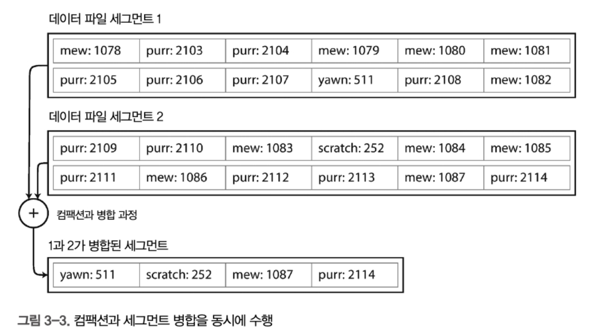
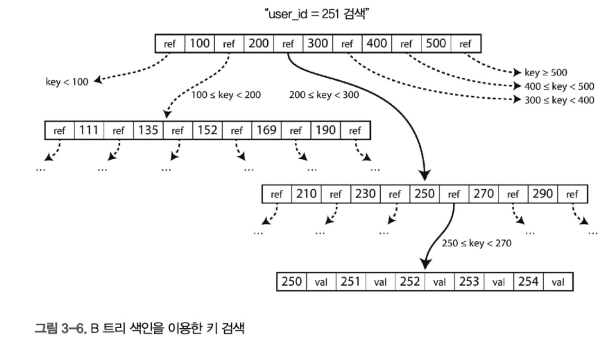
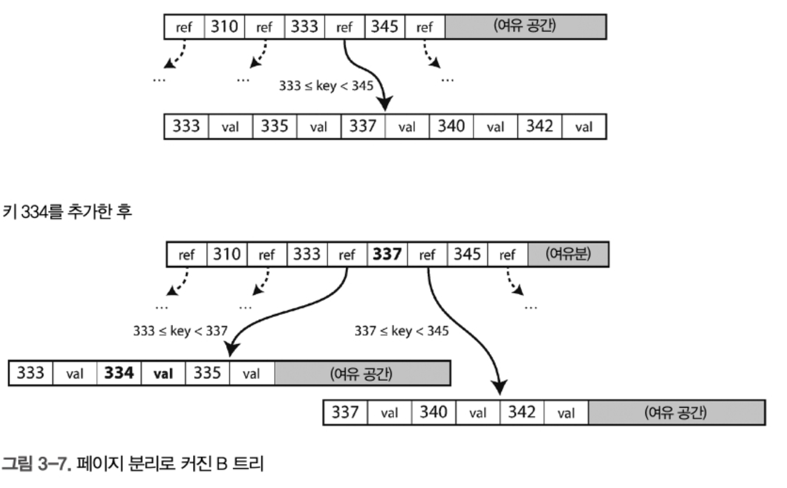

# 3장 저장소와 검색

로그 구조 계열 저장소 엔진

- **기본 원리:**
  데이터를 디스크에 순차적으로 기록하는 로그 파일 형태로 저장
- **장점:**
  - **쓰기 최적화:** 순차적 기록으로 인해 쓰기 작업이 빠르고, 대량의 쓰기 작업에 유리
  - **충돌 감소:** 업데이트 시 데이터 전체를 덮어쓰지 않고, 새로운 로그 항목을 추가하는 방식으로 진행되어 동시 쓰기 작업 시 충돌이 줄어듬
- **단점:**
  - **읽기 성능:** 데이터 조회 시 로그 전체 또는 여러 로그 구간을 탐색해야 할 수 있어, 랜덤 읽기 성능이 상대적으로 떨어질 수 있다.
  - **정리 작업:** 로그에 중복되거나 삭제된 데이터가 쌓이면 주기적으로 정리(컴팩션) 과정을 거쳐야 하므로, 추가적인 관리 오버헤드가 발생

페이지 지향 계열 저장소 엔진 (B-트리 기반)

- **기본 원리:**
  데이터를 고정된 크기의 페이지(블록) 단위로 관리하며, 각 페이지 내에서 데이터를 배열하거나 B-트리 같은 인덱스 구조를 사용해 빠른 접근을 지원
- **장점:**
  - **랜덤 읽기 최적화:** 인덱스를 통해 특정 데이터를 빠르게 찾을 수 있어, 조회 및 검색 성능이 우수
  - **업데이트 및 삭제:** 페이지 단위로 데이터를 갱신하므로, 기존 데이터를 수정하는 작업이 비교적 효율적
- **단점:**
  - **쓰기 성능:** 페이지 내에서 수정 작업을 할 때, 페이지 전체를 다시 읽고 쓸 필요가 있어 쓰기 작업에 부하가 발생
  - **공간 활용:** 페이지 단위 관리로 인해 내부 단편화(internal fragmentation)가 발생


DB에서 특정 키의 값을 효율적으로 찾기 위해선 index를 이용한다

index의 기본 개념 : 기본 데이터로부터 파생된 메타데이터.

저장소 시스템의 중요한 트레이드 오프로, 읽기 질의 속도를 향상시키지만, 모든 인덱스는 쓰기 속도를 떨어트린다.

### 해시 색인

key-value 저장소는 보통 해시-맵, 테이블로 구현한다.


많은 데이터베이스는 내부적으로 append only 형식의 로그 파일을 많이 사용해서 여기에 데이터를 기록한다.

파일에 항상 추가만 한다면 디스크 공간이 부족해지므로, 특정 크기의 segment로 로그를 나눈다.

특정 크기 도달시 세그먼트를 닫고 새 세그먼트 파일을 연다. 



그리고 세그먼트 파일들에 대해 compaction을 수행하여 최신 갱신값을 유지하면서 용량을 절약할 수 있다.

세그먼트가 쓰여진 후는 변경할 수 없기 때문에 다른 세그먼트와 병합을 통해 용량을 다시 줄이고,

새로 병합한 세그먼트로 읽기를 처리한다. 전환 후에는 이전 세그먼트 파일을 삭제하면 끝이다.


이후, 각 세그먼트는 키를 파일 오프셋에 매핑한 자체 인메모리 해시테이블을 갖는다. 

키의 값을 찾으려면 최신 세그먼트 해시 맵을 확인하고, 키가 없다면 두번째 최신 세그먼트 파일을 확인하면서

키벨류로 값을 조회할 수 있다.

실제 구현에서 고려할 내용들

* 파일 형식 : CSV는 로그에 가장 적합하지 않다. 바이트 단위 문자열 길이를 부호화 한 다음, 원시 문자열을 부호화하는 바이너리 형식을 사용하는 편이 더 빠르고 간단하다. 

```
key1,value1
key2,value2
key3,value3

문제점 : 
1. 줄단위로 읽고 ,를기준으로 나눠야함. 
2. 문자열 길이가 얼마인지 알 수 없어 전체를 먼저 읽어야 함.
3. 줄 끝을 찾아야 함 -> 느림 
```

효율적인 바이너리 방식

```
[4][key1][6][value1]

[4] -> 키의 길이
[key1] -> 실제 키 문자열
[6] -> 값 길이
[value1] -> 실제 값 문자열 

위 값을 바이너리 16진수으로 표현하면 아래처럼 표현도 가능.  
\x04key1\x06value1

파싱할 때 먼저 길이를 읽고, 정확히 필요한 만큼만 읽으면 됨 → 빠름

구분자(쉼표, 개행 등) 필요 없음

이진 로그 파일은 디스크에 순차적으로 쓰기 좋고, 공간 낭비도 적음
```

* 레코드 삭제 : 키와 관련된 값 삭제하려면 파일에 툼스톤을 추가해서 로그 세그먼트 병합시, 삭제된 키의 이전 값을 무시하게 함.

  * 툼스톤은 "이 키는 삭제되었음"을 나타내는 마커(marker)

  * ```
    [4]key1 [6]value1   ← 실제 저장
    [4]key1 [0]         ← 툼스톤 (값의 길이가 0, 즉 삭제 표시)
    ```

* crash 복구 : DB 재시작시 인메모리 해시 맵은 손실되므로 재로딩해야하는데 파일이 크면 재시작이 느려짐. 스냅숏을 디스크에 저장해 복구하는 방식 등을 고려해야 함

* 부분적 레코드 쓰기 : 체크섬 등을 통해 손상 로그 복구

* 동시성 제어 : 하나의 쓰기 쓰레드만 사용

덮어 써서 갱신하는것보다 추가 전용 로그가 훨씬 좋다. 낭비가 아니다. 왜?

* 추가와 병합은 순차 쓰기작업이라, HDD, SSD 디스크 특성상 훨씬 빠르다
* 세그먼트 파일이 추가 전용이고 불변이면, 동시성과 고장 복구가 훨씬 간단함.

해시 테이블 색인의 제한 사항

* 키가 많으면 메모리가 부족함.
* 해시 테이블은 range query에 부적합함.

이런 제한이 없는 index 구조는 무엇이 있을까?

### SS 테이블(정렬된 문자열 테이블) 과 LSM 트리


정렬된 문자열 테이블 이란, **LSM 트리 기반 저장소(예: Cassandra, RocksDB 등)**에서 사용하는 **불변(immutable) 정렬된 키-값 파일 포맷**

SS 테이블은 위 해시 색인 로그 세그먼트보다 몇가지 큰 장점이 있다.

1.**디스크 기반 인덱스 가능 → 메모리 사용 최소화**

- 해시 색인은 **전체 키를 메모리에 유지**해야 해서, 키 수가 많아지면 메모리 폭발
- SSTable은 **디스크에 인덱스 + 요약 인덱스 + Bloom filter**를 두어 메모리 효율적

2.  **정렬된 데이터 → 범위 쿼리 가능**

- SSTable은 key가 정렬돼 있어 `key > A and key < C` 같은 **범위 쿼리** 가능
- 해시 색인은 범위 쿼리 불가 → 오직 정확한 키 조회만 가능

3.  **컴팩션(merge) 최적화**

- 여러 SSTable을 효율적으로 병합/정리 가능 (merge-sort 방식)
- 로그 세그먼트는 정렬이 안돼서 중복 제거/정리 시 비효율적

4. **빠른 존재 여부 확인 (Bloom Filter 사용)**

- SSTable은 Bloom Filter를 이용해 **키가 있는지 없는지 빠르게 확인**
- 디스크 접근 줄여서 성능 향상
- Bitcask 스타일 로그는 메모리 해시에만 의존

5. 메모리의 모든 키의 색인을 유지할 필요가 없음
   * 정렬되어있으므로, 특정 키값 들의 오프셋을 이용해 그 사이를 스캔하면 됌. 
   * 수 kb정도는 스캔이 빠르므로, 파일 내 수 kb당 키 1개씩 띄엄띄엄 두면 됌 

또한 아래 읽기 요청에 대한 특성도 있다. 읽기 최적화를 위해 압축 블록을 처리한다

```
읽기 요청은 요청 범위 내에서 여러 키-값 쌍을 스캔해야 하기 때문에
→ 예: WHERE key >= 'user100' AND key <= 'user200' 같은 범위 조회가 들어옴
→ SSTable은 정렬된 구조니까 범위 조회가 가능하지만, 디스크에서 여러 키-값을 읽어야 함

해당 레코드들을 블록으로 그룹화하고 디스크에 쓰기 전에 압축한다
→ 데이터를 그냥 하나씩 저장하지 않고,
→ 예를 들어 4KB 또는 64KB 같은 덩어리(= 블록)로 묶은 다음,
→ 그 블록 전체를 압축해서 디스크에 저장함 (gzip, snappy 등)

희소 인메모리 색인의 각 항목은 압축된 블록의 시작을 가리킨다
→ 메모리에 있는 인덱스는 모든 키가 아니라,
→ 몇 개의 키(희소하게 추려낸)만 저장하고,
→ 그 키가 시작하는 압축된 블록의 디스크 위치(offset)를 가리킴

디스크 공간을 절약한다는 점 외에도 압축은 I/O 대역폭 사용도 줄인다
→ 압축된 데이터를 한 번에 읽어오니까:

디스크 공간 덜 씀

디스크 → 메모리로 데이터 복사 시 전송량이 줄어듦
```

* 희소 인덱스 : 데이터 공간 절약을 위해, 특정 구간마다 몇개 키만 인덱싱해서 저장하는것 

### SS 테이블 생성과 유지

쓰기는 임의 순서로 발생함. 하지만 ss table은 키를 기준으로 정렬하는데 어떻게 정렬할까?

메모리에 트리 데이터 구조를 이용해서 메모리에 먼저 저장하고, 디스크에 기록한다.

1. 쓰기가 들어오면 메모리 상 banacend tree 자료구조에 추가한다.(비트리나 레드블랙) 멤테이블이라고 한다
2. 보통 수 메가바이트 임계값보다 커지면 디스크에 flush 한다. 이미 정렬되어있다. 새로운 SS 테이블은 DB의 최신 세그먼트가 된다
3. 읽기 요청시 멤테이블에서 키를 찾아 최신 세그먼트에서 찾는다. 없으면 그다음 오래된 세그먼트를 뒤진다.
4. 가끔 세그먼트 파일을 합치고 덮어 씌우고 병합과 컴펙션을 백그라운드에서 수행한다.

중간에 DB 고장이라던가 등 손실되는 경우를 방지하기 위해, WAL용 로그를 무조건 사용함.

* 메모리에만 쓰면 위험하니까, **WAL로 디스크에 먼저 로그를 쓰고**,그다음에 MemTable에 반영

### SS 테이블에서 LSM(Log-Strucuted Merge-Tree) 트리 만들기

LSM 트리는 RokcsDB, 카산드라, HBase, Influx, Scylladb 등에서 사용한다.

정렬된 파일 병합과 컴팩션 원리를 기반으로 하는 저장소 엔진을 LSM 저장소 엔진이라 부른다.

**Lucene**은 LSM 트리 기반의 데이터 저장소는 아니지만, 비슷하게 **쓰기 최적화된 구조**를 가지고 있고,
 그 핵심은 **역색인(inverted index)** + **세그먼트(segment)** 구조에 있다.

> **SSTable과 유사한 '불변의 정렬된 세그먼트 파일(segment)'** 구조를 사용

그래서 본질적으로 SSTable과 매우 유사한 개념이지만 목적은 다르다 

| Lucene            | SSTable               |
| ----------------- | --------------------- |
| 검색 엔진용       | 일반적인 키-값 저장용 |
| 역색인 저장       | 정렬된 키-값 저장     |
| 세그먼트(segment) | SSTable과 유사        |
| 병합 (merge)      | 컴팩션과 유사         |

#### 성능 최적화

LSM 트리 기반 저장소 엔진은 기본 구조만으로도 꽤 괜찮지만, 성능을 높이기 위해 다양한 최적화 기법을 사용

#### 문제점: 존재하지 않는 키를 찾을 때 느리다

LSM 트리는 데이터를 멤테이블부터 오래된 세그먼트까지 여러 계층에 나눠서 저장한다.
 어떤 키가 데이터베이스에 존재하지 않으면, 가장 최신인 멤테이블부터 시작해서 가장 오래된 세그먼트까지 거슬러 올라가며 모두 확인해야 한다.
 이 과정에서 디스크를 읽는 경우가 생기므로 성능이 떨어질 수 있다.

#### 해결책 1: 블룸 필터

블룸 필터는 어떤 키가 "존재하지 않는다"는 것을 빠르게 판단할 수 있게 해주는 메모리 효율적인 자료구조다.
 블룸 필터를 사용하면 해당 키가 없다는 것을 빠르게 알 수 있기 때문에, 불필요하게 디스크를 읽는 일을 줄일 수 있다.
 정확히 존재하는지 여부를 100% 확실하게 알려주진 않지만, 없다는 건 확실하게 판단할 수 있다.

#### 해결책 2: 컴팩션 전략

LSM 트리는 시간이 지나면 SS테이블(정렬된 테이블 파일)을 백그라운드에서 병합한다.
 이 병합 작업을 어떻게 하느냐에 따라 성능이 크게 달라진다. 대표적인 전략은 두 가지가 있다.

1. 사이즈 계층 컴팩션 (Size-Tiered Compaction)
   새롭고 작은 SS테이블을 오래된 크고 긴 SS테이블에 순차적으로 병합하는 방식이다.
   HBase가 이 방식을 쓴다.
2. 레벨드 컴팩션 (Leveled Compaction)
   SS테이블을 키 범위에 따라 더 작게 나누고, 오래된 데이터는 특정한 "레벨"로 이동시킨다.
   점진적으로 병합을 진행하므로 디스크 공간을 더 효율적으로 쓸 수 있다.
   LevelDB와 RocksDB는 이 방식을 사용한다.
   카산드라는 두 가지 방식을 모두 지원한다.

#### LSM 트리(로그 구조화 색인)의 핵심 개념

LSM 트리의 핵심은 SS테이블을 백그라운드에서 계속 병합(compaction)하는 구조다.
 이 덕분에 메모리보다 훨씬 큰 데이터셋도 효율적으로 관리할 수 있다.
 데이터가 정렬된 상태로 저장되기 때문에 범위 질의(range query)도 빠르게 처리할 수 있다.
 또한 디스크에는 순차적으로 쓰기 때문에 매우 높은 쓰기 성능을 낼 수 있다.


### B 트리

가장 널리 색인되는 자료구조. NoSQL도 많이 사용함(몽고디비, couchbase)

SS테이블처럼 키로 정렬된 키-값쌍을 유지해서 키-값 검색과 범위 질의에 효율적임.

로그 구조화 색인은 DB를 일반적으로 수 메가바이트 이상의 가변 크기를 가진 세그먼트로 나누고 항상 순차적으로 세그먼트를 기록하지만,

B 트리는 전통적으로 OS 페이지에 맞게 4KB 또는 8KB의 고정 크기 블록이나 페이지로 나누고 한번에 하나의 페이지에 읽기 또는 쓰기를 한다.



* 한 페이지가 다른 페이지를 포인터(메모리 말고 디스크)로 참조해서 페이지 트리를 구성한다.

B 트리의 한 페이지에서 하위 페이지를 참조하는 수를 분기 계수(BranchingFactor 라고 한다)

* 한 노드가 가질 수 있는 자식 노드 수

* 자식 노드 수가 6이면 b factor는 6

*  **한 페이지 크기(예: 4KB) 안에 들어갈 수 있는 키 + 포인터의 개수에 따라 결정 됌**

   * ```
     페이지 크기: 4096 바이트 (4KB)
     키 하나 저장: 16바이트
     포인터 하나 저장: 8바이트
     
     n * (16 + 8) ≤ 4096
     → n ≤ 170 = 분기 계수 
     
     실제로는 훨씬 더 많이 잡을수도 있음. 
     ```

   * 분기계수가 클수록 트리 높이가 낮아져 디스크 접근 횟수는 줄어들지만, 한 페이지에 너무 많은 키가 있으면 캐시 적중률이 낮아짐. 

   * 또한 key 크기가 작을수록 한 페이지에 더 많은 키를 저장하므로 분기계수 증가. 연산속도 증가 -> 성능 향상 

* 현실의 B-트리에서는 보통 **분기 계수 수백~수천 개**도 가능 

  * 이 계수를 이용해 트리 높이 계산도 가능

  * ```
    h≈log b N 
    
    h: 트리의 높이
    b: 분기 계수 (한 노드가 가질 수 있는 자식 수)
    N: 전체 데이터(키)의 개수
    ```

B 트리에서의 키 update는

1. **리프 노드(페이지)**에서 해당 키를 찾고
2. 값을 바꾼 뒤
3. 해당 페이지를 **디스크에 다시 저장(write back)** 하면 끝

**트리 구조는 바뀌지 않음** → 모든 인덱스 포인터는 여전히 유효

키 insert는

1. 키가 들어가야 할 범위의 **리프 페이지를 찾고**
2. 거기에 키와 값을 **추가**

🔸 그런데 리프 페이지에 공간이 없다면?

- 해당 페이지를 **두 개로 분할(split)**
  → 두 페이지는 각각 반쯤만 데이터를 가짐
- 그리고 **상위 부모 노드**에
  → 분할된 페이지의 경계 키 정보를 **갱신**

→ 이 과정이 **트리의 균형**을 유지하게 해줌



#### 신뢰할 수 있는 B트리 만들기 

B트리의 기본적인 쓰기 동작은 디스크 상의 페이지에 덮어쓴다. 

장애발생 시 디스크상에 WAL을 추가해 모든 B 트리의 변경사항을 기록해야 장애가 나도 복구할 수 있다.

또한 멀티스레드에서 같은 페이지 갱신시 래치나 가벼운 lock으로 트리의 구조를 보호해야 한다

### 비트리 최적화

* 페이지 덮어 쓰기와 WAL 대신 쓰기 시 복사 방식 사용. 변경된 페이지를 다른 위치에 기록하고 트리에 상위 페이지의 새 버전을 만들어 가리키게 함
* 전체 키를 저장하지 않고 **일부분(공통 접두사 제외)**만 저장. 내부 노드에서는 **경계 역할만 하면 되기 때문에 전체 키 불필요**
* 각 리프페이지에 양쪽 더블 링크드 리스트로 참조를 가져서 레인지 스캔
* 프랙탈 트리. B-트리 변형 구조로, 일부 **로그 구조(LSM)의 개념을 차용**. 삽입·삭제 시 **버퍼를 사용**해 디스크 접근을 줄임


### B트리와 LSM 트리 비교

경험적으로 LSM 트리는 보통 쓰기에서 더 빠른 반면 B 트리는 읽기에서 더 빠르다 고 여긴다. 읽기가 보통 LSM 트리에서 더 느린 이유는 각 컴팩션 단계에 있는 여러 가지 데이터 구조와 SS테이블을 확인해야 하기 때문이다.

#### LSM 트리의 장점.

* B트리 인덱스는 최소한 두번 기록이 필요함. 쓰기 전 로그 한번과 트리 페이지에 한번. 한번에 전체 페이지도 교체해야는 케이스도 있음.

* LSM는 보통 B트리보다 쓰기 처리량이 높다. 트리에서 여러 페이지를 덮어 쓰는것이 아닌 순차적으로 컴팩션된 SS 테이블 파일을 쓰기 때문. (sequence 쓰기는 HDD에서 속도가 꽤 빠름 )
* 컴팩션 기반 구조로 파편화 적음, LSM 트리는 압축률이 더 좋음. 
  → 주기적인 SSTable 병합으로 공간 낭비 최소화
  → B-트리는 페이지 분할 등으로 파편화 발생

* 디스크 대역폭 활용 효율적
  → 데이터가 압축되어 있어 더 많은 I/O 처리 가능
  → 디스크가 처리할 수 있는 쓰기량을 극대화 가능

#### LSM 트리의 단점.

1. **컴팩션이 읽기/쓰기 성능에 영향**

- 컴팩션(compaction)은 백그라운드에서 실행되지만, **디스크 I/O를 공유**하기 때문에  진행 중인 읽기·쓰기 요청에 **지연**이 생길 수 있음
- 특히 디스크 자원이 부족한 상황에서는  요청이 컴팩션 종료까지 **대기**하게 됨
- 평균 처리량이나 응답 시간에는 영향이 적지만,
  → **최악의 응답 시간(상위 백분위 응답 시간)**은 종종 매우 길어짐
  → 지연 시간의 예측이 어려움

2. 쓰기 대역폭 경쟁
   * WAL 로그 기록과 Memtable flush가 같은 쓰기 대역폭을 경쟁적으로 사용해서 병목 발생 가능

3. 강력한 트랜잭션 지원에 불리

- B-트리는 키 범위에 **잠금**을 걸 수 있고, 트리에 직접 잠금 구현 가능 → 트랜잭션 격리 수준 구현에 유리
- LSM 기반 구조는 키가 여러 곳에 존재할 수 있어→ **정확한 잠금 구현이 어렵고 복잡함**

4. 중복된 key 존재 가능
   * LSM 트리는 **다양한 SSTable에 같은 키가 중복 저장**될 수 있음 → 항상 **가장 최신 값을 찾는 추가 작업 필요**

### 색인 안에 값 저장하기 - 클러스터링 인덱스

색인은 데이터를 빠르게 찾기 위한 구조이며, 색인의 **키는 검색 대상**, **값은 실제 데이터 또는 해당 데이터의 위치를 가리키는 참조**다. 만약, 값이 데이터를 포함하지 않고 위치를 가리키는 경우가 있는데 가리키는 곳을 힙 파일이라고 한다 (데이터 페이지).

* 힙 파일은 데이터를 특정 순서 없이 저장하며, 필요 시 삭제된 레코드를 기록하거나 새로운 레코드로 덮어쓰기 위해 사용된다
* 힙 파일을 사용하는 방식은 **값만 갱신하고 키는 그대로 둘 때 효율적**이다.

하지만 색인만 보고는 데이터를 다 알 수 없어, 힙 파일을 다시 읽어야 하는데 이건 **읽기 성능을 떨어뜨리는 단점**이 있다.
 그래서 어떤 경우에는 **색인 내부에 데이터를 직접 저장**하는 방식이 더 낫다. 이걸 **클러스터드 색인**이라고 부른다.
 예를 들어:

- MySQL의 InnoDB는 기본키가 항상 클러스터드 색인이며, 보조 색인은 힙 위치가 아니라 기본키를 참조한다.
- MS SQL Server는 테이블당 하나의 클러스터드 색인을 지정할 수 있다.

클러스터드 색인과 비클러스터드 색인에는 각각 장단점이 있는데, 이 둘의 **중간 형태**로 나온 게 **커버링 색인(covering index)**이다. 

* 색인 안에 **검색에 자주 사용되는 칼럼의 일부 데이터도 함께 저장**해서, 색인만 조회하고도 결과를 반환함.

이렇게 하면 **읽기 속도는 빨라진다**.
 하지만 그만큼 단점도 있다.

1. **저장 공간이 더 많이 필요하다**
   - 색인 안에 칼럼 데이터를 함께 저장하니까 전체 데이터 크기가 커진다.
2. **쓰기 작업이 느려질 수 있다**
   - 데이터를 추가하거나 수정할 때, 색인도 같이 수정해야 하니까 작업이 더 많아진다.
3. **데이터 복제 환경에서는 조심해야 한다**
   - 색인과 실제 데이터 사이에 불일치가 생길 수 있는데, 애플리케이션에서는 그걸 알아채기 어렵다.
   - 그래서 데이터베이스는 트랜잭션(정합성 보장)을 더 철저하게 관리해야 한다.

### 전문 검색(fulltext)과 퍼지 색인(fuzzy index)

**Lucene**은 LSM 트리 기반의 데이터 저장소는 아니지만, 비슷하게 **쓰기 최적화된 구조**를 가지고 있고,
 그 핵심은 **역색인(inverted index)** + **세그먼트(segment)** 구조에 있다.

단어가 어디에 저장되어 있는지를 매번 디스크를 뒤져서 찾으면 느리기 때문에,
 루씬은 메모리 안에 **작은 색인(in-memory index)**을 만들어 둔다.
 이 색인은 "이 키(단어)는 디스크 파일의 어디쯤 있어요"라고 **위치를 가리켜주는 역할**을 한다.

**루씬**은 훨씬 정교하게 만든다.
 인메모리 색인을 **유한 상태 오토마톤(FSA)**이라는 걸로 만든다.
 이건 **트라이(Trie)**라는 자료구조랑 비슷한데, 단어의 **문자 하나하나를 경로처럼 따라가면서 찾는 구조**

### 모든것을 메모리에 보관

캐시드 같은 일부 인메모리 키-값 저장소는 장비가 재시작되면 데이터 손실을 허용하는 캐시 용 도로만 사용된다. 하지만 다른 인메모리 데이터베이스는 지속성을 목표로 한다. 이 목표를 달성하는 방법은 (배터리 전원 공급 RAM과 같은) 특수 하드웨어를 사용하거나 디스크에 변경 사항의 로그를 기록하거나 디스크에 주기적인 스냅숏을 기록하거나 다른 장비에 인메모리 상태를 복제하는 방법이 있다.


안티 캐싱은 메모리가 부족할 때
 **가장 오래 안 쓰인 데이터**를 **디스크로 내보내고**,
 나중에 그 데이터가 다시 필요해지면 **다시 메모리로 불러오는 방식**이다.

→ 이 방식은 운영체제의 **가상 메모리 + 스왑(swap)** 방식과 비슷하지만,
 데이터베이스는 운영체제보다 더 **세밀하게 개별 레코드 단위**로 다룰 수 있어서
 **더 효율적**이다.