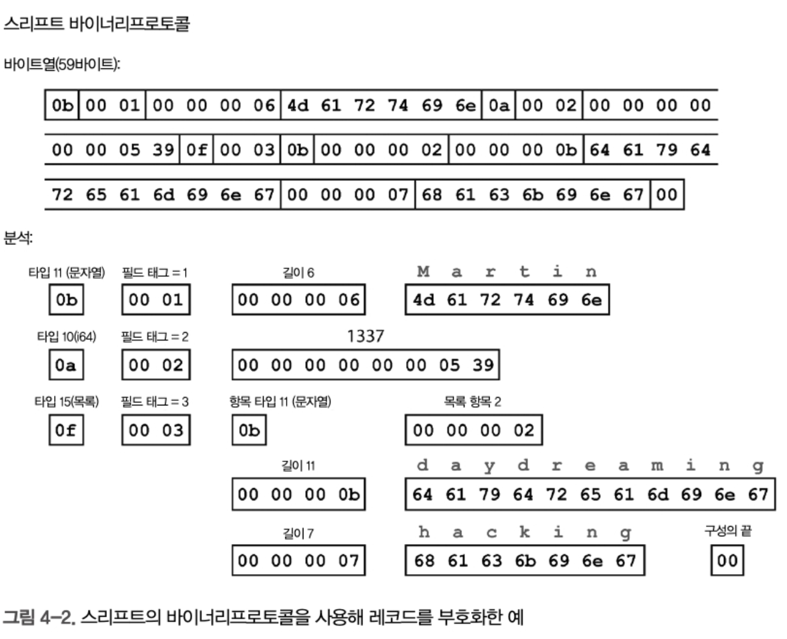
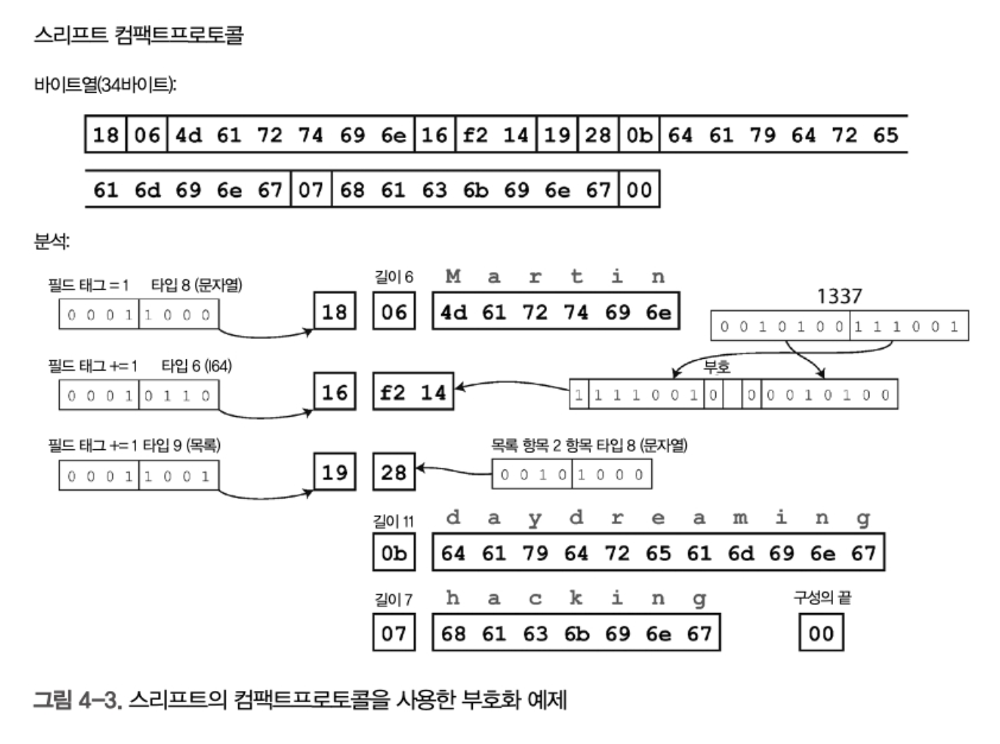
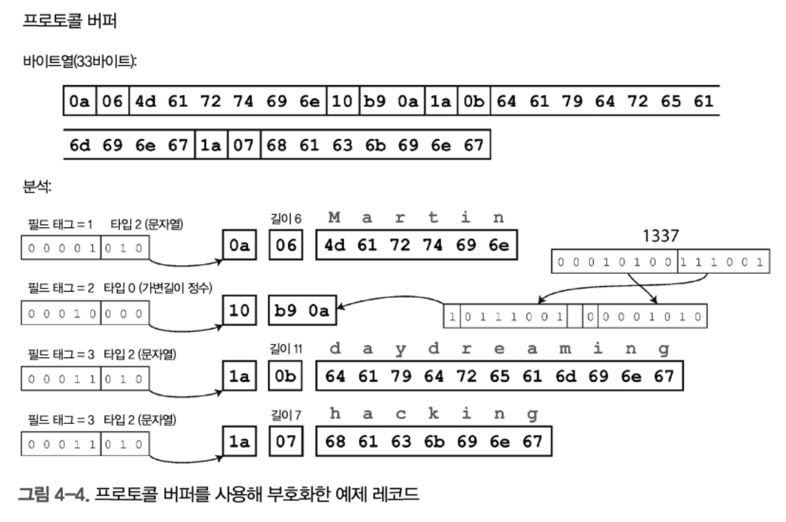
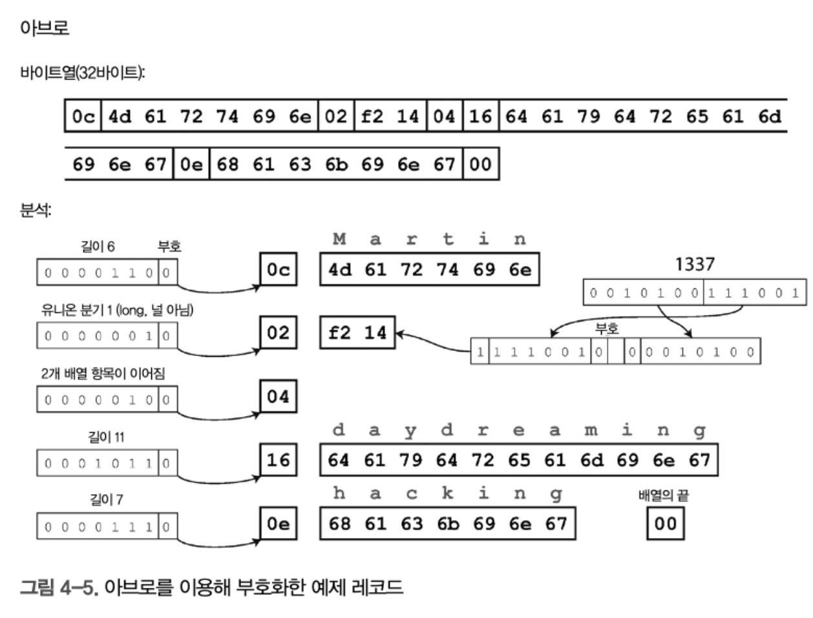
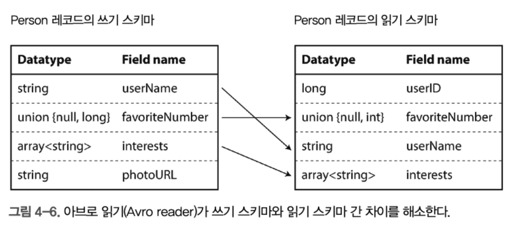

# 4 부호화와 발전

시간이 지날수록 애플리케이션은 필연적으로 변한다. 기능 변경시 저장하는 데이터도 변경되는 경우가 많다.

쓰기스키마와 달리 읽기스키마 데이터베이스는(몽고디비처럼) 이전 데이터 타입과 새 데이터 타입이 섞여 포함되기 좀 수월하다. 시스템이 원활하게 실행되려면 양방향으로 호환성을 유지해야 한다

* 하위 호환성 : 새 코드는 이전 코드가 기록한 데이터를 읽을 수 있어야 함
* 상위 호환성 : 이전 코드는 새 코드가 기록한 데이터를 읽을 수 있어야 한다

하위 호환성은 상대적으로 쉽지만, 상위 호환성은 다루기 더 어렵다.

JSON, XML, Protocol buffers, thrift, Avro 등에 대해 알아보자.

## 데이터 부호화 형식

프로그램은 보통 두가지 형태로 표현된 데이터를 사용해 동작

* object, structure, list, array, hash table, tree 등으로 데이터가 유지됌

파일이나 네트워크를 통해 전송하려면, 바이트 배열의 형태로 부호화 해야함. 

이를 다시 데이터로도 표현해야 하는데 이를 부호화(직렬화, 마샬링) 그리고 반대는 복호화(파싱, 역직렬화, 언마샬링)이라고 한다.

### 언어별 형식

인메모리 객체를 바이트열로 부호화하는 기능이 내장되어 있음.

* 자바는 Serializable

그러나 문제점이 많음

* 실수로 `serialVersionUID`를 생략하거나 잘못 지정하면 **`InvalidClassException`** 발생 가능
* 패키지 경로까지 포함해서 저장(FQCN)이라, 시스템간 공유하기 어려움. 

때문에 내장된 방법들을 사용하지 말고 다른 표준 포맷을 사용하는것이 좋음

### JSON과 XML, 바이너리 변형

XML은 너무 장황하고 불필요하게 복잡함.

CSV는 스키마가 없어서 각로우와 컬럼에 대해 정의와 약속이 모호함.

XML과 CSV는 수와 숫자로 구성된 문자열을 구분할 수 없어 JS에서 부동소수점 문제 발생 가능. 

### 이진 부호화(binary)

조직 내부에서만 사용하는 데이터라면, 꼭 복잡한 텍스트 형식(JSON, XML 등)을 사용할 필요 없이, 더 빠르고 효율적인 이진(binary) 형식을 써도 된다

* 최소공통분모 부호화 형식이란 JSON이나 XML 같은 **텍스트 기반 포맷**을 말하는거 같은데, 이것들은 저장 공간과처리 속도 면에서 비효율적.

### 스리프트와 프로토컬 버퍼

이진 부호화(바이너리) 라이브러리. 둘다 오픈소스

* 목적 : 데이터 구조를 직렬화(serialize)하고 역직렬화(deserialize)하기 위해 사용

* 특징 : 이진 포맷으로 작고 빠름, 텍스트보다 처리 효율이 높음

* 사용 분야 : 마이크로서비스 간 통신, RPC 시스템, 대규모 데이터 처리 등

* 텍스트 기반보다 : 더 빠르고, 더 적은 데이터 전송, 더 낮은 CPU 사용

둘다 스키마가 필요하다.

```
// 스리프트
struct Person {
  1: required string userName
  2: optional i64    favoriteNumber,
  3: optional list<string> interests
}

// 프로토 버프 스키마
message Person {
  required string user_name = 1;
  optional int64 favorite_number = 2;
  repeated string interests = 3;
}
```


스리프트는 binary  Protocol과 CompactProtocol 2가지를 지원한다.



* 각 필드 에는 타입 어노테이션이 있음. 문자열의 길이와 목록의 수도 있음. 


스리프트 컴팩트 프로토콜 부호화는 동일한 정보를 더 줄여서 표현한다.

* 필드타입과 태그 숫자를 단일 바이트로 줄이고, 가변 길이 정수를 사용하여 직렬화 함. 



프로토 버퍼는, 비트를 줄여 저장하는 처리 방식이 약간 다르지만 스리프트의 컴팩트 프로토콜과 매우 비슷하다.

* 셋다 보면 컴팩트프로토콜이랑 프로터 버퍼가 데이터 압축률이 제일 좋음




### 필드 태그(tag)와 스키마 발전(Schema evolution)


직렬화된 데이터는 직렬화된 필드의 연결일 뿐이다. 

각필드는 태그 숫자로 식별하고, 데이터 타입을 주석으로 단다. 

필드 태그는 직렬화 데이터 해석을 위해 매우 중요하다. 필드에 새로운 태그 번호를 부여하는 방식으로 스키마에 새로운 필드를 추가할 수 있다.

이전 코드에서 새 코드로 기록한 데이터를 읽으려는 경우 해당 필드를 무시해서 상위 호환성을 유지하게 한다.


하위호환성을 유지하려면 스키마 초기 배포 이후에 추가되는 필드는 optional이나 기본값을 두면 된다. 그러면 터지지 않는다.

### 데이터 타입과 스키마 발전

필드의 데이터 타입 변경은 불가능하지 않지만 값이 정확하지 않거나 에러 발생 가능성이 있다.

프로토버퍼의 흥미로운 기능 중에 목록이나 배열 데이터 타입이 없고 repeated 표시자가 있다.

repeated 필드의 직렬화는 단순히 레코드에 동일 필드 태그가 여러번 나타나므로, 단일값인 optional 필드를 다중값인 repeated 필드로 변경해도 문제가 없다. 

이전 데이터를 읽는 코드는 0이나 1개의 엘레먼트가 있는 목록으로 보게되고, 새 데이터를 읽는 예쩐 코드는 목록의 마지막 엘리먼트만 보게된다.

### Apache Avro

아브로는 직렬화 데이터 구조를 지정하기 위해 스키마를 사용한다.

2개의 스키마 언어가 있는데, 하나는 사람이 편집할 수 있는 아브로 IDL, 하나는 기계가 읽기 쉬운 JSON 기반 언어다

```
// 아브로 IDL
record Person {
	string	userName;
	union {null, long} favoriteNumber = null;
	array<string>	interests;
}

// 스키마
{
	"type" : "record",
	"name" : "Person",
	"fields" : [
		{ "name" : "userNAme", "type" : "string"}
	]
}
```

이 스키말를 이용해 직렬화하면 아브로 이진 직렬화 길이는 32바이트로 가장 짧다.



* 바이트배열을 보면, 필드나 데이터 타입을 식별하기 위한 정보가 없다. 단순히 연결된 값으로 구성됌
* 정수는 가변길이 부호화를 사용해서 직렬화된다.

아브로를 이용해 파싱하려면, 스키마에 나타난 순서대로 필드를 살펴보고 스키마를 이용해 각 필드의 데이터 타입을 미리 파악해야 한다. 

즉, 정확히 같은 스키마를 사용하는 경우에만 올바르게 역직렬화 할 수 있다.

아브로는 어떻게 스키마 진화를 제공할까?


아브로는 쓰기 스키마와 읽기 스키마가 동일하지 않아도 호환 가능하면 처리할 수 있다.

* 쓰기스키마 : 직렬화 할때 
* 읽기 스키마 : 역직렬화 할때 



필드 순서가 달라도, 이름으로 필드를 일치 스키고 읽는 코드가 읽기 스키마에는 없고 쓰기 스키마에만 존재한다면 이 필드를 무시해서 호환성을 유지한다. 그리고 읽을 때 어떤 필드가 비어있따면 디폴트 값으로 채운다. 


아브로에서 상위 호환성은 새로운 버전의 쓰기 스키마와 예전 버전의 읽기 스키마를 가질 수 있음을 의미. 

하위 호환성은 새로운 버전의 읽기 스키마와 예전 버전의 쓰기 스키마를 가질 수 있음을 의미.


기본값이 없는 필드 추가시, 새걸 읽을때 이전 기록한 데이터를 읽을수 없어 하위 호환성이 깨지고

기본값이 없는 필드 삭제시, 이전껄 읽을 때 새 데이터를 읽을 수 없어서 상위 호환성이 깨짐.

때문에 union 타입이라는 복합 타입 체계를 이용해 기본값을 null로 사용하도록 함.

* null의 그나마 장점.. 
* union {null, long, string} field의 경우 수, 문자열, 널일수 있단 의미임

**Avro는 데이터를 쓸 때 사용한 "쓰기 스키마"를 데이터와 함께 저장하거나, 별도로 버전/ID로 관리.**
 왜냐하면, 데이터를 읽을 때는 **원래 쓰기 스키마**와 현재 **읽기 스키마**를 비교해서 해석해야 하기 때문 

### 동적 생성스키마

프로토 버퍼와 스리프트에 비해 아브로는 한가지 장점이 있음.

아브로는 스키마에 태그 번호가 포함돼있지 않음.

**ProtoBuf**나 **Thrift**는 **숫자 태그(필드 번호)**로 데이터를 식별.

그래서 **Avro는 데이터베이스처럼 구조가 자주 바뀌는 상황**에서 **자동으로 스키마를 만들고 써먹기 쉬움**

* 필드를 이름으로 식별하기 때문임.
* 프로토버퍼나 스리프트는 숫자 태그가 바뀌면 수동 갱신해야 하며 문제가 생김

| 항목             | Avro                  | Protobuf / Thrift   |
| ---------------- | --------------------- | ------------------- |
| 필드 식별        | 이름으로              | 숫자 태그로         |
| 스키마 변경 대응 | 쉬움 (자동화 가능)    | 어렵고 관리 필요    |
| 필드 추가/삭제   | 유연함                | 주의 깊은 관리 필요 |
| DB 스키마 → 변환 | 자동 생성 쉬움        | 태그 번호 지정 필요 |
| 설계 철학        | 동적 생성 스키마 고려 | 정적 IDL 기반 설계  |

## 데이터 플로 모드


### 서비스를 위한 데이터 플로우 : REST와 RPC

서버는 네트워크를 통해 API를 공개하고 이 공개한 API를 서비스라고 한다.

REST는 프로토콜이 아니라 HTTP 기반 설계 철학이다. 

1970년대부터 원격 프로시저 호출인 RPC 아이디어가 나와 사용했다.

RPC는 원격 네트워크 서비스 요청을, 같은 프로세스 내에서 함수를 호출하는것처럼 동일하게 사용하게 해줌.

* 이런 추상화를 location transparency 라고 함

하지만 네트워크 요청은 에러가 발생가므로, 다음 것들을 함께 고려해야 한다.

* 예측 가능성**

  - 로컬 함수 호출은 결과가 예측 가능하며, 제어 가능한 매개변수에 따라 성공 또는 실패가 명확히 구분된다.

  - 네트워크 요청은 예측이 어렵고, 다양한 예외 상황(응답 누락, 지연, 타임아웃 등)이 발생할 수 있으며 이를 직접 통제할 수 없다.

* 결과의 다양성**

  - 로컬 함수는 일반적으로 성공, 예외 발생, 무한 루프 또는 충돌로 인해 반환되지 않는 결과를 가진다.

  - 네트워크 요청은 위의 결과들 외에도 타임아웃이 발생해 명확한 결과 없이 반환될 수 있으며, 요청의 상태조차 정확히 알 수 없는 문제가 있다.

* 중복 및 멱등성**

  - 네트워크 요청이 실패하여 다시 시도할 경우, 실제로 요청은 처리됐으나 응답만 유실되었을 가능성이 있다. 따라서 재시도로 인해 같은 작업이 중복될 수 있다. 이 문제를 방지하려면 멱등성(idempotence)을 구현해야 한다.

  - 로컬 함수 호출은 이러한 멱등성 문제가 발생하지 않는다.

* 지연 시간**

  - 로컬 함수 호출은 실행 시간이 일정하고 빠르다.

  - 네트워크 요청은 함수 호출보다 훨씬 느리며 지연 시간 편차도 크다. 혼잡하거나 원격 서비스 과부하시 수 초까지 소요될 수 있다.

* 데이터 전달 방식**
  - 로컬 함수 호출은 포인터나 참조를 효율적으로 사용할 수 있지만, 네트워크 요청은 데이터를 바이트로 직렬화(serialization)해야 한다. 큰 객체의 경우 네트워크 전송 과정에서 성능 문제가 발생할 수 있다.


이런 문제에도 RPC는 계속 사용된다. grpc 등.

RPC 스키마의 상하위 호환 속성은 사용된 모든 직렬화로부터 상속된다.


RESTful API는 URL이나 Http Accept 헤더에 버전 번호를 사용하는 방식이 일적이다

### 비동기 메시지 시스템

메시지 브로커나 미들웨어라는 중간 단계를 거쳐 비동기로 메시지를 전달함.

• 수신자(recipient)가 사용 불가능하거나 과부하 상태라면 메시지 브로커가 버퍼처럼 동작할 수 있기 때문에 시스템 안정성 이 향상된다.

• 죽었던 프로세스에 메시지를 다시 전달할 수 있기 때문에 메시지 유실을 방지할 수 있다.

- 송신자(sender)가 수신자의 IP 주소나 포트 번호를 알 필요가 없다(주로 가상 장비를 사용하는 클라우드 배포 시스템에서 특히 유용하다).
- 하나의 메시지를 여러 수신자로 전송할 수 있다.
- 논리적으로 송신자는 수신자와 분리된다(송신자는 메시지를 게시(publish)할 뿐이고 누가 소비(consume)하는지 상관하 지 않는다).


메시지 전달은 방향이 단방향이라서, 응답을 기대하지 않으므로 이런 특징이 바로 비동기 라는것. 

### 메시지 브로커

rabbitMQ, activeMQ, NATS, Apache Kafka 등이 대중화됌.

메시지를 큐나 토픽으로 전송하고 하나 이상의 consumer에게 메시지를 전달한다.


### 분산 액터 프레임워크

액터 모델(Actor Model)이란?

- 액터 모델은 동시성을 위한 프로그래밍 모델이다.
- 기존의 스레드와 관련된 문제(경쟁 조건, 잠금, 교착 상태 등)를 직접 다루는 대신, 로직을 **액터(actor)**라는 독립적인 단위로 캡슐화한다.
- 각 액터는 독립적인 로컬 상태를 가지며, **비동기적 메시지 송수신**을 통해 다른 액터와 소통한다.
- 액터는 **메시지 전달의 성공을 보장하지 않으며**, 일부 상황에서 메시지가 유실될 수 있다고 미리 가정한다.
- 액터는 한 번에 하나의 메시지만 처리하므로, 스레드 문제에 대한 걱정이 없다.

분산 액터 프레임워크

- 단일 프로세스 내에서 사용하던 액터 모델을 **여러 노드(컴퓨터) 간으로 확장**한 모델이다.
- 메시지 전달 방식이 동일한 노드든 원격 노드든 동일하게 유지된다 (**위치 투명성**).
- 노드 간 메시지는 자동으로 바이트로 인코딩되어 네트워크를 통해 전송 및 디코딩된다.
- 이미 액터 모델이 메시지 유실을 가정하고 있기 때문에, RPC(원격 프로시저 호출)보다 **분산 환경에서의 자연스러운 사용**이 가능하다.

분산 액터 프레임워크의 장점과 고려할 점

- **위치 투명성** 덕분에 개발자는 메시지 수신자가 어디에 위치하는지 신경 쓰지 않아도 된다.
- 하지만 메시지 형식의 변화가 있을 때는 반드시 **상위 및 하위 호환성**을 고려해야 한다.
  - 특히 **순회식 업그레이드(rolling upgrade)** 시에는 서로 다른 버전 간에 메시지가 교환될 수 있어 호환성 관리가 중요하다.

대표적인 분산 액터 프레임워크 및 메시지 부호화 방식

| 프레임워크            | 메시지 부호화 방식          | 순회식 업그레이드 지원 여부                               | 특징 및 고려사항                                             |
| --------------------- | --------------------------- | --------------------------------------------------------- | ------------------------------------------------------------ |
| **아카(Akka)**        | 기본적으로 자바 내장 직렬화 | 기본 방식은 지원하지 않지만, 프로토콜 버퍼로 교체 시 가능 | 프로토콜 버퍼로 변경해 상위/하위 호환성 확보 가능            |
| **올리언스(Orleans)** | 사용자 정의 데이터 부호화   | 기본 방식으로는 지원하지 않음                             | 업그레이드시 새 클러스터 배포 후 트래픽 이전 필요            |
| **얼랭(Erlang) OTP**  | 자체 레코드 스키마 기반     | 지원하지만 매우 신중히 계획해야 함                        | Maps 데이터 타입(JSON 유사)을 활용하면 업그레이드 용이성 향상 |

코틀린 예시

```
import kotlinx.coroutines.*
import kotlinx.coroutines.channels.actor

// 액터가 처리할 메시지 타입을 sealed 클래스로 정의
sealed class CounterMsg
object Increment : CounterMsg()
class GetCount(val response: CompletableDeferred<Int>) : CounterMsg()

// 액터 생성 함수
fun CoroutineScope.counterActor() = actor<CounterMsg> {
    var count = 0  // 액터가 가진 로컬 상태
    for (msg in channel) {
        when (msg) {
            is Increment -> count++
            is GetCount -> msg.response.complete(count)
        }
    }
}

fun main() = runBlocking {
    val counter = counterActor()  // 액터 생성

    // 액터에 메시지 전달 (비동기 방식)
    repeat(1000) {
        launch {
            counter.send(Increment)
        }
    }

    // 현재 액터 상태 가져오기
    val response = CompletableDeferred<Int>()
    counter.send(GetCount(response))

    println("최종 카운트 값 = ${response.await()}")

    counter.close() // 액터 종료
}

```

아카(Akka) 사용 사례

- **링크드인(LinkedIn)**
  - Akka를 사용해 실시간 메시징 및 푸시 알림 서비스 처리.
  - 액터 모델을 활용해 수백만 명의 사용자 메시지 처리를 안정적으로 수행 중.
- **페이팔(PayPal)**
  - 결제 시스템 및 서비스 인프라에서 Akka 액터를 활용해 고성능 트랜잭션 처리 및 신뢰성 향상.

**분산 액터 프레임워크** 는 동시성, 확장성 및 장애 대응에 강력한 장점이 있는 반면,
 메시지 유실 처리, 직렬화 비용 및 호환성 관리 등 추가적인 복잡성을 동반

