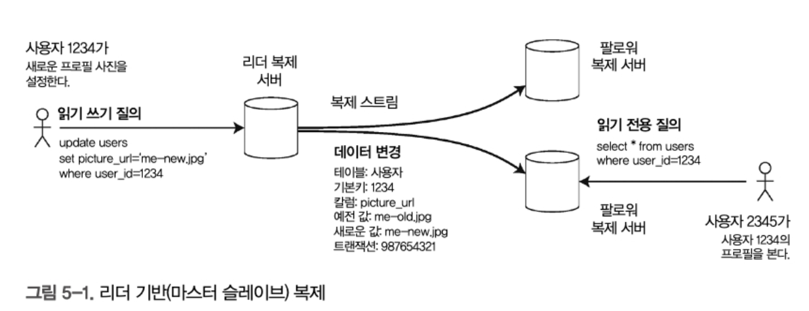
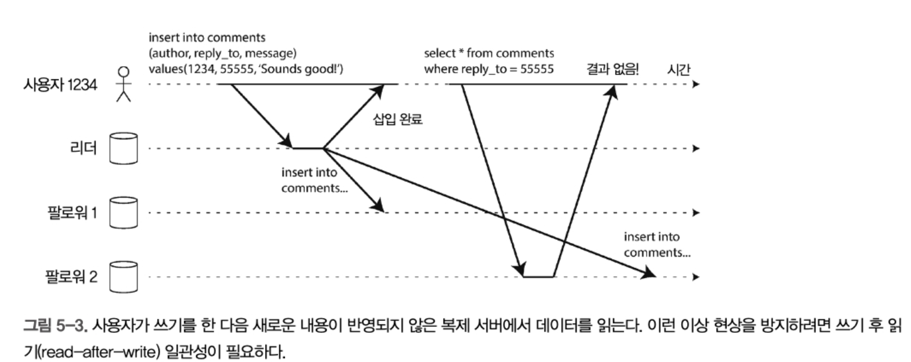
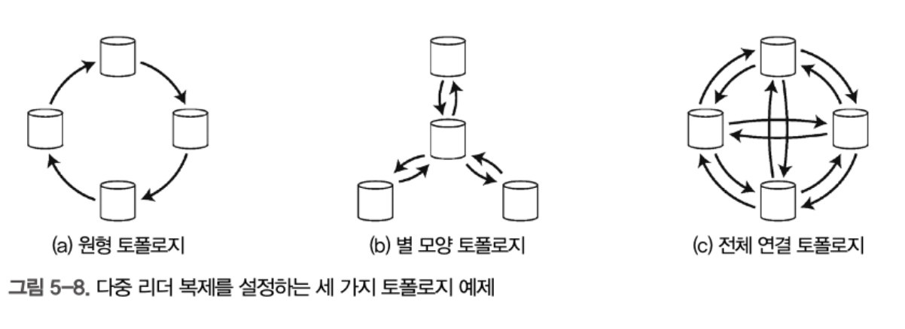
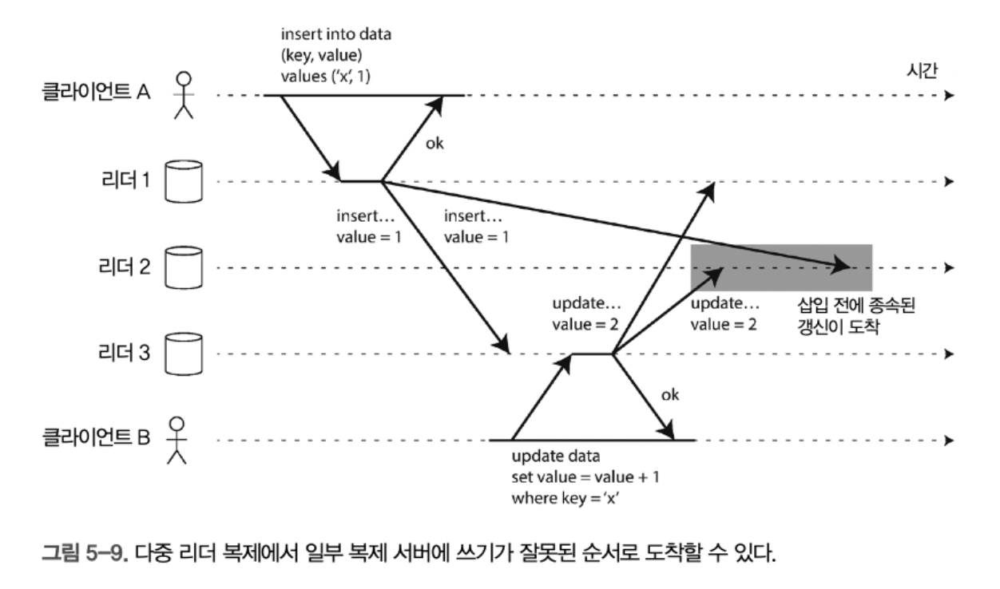

# 5장 복제

복제란 네트워크로 연결된 여러 장비에 동일한 데이터의 복사본을 유지한다는 의미 

- 지리적으로 사용자와 가깝게 데이터를 유지해 지연 시간을 줄인다.
- 시스템의 일부에 장애가 발생해도 지속적으로 동작할 수 있게 해 가용성을 높인다.
- 읽기 질의를 제공하는 장비의 수를 확장해 읽기 처리량을 늘린다.

복제 자체는 어려운 문제가 아니지만, 복제된 데이터의 변경 처리가 어렵다.

분산 DB에서는 single-leader, multi-leader, leaderlss 복제 아키텍처를 이용한다.

트레이드 오프도 고려해야 하는데,

* 동기식 복제와 비동기식 복제 중 어떤것을 사용할지
* 잘못된 복제본은 어떻게 처리할지 등

## 리더와 팔로워

DB의 복사본을 저장하는 노드를 replica 라고 함.

여러 서버 중 하나를 leader(master or primary라고도 함)로 지정하고, 쓰기는 무조건 리더로 보낸다.

다른 복제 서버는 팔로워라고 하고 리더의 쓰기 저장소에 기록될때마다 데이터 변경사항을 replication log나 change stream의 일부로 팔로워에게 전송한다. 팔로워는 받아서 로컬 복사본을 갱신한다.



이 방식은 pg, sql server, oracal 등에 사용되는 방식이다.

카프카나 rabbit MQ등에도 사용된다

### 동기식  vs 비동기식 복제

**제 대상 노드에 변경 내용을 언제 적용하느냐**에 따라 구분되는 개념

동기식 : 쓰기 작업이 모든 복제 대상 노드에 반영될 때까지 대기한 후, 클라이언트에 성공 응답을 반환

비동기식 : **쓰기 작업이 Primary에서 완료되면 즉시 클라이언트에 응답하고**, 나중에 복제 노드에 데이터를 전송


동기식 복제의 장점은 팔로워와 리더가 일관성있게 서로 최신 복사봉늘 가지는것을 보장함 

단점은 동기 팔로워 응답 지연시 쓰기가 처리될 수가 없을수도 있음. 블로킹 되기 때문에.

이런 이유로 모든 팔로워가 동기식이면 비현실적이다. 

팔로워 하나만 동기식으로 하고 나머지는 비동기식으로 둬서 성능을 좀 높여야 한다. 이것을 반동기식이라고 한다.


보통 리더 베이스 복제는 완전히 비동기식으로 구성한다. 리더가 잘못된경우 복구가 불가능하긴 하지만 모든 팔로워가 고장나더라도 리더는 계속 쓰기가 가능하다. 

### 새로운 팔로워 설정

복제 서버 수를 늘리거나 장애 노드 대체를 위해 새로운 팔로워 선출을 한다. 

이때 새 팔로워가 리더의 복제본을 100% 정확히 복사했는지 보장해야 하는데 어떻게 보장할까

개념적으로 팔로워 설정은 중단시간 없이 수행할 수 있따.

1. 리더디비의 스냅숏을 일정 시접에 가져온다. 이 시점에서 "어디까지 복제 로그를 기록했는지"도 같이 저장됨 (→ LSN, Binlog 위치)
2. 이 스냅숏을 새 팔로워 노드로 복사. 네트워크나 외장디스크로 통째로 복사.
3. 팔로워가 리더에 연결하여 이후 변경사항만 복제 스냅숏 이후 리더에서 발생한 **변경 로그들(WAL, binlog, oplog)** 을 따라잡기 시작함. (여기에 사용되는 위치 를 log sequence number라고 함)
4. 이 시점부터는 리더가 새로 처리하는 데이터를 실시간으로 같이 반영함.


### 노드 중단 처리

리더 기반 복제에서 고가용성을 달성하는 방법. (여러 이유로 중단될 수 있음. 장애, 계획된 유지보수 등)

#### 팔로워 장애 : 따라잡기 복구

각 팔로워가 리더로 부터 수신한 변경 데이터 로그를 로컬에 보관하고, 보관된 로그에서 처리한 마지막 트랜잭션을 알아낸 다음 그 이후 데이터들을 받는다.

### 리더 장애: 장애 복구

리더 장애 처리는 까다롭다. 팔로워중 하나를 리더로 승격해야 하고, 재설정도 필요하며, 다른 팔로워는 새 리더로부터 데이터 변경을 소비하라는것

다음과 같은 단계로 구성

1. 리더가 장애인지 판단하는것이 우선. 무엇이 문제인지를 모르기때문에 서로의 ping-pong 타임아웃을 장애 판단의 근거로 삼는다
2. 새 리더 선택. 선출 과정(투표 등)을 통해 이뤄지거나 controller 노드에 의해 새 리더가 임명 가능하다. 
3. 새 리더 사용을 위해 시스템을 재설정한다. 클라이언트는 새 쓰기 요청을 새 리더에게 라우팅 해야한다.

그러나 장애 복구 과정은 또다른 장애를 낳는 버그 투성이일 수 있다.

* 비동기 복제 사용시, 기존 팔로워였던 새 리더는 이전 쓰기 리더의 일부를 수신 못했을수도 있음. 즉 동기화가 안되어 있을수도 있음 -> 데이터 손실, 고가용성 확보 실패
* 쓰기 자체 폐기 방법을 사용하는것은 위험함. 데이터 불일치 일으킬 수 있음
* 특정 결함 시나리오에서 두 노드가 서로 자기들이 리더라고 믿을 수 있는 스플릿 브레인 현상 발생 가능. 둘다 쓰기 요청을 받으면 충돌이 일어날 수 있어 데이터 유실 및 오염 가능함. 두 노드가 둘다 죽을수도 있고.
* 리더가 죽었다고 판단하는 적절한 타임아웃을 얼마로 둬야하는지에 대한 문제. 긴 타임아웃은 확실해 지지만 복구까지 오랜 시간이 걸리며, 너무 짧으면 별것도 아닌것에 대해서 장애 판명이 나서 리밸런싱이 일어날 수 있음.

## 복제 로그 구현

리더 기반 복제는 내부적으로 어떻게 동작할까 

### 구문 기반 복제

모든 쓰기 statement을 기록하고 쓰기 구문 로그를 팔로워에게 전송한다. 그리고 각 팔로워는 SQL 구문을 파싱하고 실행한다.

이 방법은 합리적인거같지만 복제가 깨질 수 있는 사례가 있음

* NOW(), RAND() 같은 비결정적 함수 호출시 각 서버마다 다른 값 생성 가능
* auto increment 컬럼이나 DB에 있는 다른 데이터에 의존시, 각 복제 서버에서 정확히 같은 순서로 실행돼야 함.
* 부수 효과를 가진 프로시저, 트리거 등 부수 효과가 결정적이지 않으면 각 복제 서버에서 다른 결과가 나올 수 있음 

이런경우 -> 비 결정적 함수가 고정값을 반환하게끔 대처하거나, 애플리케이션에서 생성하여 넘기면 됌 

### 쓰기 전 로그 배송

db의 모든 쓰기를 포함하는 로그 자체를 복제 서버에 전송하여 그대로 처리하게 한다.

가장 큰 단점은 로그가 제일 저수준 데이터를 기록하며, db 엔진 버전이 다르다면 실행할 수 없는 케이스도 있다.

### 논리적(로우 기반) 로그 복제

복제와 저장소 엔진을 위해 다른 로그 형식을 사용해서 저장하는것.

rdb용 논리적 로그는 대개 로우 단위로 테이블에 쓰기를 기술한 레코드 열임

- 삽입된 로우의 로그는 모든 칼럼의 새로운 값을 포함한다.
- 삭제된 로우의 로그는 로우를 고유하게 식별하는 데 필요한 정보를 포함한다. 보통 이것은 기본키지만 테이블에 기본키가 없다면 모든 칼럼의 예전 값을 로깅해야 한다.
- 갱신된 로우의 로그는 로우를 고유하게 식별하는 데 필요한 정보와 모든 칼럼의 새로운 값(적어도 변경된 모든 칼럼의 새로 운 값)을 포함한다.

여러 로우 수정하는 트랜잭션은 여러 로그 레코드를 생성한 다음 트랜잭션이 커밋됐음을 레코드에 표시한다.

* mysql은 이 방식을 사용

이렇게 엔진과 분리하면 하위 호환성을 쉽게 유지 가능하고, 다른 버전의 db나 소프트웨어, 엔진을 사용할 수 있다.

이 기술을 Change Data Capture라 부른다 

* PG는 모든 변경 사항을 WAL에 먼저 기록함
  * 논리 복제 방식으로써 행 기반 데이터를 저장함 
* MySQL은 binLog에 변경 이록을 기록함
  * MySQL도 기본은 행 기반이고, 스테이트먼트 혹은 MIXED 설정 가능 
* Mongodb는 Oplog에 기록함
  * 변경 도큐먼트가 어떻게 되었는지 등 거의 로그 기반이라고 볼 수 있음 


## 복제 지연 문제

많은 팔로워들을 만들어 읽기 요청을 분산하는 read-scaling 아키텍처는 처리가 쉽지만, 비동기식 복제에서만 동작한다. 동기식으로 하면 쓰기가 매우 불안정 해짐.

팔로워가 뒤처지면 읽기 불일치가 발생할 수 있는데, 시간이 지나거나 쓰기가 멈추면 결국 일치하게 되고 이 효과를 최종 일관성이라고 한다.

이렇게 복제 지연 이 발생할 수 있는 사례는 뭐가 있을까

### 자신이 쓴 내용 읽기



쓰기를 수행한 직후 봐야하는 데이터가 있을 시, 복제에서 읽으면 반영되지 않았을 수도 있다.

이경우 쓰기 후 읽기 일관성이 필요하다.  어떻게 구현할까?

* 사용자가 수정한 내용 읽을시 리더에서 읽고, 나머지는 팔로워에서 읽는다. 
  * 이 경우 질의하지 않고 무엇이 수정됐는지 알 수 있는 방법이 필요한데, 예를 들어 SNS에서 사용자 프로필 정보는 본인만 편집에 접근 가능하다는 것들을 이용한다
* 대부분 내용을 사용자가 편집할 가능성이 있따면, 대부분 리더에서 읽기때문에 효율적이지 않다. 이경우 다른 기준이 필요하며, 마지막 갱신 시간을 찾아서 마지막 갱신 후 1분 동안 리더에서 모든 읽기를 수행하는 방법도 있다.
* 클라이언트는 가장 최근 쓰기 타임스탬프를 기억할 수 있는데, 복제 서버가 최신 내용이 아닌 경우 다른 복제 서버가 읽기를 처리하거나 복제 서버가 따라잡을 떄까지 질의를 대기시킨다. -> 어려울듯?
* 여러 데이터센터에 복제가 분산될 수 있으므로, 리더가 제공해야 하는 요청은 리더가 포함된 데이터 센터로만 라우팅 한다

동일한 사용자가 여러 디바이스로 접근시에도 이 일관성이 깨질 수 있다.

* 이경우 사용자 마지막 갱신 타임 스탬프도 어려움. 이 정보를 다른 디바이스에서 알 수 없기 때문

### 단조 읽기(monotonic read)

시간이 거꾸로 흐르는 현상을 목격할 수 있음.

이경우는 사용자가 각기 다른 복제 서버에서 여러 읽기를 수행할 때 발생할 수 있음.

예를들어 같은 findById를 각기 다른 복제 서버에 두번 읽는 문제임 .

단조 읽기는 이걸 해결하는 방법.

각 사용자의 읽기가 항상 동일한 복제 서버에서 수행되게끔 하는 법이다. 

* 사용자 ID 기반 해시 라우팅을 하던가. 

### 일관된 순서로 읽기

a : 안녕하세요 현재는 12시 10분 1초

b: 안녕하세요 현재는 12시 10분 10초

순서대로 저장되었지만, 반대로 출력되는 경우가 있다. 복제 지연이 발생했기 때문

이경우 Consistent Prefix Read같은 보장이 필요하다. 

이는 샤딩된 db에서 발생하는 문제다. 이경우 서로 인과성이 있는 쓰기가 동일한 파티션에 기록되게 해야 한다. 

### 정리 - 복제 지연 시 발생 가능한 문제들


| 문제 유형                                | 설명                                             | 실제 사례                                       |
| ---------------------------------------- | ------------------------------------------------ | ----------------------------------------------- |
| 🧩 **데이터 불일치**                      | 팔로워에서 읽은 데이터가 최신 상태가 아님        | 팔로워에서 읽은 주문 상태가 여전히 `결제 전`    |
| ❗ **읽기 후 쓰기 오류**                  | 팔로워에서 읽고 처리한 데이터를 리더에 쓰면 충돌 | "삭제된 유저"를 다시 참조하는 API 응답          |
| 🧨 **일관성 깨짐 (Read Your Write 불가)** | 유저가 방금 저장한 글이 보이지 않음              | 유저가 댓글을 달았지만 새로고침하면 안 보임     |
| 🔁 **Failover 시 데이터 손실**            | 팔로워가 리더로 승격되었는데, 최신 데이터가 없음 | 리더 장애 후 일부 트랜잭션 유실됨               |
| 🐌 **비동기 작업 지연**                   | CDC, 로그 기반 이벤트 발행이 지연됨              | Kafka로 전달되는 이벤트가 몇 분 늦게 전송       |
| 🧪 **테스트 및 모니터링 왜곡**            | 로그 분석, A/B 테스트 데이터가 왜곡됨            | 사용자 행동 로그가 순서가 바뀌어 분석 오류 발생 |


## 다중 리더 복제

쓰기 노드가 두개 이상인 아키텍처

### 다중 리더 복제 사용 사례

#### 다중 데이터 센터 운영

각 데이터 센터마다 리더가 존재할 수 있음.

일부 데이터 베이스는 기본적으로 다중 리더 설정을 제공함.

그러나 동일 데이터를 다른 두 개의 데이터 센터에서 동시에 변경할 수 있으며 쓰기 충돌이 발생하므로 해소해야 한다.

#### 오프라인 작업을 하는 클라이언트

다중 리더 복제가 적절한 또 다른 상황은 인터넷이 끊겨도 애플리케이션이 동작해야 하는 경우.

* 휴대전화, 노트북, 디바이스의 캘린더 앱

모든 디바이스에는 리더처럼 동작하는 로컬 디비가 있으며, 서버간 디비랑 동기화가 되어야 한다. 

#### 협업 편집

실시간 협업 편집 애플리케이션(노션같은)은 로컬 복제 서버에 적용하고 동일한 문서를 편집하는 다른 사용자와 서버에 비동기로 복제하여 동기화 해야함.

이때 편집 충돌 방지하기 위해 문서의 잠금을 얻어야 수정이 가능하다. 

#### 쓰기 충돌 다루기

다중 리더 복제에서 문제는 쓰기 충돌임. 

다중 리더에서의 쓰기는 모두 성공하며 충돌은 이후 특정 시점에서 비동기로 감지하게 해야함.

제일 간단한 전략은 충돌을 피하는것이 좋음. 예를들어 특정 사용자의 데이터는 항상 동일 데이터 센터로 라우팅 한다던가.

또다른 문제는 lost update가 발생할 수 있음. A -> B -> C 순서인데 A -> C -> Brk ehlsms tnstj emd.

#### 사용자 정의 충돌 해소 로직

충돌을 해소하는 가장 적합한 방법은 애플리케이션에 따라 다르다.

* 쓰기 수행중 : 복제된 변경 사항 로그에서 DB 시스템이 충돌 감지하자마자 핸들러를 호출한다
* 읽기 수행중 : 충돌 감지시 모든 충돌 쓰기를 저장한다. 다음번 데이터 읽을시 여러 버전의 데이터를 애플리케이션에 반환하고 애플리케이션에서 로직을 통해 충돌을 해소한다.

> 자동 충돌 해소 방법
>
> 동시 데이터 수정시 발생하는 충돌을 해소하는 연구 내용
>
> * 충돌없는 복제 데이터 타입 : set, map, sorted list, counter 를 이용해 자동 해소
> * 병합 가능한 영속 데이터 구조 : git 버전 제어 시스템과 유사하게 사용
> * 운영 변환 : 구글 독스같은 애플리케이션의 해소 알고리즘

### 다중 리더 복제 토폴로지

복제 토폴로지는 쓰기를 한 노드에서 다른 노드로 전달하는 통신 경로



일반적인 토폴로지는 all-too-all(c타입)이다. 

* 모든 리더가 각 쓰기를 다른 모든 리더에 전송 

원형 토폴로지는 MySQL이 이용

원형과 star 토폴로지의 문제점은 한 노드 장애시 다른 노드에 장애 전파되어 통신 불가능함.

전체 연결 토폴로지는 특정 네트워크 연결이 다른 연결보다 빠르다면 복제가 추월되어 순서가 엉킬 수 있음. 



* ex) 클라 a가 리더 1에 쓰고, 클라 B가 리더 3의 로우 갱신시, 리더 2는 쓰기->갱신이 아닌 갱신 -> 쓰기 요청을 받을수도있음.

이런 이벤트를 올바르게 정렬하기 위해 version vector라는 기법 사용 가능. 

* 각 노드(또는 클라이언트)가 "자신이 언제, 무엇을 변경했는가"를 **벡터 형태로 기억**하여
  서로의 변경 이력을 비교할 수 있도록 해주는 **분산 시간 추적 기법**

* ```
  예시) 3 노드 시스템에서 리더1이 2번째 쓰기를 하면:
  VV = {L1: 2, L2: 0, L3: 0}
  ```

* 이 값들을 비교해서, 한 벡터가 다른 벡터의 선행이면 병합하고, 벡터가 병렬이면 앱 레벨에서 머지, 리라이트, 운영 조정 등을 하고, 중복이면 무시하고 이렇게 해야 함 

* 매우 어려운 개념.. 

## 리더 없는 복제

일부 시스템은 리더 개념 버리고 모든 서버가 복제하며 쓰기를 직접 허용받는 시스템도 있다.

다이나모, 카산드라 같은 시스템에서 쓰이며 멀티 마스터 라고도 함.

* 다이나모 스타일 이라고도 함.

### 노드가 다운됐을때 데이터베이스의 쓰기

리더 없는 설정에서는 장애 복구가 필요하지 않음. 클라이언트가 여러 노드에 쓰기 때문

다만, 읽기시에 장애 발생했던 노드가 복구되고 아직 복제가 완료되지 않았다면 과거 데이터를 읽을 수 있는 문제가 있음. 이경우 읽기 요청을 병렬로 여러 노드로 전송 후 응답을 받아 최신 값만 처리하면 되긴 함.

* 근데, 이러면 읽기 요청을 분산시키는 의미가 있을까? 

#### 읽기 복구와 안티 엔트로피

장애 발생한 노드가 다시 복구되고 누락된 쓰기를 어떻게 따라잡아야 할까?

다이나모 스타일 디비는 두가지 메커니즘을 주로 사용함

* 읽기 복구 : 병렬 일기 수행 후 최신 버전 반환하고, 클라이언트는 오래된 서버에 최신 값을 갱신 처리함
* 안티 엔트로피 처리 : 백그라운드 프로세스를 두고 복제 서버간 데이터 차이를 찾아 누락된 데이터를 하나의 복제 서버에서 다른 서버로 복사함. 리더 기반 복제 로그와 달리, 순서로 쓰기를 복사하기 때문에 상당한 지연 발생 가능

| 구분             | Dynamo                                         | Cassandra                                               |
| ---------------- | ---------------------------------------------- | ------------------------------------------------------- |
| 읽기 복구        | 클라이언트 중심, 읽기 시 직접 갱신             | 서버 내부에서 자동 갱신 수행                            |
| 안티 엔트로피    | Merkle Tree 기반, 주기적 실행                  | Merkle Tree 기반, `nodetool repair` 필요                |
| 일관성 회복 전략 | 결국 모든 복제본이 최신 데이터로 수렴하게끔 함 | 동일하나, 관리자가 명시적으로 repair 수행하는 점이 다름 |

#### 읽기와 쓰기를 위한 정족수

예를들어 마스터 3대 서버중, 쓰기를 두 개만 처리해도 성공한것으로 간주했다.

근데 1개만 쓰기를 허용한다면 어느 범주까지 허용해야 하는지에 대한 문제도 있다.

* n개의 복제 서버가 있을 때, 모든 쓰기가 w개의 노드에서 성공해야 쓰기가 확정이고, 모든 읽기는 최소한 r개의 노드에 질의해야 한다면

w + r > n 이면 읽을 때  최신 값을 기대할 수 있따.

```
n: 복제본 수 (replication factor)

w: 쓰기 성공에 필요한 최소 노드 수

r: 읽기 성공에 필요한 최소 노드 수

w + r > n: 최신 데이터를 읽기 위한 보장 조건
```

* 이 조건을 만족해야, **읽기와 쓰기 작업이 최소한 1개의 노드에서 겹친다(교집합이 있다)**는 것을 보장할 수 있기 때문
* 사용 불가능한 노드를 어느정도 용인하는것. 
* 예시 1 : 조건 만족 (`n = 3, w = 2, r = 2`)
  * 쓰기는 3대 중 2대에 기록됨 → 예: 노드 A, B
  * 읽기는 3대 중 2대에서 조회함 → 예: 노드 B, C
  * → B는 읽기/쓰기 모두에 포함됨 → **최신 데이터가 존재할 가능성이 있음**
* 예시 2: 조건 불만족 (`n = 3, w = 1, r = 1`)
  * 쓰기는 A 하나만 → B, C는 모름
  * 읽기도 C 하나만 → C는 최신 데이터 없음
  * → **무조건 최신값을 읽을 수 없음 (일관성 깨짐)**
* r < n이면 노드 하나를 사용할 수 없어도 여전히 읽기 처리 가능
* n = 5, w = 3 , r = 3면 사용 불가능한 노드 둘을 용인함.

이런 r과 w를 따르는 읽기 쓰기를 정족수라고 한다.

* 일반적으로 n을 홀수 (3, 5)로 하고 w = r = (n + 1 ) / 2 로 설정한다.

### 정족수 일관성의 한계

w + r > n 이 되게 한단 것은, 읽은 노드 중 적어도 최신 값을 가진 노드가 하나 이상 있다는 것을 기대한다.

정족수 조건: `w + r > n`

*  → 읽기와 쓰기 노드가 **반드시 최소 1개 이상 겹친다**

왜 보통 과반수로 설정할까?

- 보통 `w = r = (n + 1) / 2`
  → 예: `n = 3 → w = 2, r = 2`

- **n/2 이하의 노드 장애를 허용**하면서도 `w + r > n` 보장
- 안정성과 가용성 간의 **적절한 균형** 제공

꼭 과반수여야 할까?

- 꼭 그런 건 아니다. 중요한 건 **읽기와 쓰기 노드 집합 간에 적어도 1개 이상 겹치면 된다**. 따라서 다양한 `w, r` 조합이 가능함 (유연성 있음)

**정족수 조건을 깨면 어떻게 될까?**

`w + r ≤ n`인 경우:

- **읽기 성능은 좋아짐**
- **가용성은 높아짐** (더 적은 노드 응답으로 성공 처리 가능)
- ❗ 하지만 **최신 데이터 읽기 확률은 떨어짐**

하지만 `w + r > n`이라고 항상 안전하지 않음

아래와 같은 에지 케이스에서는 **최신 값이 보장되지 않을 수 있음**

| 에지 케이스                | 설명                                                         |
| -------------------------- | ------------------------------------------------------------ |
| **1. 느슨한 정족수**       | 쓰기와 읽기가 겹치는 노드를 포함하지 않을 수도 있음 (구현 방식 차이) |
| **2. 동시 쓰기 충돌**      | 두 쓰기가 동시에 발생하면 타임스탬프 기반으로 정해지는데, clock skew가 있으면 잘못된 값이 살아남을 수 있음 |
| **3. 쓰기-읽기 동시 발생** | 읽을 때 이미 최신 쓰기가 일부 노드에만 반영된 상태라면, 읽기 결과가 불확실함 |
| **4. 부분 실패 쓰기**      | 일부 노드 쓰기 성공했지만 w개 미만 → 실패로 처리되나, 일부는 값 저장함 → 다음 읽기에 해당 값이 보일 수도, 아닐 수도 있음 |
| **5. 쓰기 직후 노드 장애** | 새로운 값을 가진 노드가 고장나면, 예전 값을 가진 노드에서 복원될 수 있음 |
| **6. 시점 문제**           | 이론상 맞아도, 실제 동시성 상황에서는 최신값을 보장하지 못하는 타이밍 문제 발생 가능 |

### 최신성 모니터링

**최종적 일관성(Eventual Consistency)**을 사용하는 시스템에서 운영 관점에서 **"복제가 얼마나 늦었는지"**, 즉 **데이터의 최신성(Staleness)**을 **정량화하고 모니터링**할 수 있는 방법을 고민해야함.

**리더 기반 복제는 모니터링이 쉬움**

- 리더 → 팔로워로 **순차적으로 복제**됨
- 모든 노드는 복제 로그 위치(log sequence number)를 가짐
- **복제 지연(replication lag)** = 리더의 로그 위치 - 팔로워의 로그 위치
- ⇒ Prometheus, Datadog 등에서 `replication_lag_seconds` 같은 지표로 쉽게 모니터링 가능.

**리더 없는 복제는 더 어렵다**

- 순서가 명확히 정해지지 않음 (예: Cassandra, Dynamo 등)
- 일부 노드는 최신 값을 알지만, 어떤 노드가 얼마나 뒤처졌는지 파악이 어려움
- 읽기 복구만 사용하는 경우, **자주 읽히지 않는 값은 아주 오래될 수도 있음**
- ⇒ **Staleness(오래됨)**을 추적하기 위한 특별한 설계가 필요함

### 느슨한 정족수와 암시된 핸드오프

핵심은 “정족수를 충족하지 못해도 쓰기를 허용할 수 있을까?”라는 **트레이드오프 문제**에 대해 논의하는 것

이 모델은 다음과 같은 장점을 제공한다:

- 모든 노드가 응답할 필요 없음 → 느린 노드 무시 가능
- 일부 노드 장애 허용 → 내결함성

그러나 **네트워크 장애**나 **노드 분리(partitioning)** 상황에서는 문제가 발생한다.
 특히 클라이언트가 연결 가능한 노드 수가 `w` 또는 `r`보다 적다면, 시스템은 더 이상 요청을 처리할 수 없게 된다.


노드가 n개 이상인 대규모에서 클라이언트는 네트워크 장애 상황에서 일부 노드에 연결된 가능성이 있음. 

이때 설계자는 트레이드 오프에 직면한다

> 정족수를 만족하지 못하면 무조건 실패로 처리해야 할까?”
> “아니면 임시적으로라도 쓰기를 받아들이는 것이 더 좋을까?”

여기서 등장하는 개념이 바로 **느슨한 정족수(Loose Quorum)**와 **암시된 핸드오프(Hinted Handoff)**다.

**느슨한 정족수란?**

느슨한 정족수는 **쓰기 요청이 홈 노드(home node)**에 도달하지 못하더라도, **접근 가능한 다른 노드에 임시로 저장하는 방식**이다. (임시적으로 쓰기를 일단 받아들인것.)

- **홈 노드(home node)**: 해당 키를 책임지는 원래 n개의 복제 노드
- **비홈 노드(non-home node)**: 지금 접근 가능한 다른 노드

이 방식은 비유하면 다음과 같다:

> 🏠 “내 집 문이 잠겨 들어갈 수 없다면, 옆집 소파에서 잠시 잘 수 있는 상황”

이렇게 하면 `w`개의 응답 가능한 노드만 확보되면 쓰기를 완료할 수 있으므로 **가용성이 극적으로 높아진다.**

**암시된 핸드오프란?**

네트워크가 회복되었을 때, 임시 저장소 역할을 한 노드는 해당 키의 홈 노드에 데이터를 **“암시적으로 다시 전달”**한다. 이 과정을 **암시된 핸드오프(Hinted Handoff)**라고 한다.

>  이웃이 “이제 집 열렸으니 돌아가라”며 내 데이터를 내 집으로 보내주는 것

이렇게 해서 데이터의 최종 복구가 이뤄지며, 시스템은 점차 **최종적 일관성(Eventual Consistency)**에 도달한다.

하지만 이 구조는 **전통적인 정족수 일관성의 보장과는 다르다.**


| 문제                               | 설명                                                         |
| ---------------------------------- | ------------------------------------------------------------ |
| 최신 값 읽기 불가                  | 암시된 핸드오프가 끝나지 않았다면 `w + r > n`이어도 최신 데이터 못 읽을 수 있음 |
| 일관성 보장 없음                   | r개의 노드가 데이터를 읽더라도, 최신 쓰기를 포함하지 않을 수 있음 |
| 상태 복잡성 증가                   | 핸드오프 추적 및 만료 관리 등 운영 부담 존재                 |
| 오랜 시간동안 stale 상태 유지 가능 | 자주 조회되지 않는 키는 복구가 지연될 수 있음                |

실제 시스템에서의 적용 여부

| 시스템                 | 느슨한 정족수 지원        | 암시된 핸드오프                  |
| ---------------------- | ------------------------- | -------------------------------- |
| **Dynamo (원형 구조)** | 기본 설계 요소            | 포함                             |
| **Riak**               | 기본 활성화               | 활성화                           |
| **Cassandra**          | 기본 비활성화 (옵션 존재) | (`hinted_handoff_enabled: true`) |
| **Voldemort**          | ❌ 기본 비활성화           | 선택적                           |

결론적으로

- **느슨한 정족수**는 `w`, `r` 조건을 충족하기 어려운 상황에서도 쓰기를 처리할 수 있도록 하는 전략이다.
- **암시된 핸드오프**는 이렇게 임시 저장된 데이터를 나중에 원래 자리로 되돌리는 메커니즘이다.
- 이 구조는 **가용성과 지연 시간에는 매우 강력한 장점**을 주지만, **일관성 보장 측면에서는 약점**이 분명하다.
- 따라서 실제 운영 시에는 **애플리케이션 요구 사항(일관성 vs 가용성)**에 따라 이 기능을 **선택적으로 활용**하는 것이 중요하다.

### 동시 쓰기 감지

다이나모 스타일 DB는 여러 클라이언트가 동시에 같은 키에 쓰는것을 허용하기 때문에 정족수 사용하더라도 충돌은 발생함.

문제는 네트워크 지연과 부분 장애 때문에 이벤트가 순서대로 도착하지 않을 수 있다는것. 


이경우 최종 쓰기 승리(동시 쓰기 버리기)를 이용할 수 있다.

각 복제본이 가진 예전 값을 버리고 가장 최신 값으로 덮어 쓰는것.

그렇다고 누가 먼저 발생했는지는 정확히 모르므로 타임 스탬프 등을 이용해 예전 타임 스탬프를 갖는것은 무시하는 방법이다.

이것이 LWW(최종 쓰기 승리)라 부르는 충돌 해소 방법이고 카산드라에서 제공하는 방법이다.

LWW는 지속성을 희생한다. 손실 데이터를(로스트 업데이트 등)허용하지 않는다면 LWW는 적합하지 않다.

#### 이전 발생 관계와 동시성

두 가지 작업이 동시에 수행됐는지 여부를 어떻게 결정할까. 

작업 A,B, C가 있고, 작업 B가 A에 대해 알거나 의존이라면 A의 이전 작업이라고 할 수 있음

하지만 작업이 다른 작업보다 먼저 발생하지 않으면 동시 작업이다. 이경우 충돌을 해소해야 한다.

우선 **두 작업이 동시에 발생했는지**, 또는 **하나가 다른 것보다 먼저 발생했는지**를 판단해야 한다 

- 이는 **동시성 제어**와 **쓰기 병합(merge)**에 꼭 필요
- 특히 **리더 없는 복제 시스템**에서는 이 순서를 알 수 없으면 충돌이 생기고 데이터 손실 발생 가능

하나의 복제본을 가진 데이터베이스에서 부터 보자.

단일 복제본 예제: "장바구니에 상품 추가"

 **기본 흐름**

1. 클라이언트 1이 `우유`를 추가 → 서버는 **버전 1** 할당
2. 클라이언트 2는 `달걀`을 추가 (우유 존재를 모름) → **버전 2**
3. 클라이언트 1이 `밀가루`를 추가 (달걀 모름) → **버전 3**, 우유 기반 덮어쓰기지만 달걀은 유지
4. 클라이언트 2가 `햄`을 추가 (밀가루 모름) → **버전 4**, 달걀 기반 덮어쓰기, [우유, 밀가루] 유지
5. 클라이언트 1이 `베이컨` 추가 → [우유, 밀가루, 달걀, 베이컨], **버전 3 기반 쓰기**

- 서버는 버전 번호를 기준으로 **작업 간 선후 관계**를 추론함 - 서버는 받은 버전보다 **작은 값은 덮어쓰기**, **동시 발생 버전은 유지**

- **버전 간 의존 관계를 기반으로 병합**할지 덮어쓸지를 결정함 - 클라이언트는 항상 쓰기 전에 먼저 읽어야 함 → 선후 관계 파악 가능

#### 동시 쓰기 병합 (sibling merge)

- 위 예시처럼 **동시에 발생한 값은 서버에 형제(sibling) 값으로 남는다**
- 애플리케이션은 이를 병합해야 함

**예시** 

형제 1: `[우유, 밀가루, 달걀, 베이컨]`
 형제 2: `[달걀, 우유, 햄]`
 → 병합 결과: `[우유, 밀가루, 달걀, 베이컨, 햄]`

**제거 연산이 있는 경우?**

- 합집합 방식은 불완전 → **삭제된 값이 다시 살아날 수 있음**
- 해결법: **삭제 시 툼스톤(tombstone) 기록**
  - 예: "버전 5에서 ‘달걀’은 삭제됨" 같은 정보 남김

#### 다중 복제본 환경에서: 버전 벡터 (Version Vector)

**단일 버전 번호의 한계 점**

- 리더 없는 복제 환경에서는 **서로 다른 복제본에서 독립적으로 쓰기 발생**
- 단일 버전 번호로는 충돌 감지/정렬 불가

해결방법 : 버전 벡터 

- 각 복제본마다 고유한 버전 번호 유지
- 버전 벡터는 복제본 ID → 숫자 매핑

```
예: {
  A: 3,
  B: 2,
  C: 0
}
```

- 클라이언트가 읽고 → 수정하고 → 다시 보낼 때 이 버전 벡터와 함께 전송
- 서버는 벡터 간 **포함관계, 비교불가** 여부로 선후/동시 관계 파악

| 관계              | 의미                            |
| ----------------- | ------------------------------- |
| A ≤ B             | A는 B보다 이전                  |
| A ∥ B (비교 불가) | A와 B는 동시에 발생 (충돌 가능) |

실제 시스템 적용 예

| 시스템                   | 병합 방식                 | 버전 구조                         | 특이사항               |
| ------------------------ | ------------------------- | --------------------------------- | ---------------------- |
| **Riak**                 | 합집합 기반 병합 (형제)   | 버전 벡터 (dotted version vector) | CRDT 지원              |
| **Cassandra**            | 보통 타임스탬프 기반 병합 | 단일 벡터 (clock skew 가능)       | 자동 병합 위주         |
| **Dynamo**               | 버전 벡터 기반            | 형제 병합 필요                    | 애플리케이션 병합 필요 |
| **MongoDB / PostgreSQL** | 리더 기반 → 충돌 없음     | 로그 시퀀스                       | 정렬된 쓰기 순서 보장  |

