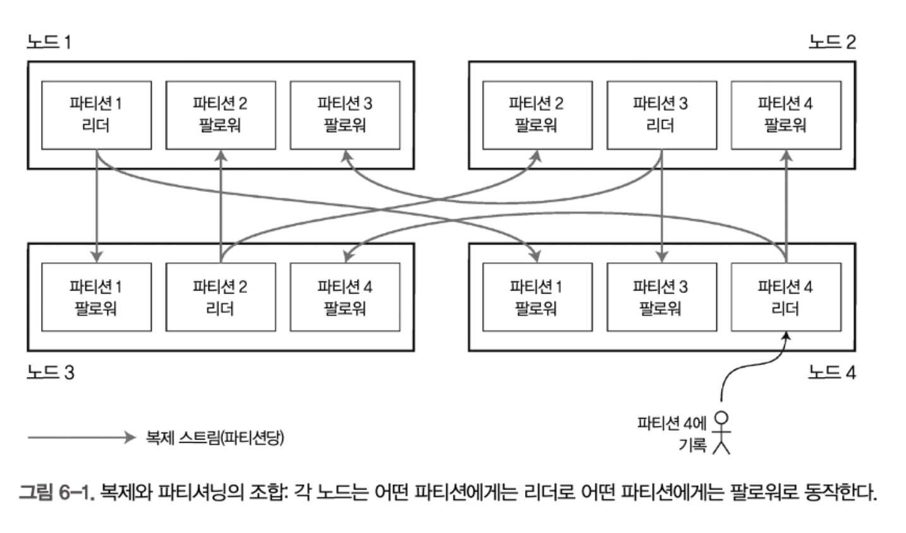
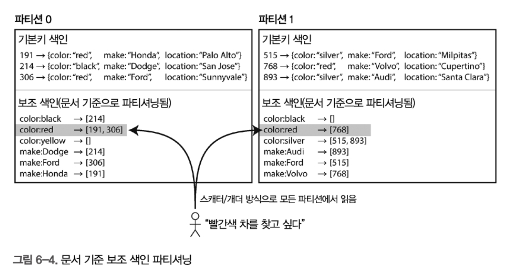
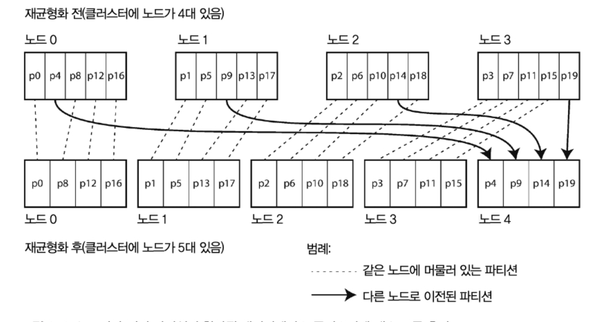
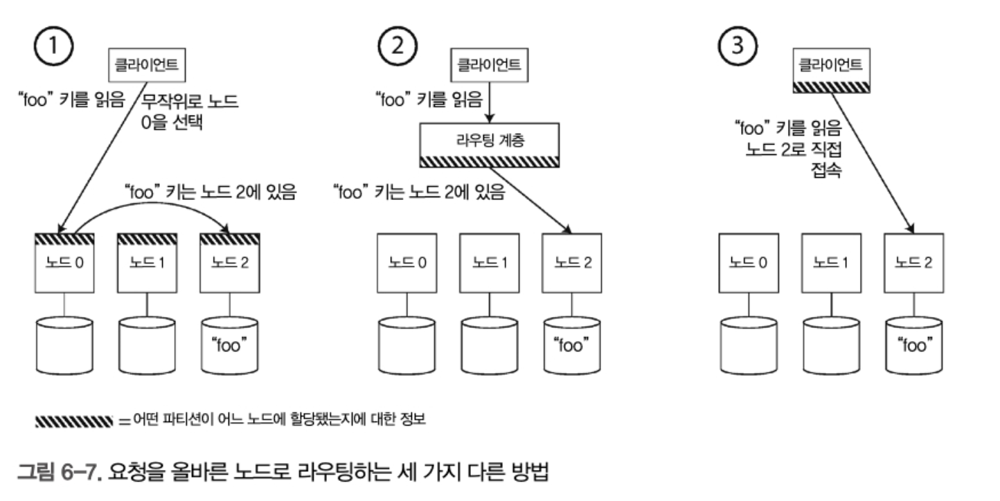
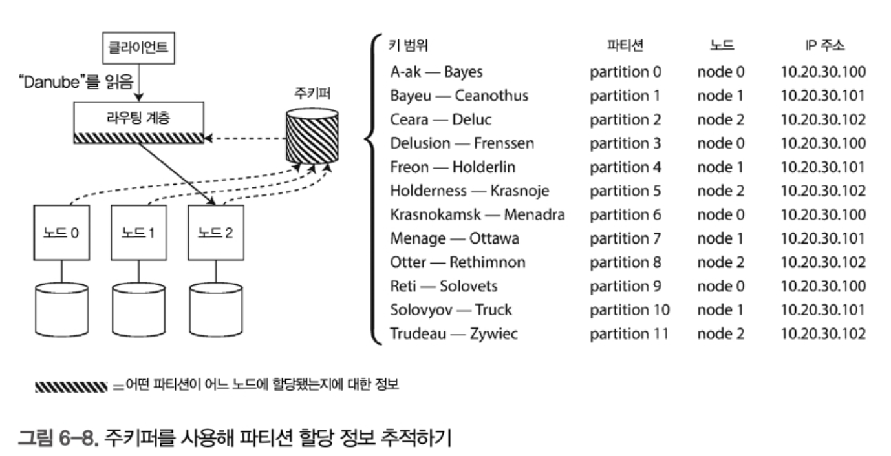

# 6장 파티셔닝(샤딩)

데이터셋이 매우 크거나 처리량이 높다면 복제만으로는 부족하고, 데이터를 파티셔닝 해야 한다.

샤딩이라고도 부른다.

* 파티션은 몽고디비, 엘라스틱서치 등에서는 샤딩에 해당하는 용어이다.

* RDB의 테이블 파티셔닝을 말하는것 같지는 않다.

파티셔닝의 주된 이유는 확장성이며, 단일 파티션에 실행되는 질의를 분산하여 처리량을 늘릴 수 있다.

## 파티셔닝과 복제

한 노드에 여러 파티션을 저장할 수 있다. 또한 각 팔로워들은 리더를 할당할 수 있다.



## 키-값 데이터 파티셔닝

대량의 데이터를 어느 노드에 저장해야 할까.

파티셔닝의 목적 : 데이터와 질의 부하를 노드 사이에 고르게 분산시키는것

특정 파티션에 데이터랑 질의가 몰리면 효과가 떨어지며 이것을 핫스팟이라고 한다.

핫스팟을 회피하는 간단한 방법은 무작위 분배지만, 어느 노드에 저장됐는지 알 수 없어 병렬적으로 질의를 실행해야 한다.

### 키 범위 기준 파티셔닝

데이터를 나누는 방법 중 하나로, **연속된 키 값의 범위(range)**를 기준으로 파티션을 나눈다.

어떤 키가 어디에 속하는지 **파티션 경계(boundary)**만 알면 쉽게 찾을 수 있고, 특정 노드로 직접 요청을 전달할 수 있다.

**장점**

파티션 내에서 키를 **정렬된 순서로 저장** 가능

이 정렬 덕분에 **범위 스캔(range scan)**에 유리

- 예: `timestamp` 기준으로 특정 월, 특정 일의 데이터를 연속적으로 조회 가능

연관된 레코드를 **연쇄된 색인(linked index)**으로 묶어 한 번에 읽는 쿼리 효율성 증가

**단점**

특정 시간대에 쓰기 요청이 **한 파티션에 집중**되는 문제가 발생

- 예: 오늘의 타임스탬프 데이터를 계속 쓰면, 오늘 파티션만 과부하됨
- 나머지 파티션은 데이터가 없거나 접근이 없음 → 자원 낭비

**해결 전략: 키 순서 변경 (Prefix 추가)**

- 타임스탬프가 키의 첫 요소면 안 됨.
- **센서 이름 + 타임스탬프** 형식으로 키를 구성
  - 예: `sensor123_2025-04-16T12:00:00`
- 이렇게 하면 동일한 시간에도 센서별로 파티션이 나뉘어 **쓰기 부하 분산**
- 단점: 시간 범위로 데이터를 조회하려면 **센서마다 개별 질의**가 필요

### 키의 해시값 기준 파티셔닝

키의 파티션을 정하는데 해시 함수를 사용하여 쏠림 현상과 핫스팟을 방지하려고 한다.

- 키 값에 **해시 함수**를 적용하여 얻은 숫자를 기준으로 파티션을 나눔.
- 해시값은 특정 범위 (예: 0 ~ 2³²-1) 안에서 **균일하게 분산**되도록 설계.

```
입력 키        → 해시 함수 → 해시값      → 파티션
"apple"       → hash()    → 4312501     → P2
"banana"      → hash()    → 1051234     → P1
"carrot"      → hash()    → 99881234    → P8
```

**장점**

- 쓰기 부하가 고르게 분산됨 → **핫스팟 방지**.
- 데이터 양에 비례해 노드 부하도 고르게 분산됨.

**단점**

- **범위 질의 불가능**: 인접 키들이 서로 다른 파티션에 분산됨.
- 예: `timestamp BETWEEN A AND B` → 모든 파티션에 질의해야 함.

**해시 기반 파티셔닝에서 주의할 점**

해시 함수의 조건

| 기준                                 | 설명                                                 |
| ------------------------------------ | ---------------------------------------------------- |
| 암호학적으로 강력할 필요 ❌           | MD5, FNV 등 빠르고 단순한 해시도 사용 가능           |
| 결과가 프로세스마다 달라지면 안 됨 ❌ | 예: Java `Object.hashCode()`는 JVM마다 달라져 부적합 |

`Consistent Hashing`은 원래 **CDN/캐시** 시스템에서 노드 추가·삭제에 따른 재배치 비용을 줄이기 위해 등장한 기법.

- **ACID의 "일관성(Consistency)"과 무관**
- **데이터베이스에선 잘 안 씀** → 실전에서 분산 데이터베이스들은 거의 사용 X
- 오해 방지를 위해 **"해시 파티셔닝"이라는 용어로 부르는 것이 정확**

카산드라는 해시와 레인지 파티셔닝 전략 사이에서 타협한다.

* 여러 칼럼 포함하는 복합 키본키 지정하고
* 키의 첫 부분에만 해싱을 적용해 파티션 결정에 사용하고, 남은 컬럼은 카산드라의 SS 테이블에서 데이터를 정렬하는 연쇄된 색인으로 사용 
* 첫번째 칼럼은 값 범위 검색 질의에 쓸순없지만, 키의 다른 컬럼에 대해선 범위 스캔 가능 

**타협 방식: Cassandra의 복합키 + 부분 해시 전략**

 **복합 기본 키 구조 예:**

```
PRIMARY KEY ((user_id), update_timestamp)
```

- **파티션 키**: `user_id` (해시됨 → 어떤 노드에 저장될지 결정)
- **클러스터링 키**: `update_timestamp` (정렬됨 → 내부 정렬 순서 유지)

### 💡 효과

- 동일한 `user_id`의 데이터는 **같은 파티션**에 모이게 됨.
- 내부적으로는 `update_timestamp` 기준으로 **정렬되어 저장**됨.

### 📚 예시


| user_id | update_timestamp    | 문서 내용 |
| ------- | ------------------- | --------- |
| u123    | 2025-04-10T10:01:00 | 문서 A    |
| u123    | 2025-04-10T10:05:00 | 문서 B    |
| u123    | 2025-04-10T10:10:00 | 문서 C    |

> 👉 `user_id = u123` 조건이 붙으면 → 한 파티션 내에서 `timestamp` 범위 스캔 가능
> 👉 다른 사용자의 데이터는 다른 파티션에 저장됨 → 분산 + 정렬 둘 다 챙김


### 쏠린 작업부하와 핫스팟 완화

해싱을 통한 파티션 키 방식은 무작위로 배포하므로 핫스팟을 줄이는데 도움이 되지만 완벽히 제거할 수는 없다.

* ex 소셜미디어에서 호날두 등

이런 경우, 애플리케이션에서 쏠림을 완화해야 한다.

* 각 키의 앞이나 뒤에 임의의 10진수 두개만 붙여도 됌 

동일한 키를 **여러 개의 분산된 키**로 쪼개어 저장 → 쓰기 요청이 여러 파티션으로 퍼지게 함

원래 키 : post:12345

쪼갠키 : 

```
post:12345:00
post:12345:01
...
post:12345:99  // 100개 버킷
```


그러나 읽을 때 문제가 생길 수 있다. 데이터는 여러 키(post:12345:00 ~ :99)에 쪼개졌기 때문에, 읽을 때는 **모든 키를 읽어서 병합**해야 함

**해결책**

- **애플리케이션 단**에서 키 조합 후 정렬 & 응답
- 병렬로 다중 파티션에서 읽는 병렬 쿼리 작성 필요
- 어느 키가 분산 대상인지 **메타데이터로 추적** 필요

## 파티셔닝과 보조 색인

보조 색인은 rdb나 document db에서 많이 쓰인다.


### 문서 기준 보조 색인 파티셔닝

예시 : 중고차 웹사이트. 각 항목 문서 ID 라는 고유 ID가 있고 이 기준으로 파티셔닝 

차 검색시 색상과 제조사로 필터링 하려면 보조 색인이 필요.



* 이렇게, 보조 색인으로 문서의 기본키를 색인해서 문서를 찾아가는 방법이다.

**각 파티션이 독립적**으로 작동하며, 자신에게 속한 **문서만 색인하고 처리**함.

파티션은 **자기 문서만 보조 색인에 등록**하며, 다른 파티션과는 상호작용하지 않음.

* 이래서 local index 라고도 한다 

**문제점: 스캐터/개더(Scatter/Gather)**

- 하나의 질의(ex. `"color = red"`)를 **모든 파티션에 전송(scatter)**해서
- 결과를 **모은 뒤(gather)** 하나로 합쳐야 하는 방식
- 파티션 수가 많을수록 **전체 쿼리 지연시간은 가장 느린 파티션에 좌우됨** (→ 꼬리 지연 시간 문제)
- 모든 노드에 질의를 날려야 하므로 CPU·네트워크 비용 증가

**장점**

* 단순성 : 각 파티션은 자기 문서만 책임져 설계 유지보수가 간단함
* 확장성 : 색인 유지시 전체 시스템 락 없이 파티션 독립적으로 확장 가능
* 쓰기 성능 : 하나의 파티션만 쓰기 갱신하면 됌

### 용어 기준 보조 색인 파티셔닝

각 파티션이 자신만의 보조(지역 색인)을 갖는 대신 모든 파티션의 데이터를 담당하는 전역 색인을 만들수도 있다.

하지만 전역 색인을 한 노드에 몰아넣으면 병목이 되므로, **색인 자체도 파티셔닝**해서 분산 저장해야 함.

**용어(term)에 따라 색인을 나누는 방식**

- 예: `color:red`라는 속성값을 색인한다고 해보자.
- 이때 `color:red`, `color:blue`, `color:yellow` 등의 **"용어"** 를 기준으로 색인을 분산 저장함.
- 그림에서처럼 다음과 같이 파티셔닝할 수 있음:
  - `color:a~r` → 파티션 0
  - `color:s~z` → 파티션 1

즉, **어떤 용어냐에 따라 색인을 담당하는 파티션이 다름.** 이 방식을 **"용어 기준 파티셔닝(term-partitioned)"** 이라고 함.

> 용어(term)란?
> 색인에 들어가는 단어 하나하나를 말함. 예를 들어 "red", "blue" 같은 값들.

**파티셔닝 기준은 실제 단어 or 해시값**

- `color:red` 같은 **실제 용어를 기준**으로 나누면 **범위 검색(예: 가격 범위 검색)** 에 유리함.
- 반대로 **용어의 해시값으로 나누면** 파티션 간에 **부하 분산이 더 균일**해짐.

####  장점: **읽기 속도 향상**

- 전통적인 문서 기준 색인은, 데이터를 읽을 때 **모든 파티션을 뒤져야(scatte/gather)** 함.
- 하지만 **용어 기준 색인**은 원하는 용어가 **어느 파티션에 있는지 알고** 있으니, 그 파티션만 조회하면 됨 → **빠름!**

#### 단점: **쓰기 복잡도 증가**

- 하나의 문서에 여러 용어가 포함될 수 있음 → 이 용어들이 각각 **다른 파티션에 걸쳐 있을 수 있음**
- 그래서 문서 하나를 저장해도 여러 파티션을 건드려야 함 → **쓰기 작업이 느려지고 복잡해짐**
- 이상적으로는 쓰자마자 색인도 함께 업데이트되어야 하지만,
  - 현실에서는 **비동기 갱신(Delayed Indexing)** 이 일반적
  - 예: DynamoDB는 보통 1초 안에 색인을 갱신하지만, 시스템 이상이 생기면 지연될 수도 있음


## 파티션 재균형화

시간이 지나면 DB에 변화가 생김

* 질의량이 증가해서 CPU를 추가
* 데이터가 커져서 사용할 디스크와 램 추가
* 장비 장애발생으로 다른 장비로 교체해야함

위 케이스 발생시, 데이터와 요청이 한 노드에서 다른 노드로 옮겨져야하는데 이것을 rebalancing이라고 한다.

어떤 파티셔닝 방식을 쓰는지에 무관하게 재균형화가 실행될 때 보통 만족시킬 것으로 기대되는 최소 요구사항

- 재균형화 후, 부하(데이터 저장소, 읽기 쓰기 요청)가 클러스터 내에 있는 노드들 사이에 균등하게 분배돼야 한다.
- 재균형화 도중에도 데이터베이스는 읽기 쓰기 요청을 받아들여야 한다
- 재균형화가 빨리 실행되고 네트워크와 디스크 VO 부하를 최소화할 수 있도록 노드들 사이에 데이터가 필요 이상으로 옮겨 져서는 안 된다.

### 재균형화 전략

파티션을 노드에 할당하는 몇가지 방법

#### 쓰면 안되는 방법 : 해시값에 mod N 연산을 실행

`hash(key) % N` 방식은 노드 수(N)가 바뀌면 **기존 데이터 대부분이 다른 노드로 이동**해야 함.

예:

- 노드가 10대일 때: `hash(key)=123456 → 123456 % 10 = 6번 노드`
- 노드가 11대 되면: `123456 % 11 = 3번 노드` → **키 재배치 필요**

**노드 수가 바뀔 때마다 대부분의 데이터를 다시 옮겨야 해서 재균형 비용이 너무 큼.**

#### 나은 방식: **파티션 수를 미리 많이 정해놓기** - 파티션 개수 고정

- **노드 수와 무관하게 파티션 수를 고정**시켜 놓고, 노드마다 여러 개의 파티션을 할당함.
- 예:
  - 처음부터 **1,000개 파티션**을 만들어 놓고,
  - 10개의 노드가 **100개씩 파티션을 나눠 가짐**

**장점**

- 노드 추가 시 → 기존 노드에서 몇 개 파티션만 **새 노드로 이동**시키면 끝.
- 노드 제거 시 → 해당 노드의 파티션을 **다른 노드로 재할당**하면 됨.
- **파티션 ID는 고정**이므로, 키가 속한 파티션도 변하지 않음 → **데이터는 일부만 이동하면 됨.**

데이터 이동시에

- **파티션 단위로 통째로 이동**함.
- 파티션 개수는 변하지 않음.
- **파티션 ↔ 노드 간의 관계만 바뀜**
- 네트워크를 통해 실제 데이터 복사가 필요하므로 반영에는 시간이 걸림.
  - 복사 도중에도 읽기/쓰기는 기존 노드가 담당함.



* 위 처럼 재균형을 할 수 있음

**주의점들**

- 파티션 개수는 **처음부터 충분히 크게 설정해야 함.**
  - 미래에 노드가 늘어날 수 있기 때문.
- 하지만 너무 많으면 → **파티션 관리 오버헤드**가 커짐.
- 적절한 파티션 수 = 운영 단순성 + 성능 + 유연성의 **균형 필요**

**파티션 크기 문제**

- 파티션 수는 고정되지만, **전체 데이터셋 크기는 시간이 지나면서 변할 수 있음**
- 그러면:
  - 파티션이 너무 커지면 → **복구/재분배 비용 증가**
  - 너무 작으면 → **관리 오버헤드 증가**
- **“적당한 파티션 크기”가 가장 성능 좋음**
  하지만 이 적정 크기를 미리 알기 어렵고, 파티션 수는 고정이니 고민 필요.


파티션 수는 고정시키고 노드에 유동적으로 재할당하는 방식이, 노드 수 변경 시 재균형 비용을 줄이는 가장 실용적인 전략이다.

### 동적 파티셔닝

동적 파티셔닝은 데이터 양에 따라 파티션을 자동으로 쪼개거나 병합해서, 부하 분산과 유연한 스케일링을 가능하게 만드는 전략

키 범위 파티셔닝(static range partitioning)의 문제는 파티션 경계를 **고정**해두면 잘못 설정할 경우 **데이터가 한쪽으로 쏠릴 수 있음**

그래서 파티션을 '자동'으로 쪼개고 합치는 방식이 있음.

**어떻게 동작하나?**

- 데이터가 몰린 파티션이 **크기 임계값**(ex. HBase는 기본 10GB)을 넘으면 → **자동으로 2개로 분할**
- 반대로 데이터가 많이 삭제돼서 너무 작아지면 → **인접 파티션과 자동 병합**
- 이 방식은 마치 **B-트리에서 노드 분할/병합**하는 것과 유사함

**해시 파티셔닝에도 적용 가능**

- 꼭 키 범위 파티셔닝만 되는 게 아님
- **MongoDB 2.4 이상**은 **키 범위 + 해시 파티셔닝 모두 동적 분할 지원**

### 노드 비례 파티셔닝

이 방식은 **노드 수에 비례해서 파티션 수를 정하는 방식**

- 예: 노드 하나당 256개 파티션 → 노드 10개면 총 2,560개 파티션

대표적인 사용 사례:

- **Cassandra**
- **Ketama (Consistent Hashing 기반 라이브러리**

**다른 파티셔닝 방식과의 차이**

| 방식                   | 파티션 수          | 파티션 크기                            |
| ---------------------- | ------------------ | -------------------------------------- |
| **고정 파티션 수**     | 고정               | 데이터 증가 → 파티션 커짐              |
| **동적 파티셔닝**      | 데이터 크기에 비례 | 크기 일정 (최소~최대 범위 유지)        |
| **노드 비례 파티셔닝** | **노드 수에 비례** | **노드 수 증가 시 → 파티션 크기 감소** |

* 즉, **데이터가 많아지면 노드도 추가될 가능성이 높고**, 그에 맞춰 **파티션 수도 같이 늘어나도록** 설계된 방식

**장점**

- **데이터 증가 = 노드 증가 → 파티션 증가 → 자동 부하 분산**
- 노드 수에 따라 파티션 수가 자동으로 조절되므로 **파티션 크기 안정성** 유지
- **파티션 경계를 해시로 무작위 생성** → 특정 키에 치우침 방지
- 일관성 해싱(Consistent Hashing)의 본래 아이디어에 충실한 구현

단점

* **분할의 불균형 가능성** : 무작위 선택이기 때문에, 어떤 노드는 많이, 어떤 노드는 적게 가져갈 수 있음
* **메타데이터 오버헤드** : 파티션 수가 많으면 메타데이터도 많아짐

### 운영: 자동 재균형화와 수동 재균형화

리밸런싱은 자동으로 해야할까 수동으로 해야할까.

자동 재균형화의 장점과 단점

**장점**

- 운영자가 개입하지 않아도 되므로 **유지보수가 편함**
- 노드 추가/제거 시 빠르게 반응 가능 → **확장성과 자가 복구에 유리**

 **단점**

- **언제 실행될지 예측하기 어려움**
  → 재균형화는 **무거운 작업**이므로 트래픽 많은 시간대에 실행되면 **성능 저하 발생**
- 요청 경로 변경 + 데이터 대량 이동 → **네트워크 및 노드에 부하**
- **장애 감지와 자동화가 엮이면 위험**:
  - 예: 한 노드가 일시적으로 느려지면 → 죽은 걸로 간주하고 파티션 이동 시도
  - → 결과적으로 **정상 노드에 더 큰 부하**, **연쇄 장애** 가능성 있음

**운영에서의 균형 잡기**

- **완전 자동**:
  → **운영 자동화 수준이 높고**, 시스템 부하에 여유 있는 환경에서 적합
- **완전 수동**:
  → 안정성과 예측 가능성이 중요할 때 적합 (ex. 대형 금융 서비스)
- **반자동(제안 + 승인)**:
  → **운영자 통제력**과 **시스템 자동성**의 균형을 맞추는 현실적인 선택
  → 대부분의 분산 시스템에서 선호됨

운영에서는 가능하다면 개발자의 승인을 거치는 반자동 방식이 예측 가능성과 안정성을 동시에 확보하는 현실적인 해법이다.

## 요청 라우팅

여러 노드로 파티셔닝을 하더라도, 어느 노드로 접속해야 하는 라우팅 문제가 남아있음.

이 문제는 서비스 디스커버리의 일종임.

몇가지 방법이 있음

1. 클라이언트가 아무 노드에 접속하고, 요청을 전달. 올바르지 않으면 올바른 노드로 전달
2. 클라이언트 모든 요청을 라우팅 계층으로 보내고, 라우터가 처리할 노드를 알아내서 전달
3. 클라이언트가 파티셔닝 방법과 파티션이 어느 노드에 할당됐는지를 알게 하면됌. 



그러나 위 방법들은, 모든 곳에서 정보가 일치해야 해서 다루기 어려움. 요청이 잘못된 노드로 전송될수도 있기 때문임.

때문에 다른 방법이 나옴



주키퍼 같은 분산 코디네이터로 클러스터 메타데이터를 추적함.

각 노드는 주키퍼에 자신을 등록하고 주키퍼는 파티션과 노드사이 할당 정보를 관리함. 

클라이언트는 이것을 구독해서 정보가 바뀌면 라우터에 이를 알려 라우팅 정보를 갱신함

카프카도, 몽고디비도 이것과 비슷한 원리로 사용함

카산드라는 gossip protocol을 사용해서 클러스터 상태 변화를 노드 사이에 전파함. 

* 외부 코디네이션 서비스를 의존하지 않음
* 가십은 마치 사람들이 **소문을 퍼뜨리는 방식**과 유사해서 **Gossip(가십)** 이라는 이름이 붙음
* 네트워크에 연결된 노드끼리 자기들끼리 무작위로 선택해서 연결해서 정보공유함.

## 정리

파티셔닝의 목적은 불균형으로 높은 부하를 받는 핫스팟 문제를 생기지 않게 하면서 데이터와 질의 부하를 여러 장비에 균일하게 분배해야 한다. 

두가지 주요 파티셔닝 기법은

* 키 범위 : 키가 정렬되있고 개별 파티션이 특정 범위를 담당함
* 해시 파티셔닝 : 각 키에 해시 함수를 적용하고 개별 파티션은 특정 범위의 해시를 담당함

두 방법을 섞어 일부분은 파티션 식별, 나머지는 정렬 순서용으로 만든 복합키를 쓸수도 있다.

### rdb

- **키 예시**: `(user_id, created_at)`
- **파티셔닝 방식**
  - **해시 파티셔닝**: `user_id % N` 으로 파티션 분리 (ex: `PARTITION BY HASH(user_id)`)
  - **키 범위 파티셔닝**: `created_at` 기준 날짜 범위로 분리 (ex: 월별 파티션)
  - **복합키 예시**: `user_id`로 해시 파티셔닝 후, 파티션 내 `created_at`으로 정렬

mongodb

- **키 예시**: `{ userId: ObjectId, timestamp: ISODate }`
- **파티셔닝 방식**
  - **해시 파티셔닝**: `userId`를 해싱하여 shard 선택 (`hashed` shard key)
  - **키 범위 파티셔닝**: `timestamp` 기준 범위로 shard 분리
  - **복합키 예시**: `{ userId: hashed, timestamp: range }` 형태의 복합 shard key 구성 가능

redis

- **키 예시**: `user:12345:cart`
- **파티셔닝 방식**
  - **해시 파티셔닝만 가능**: Redis Cluster는 **CRC16 해시 함수**를 사용하여 키를 16384 슬롯 중 하나에 매핑
  - `{}` 안의 문자열 기준으로 해시됨 → `user:{12345}:cart` → `12345` 기준으로 해시됨
  - **키 범위 파티셔닝은 직접 구현 필요** (ex: 앱단에서 prefix 조작으로 의사 범위 분리)

cassandra

- **키 예시**: `(user_id, created_at)` → **partition key + clustering column**
- **파티셔닝 방식**
  - **해시 파티셔닝**: `user_id`를 파티션 키로 → 내부적으로 Murmur3 해시 사용
  - **키 범위 (클러스터링 키)**: `created_at`을 클러스터링 키로 사용해 **정렬 순서** 보장
  - **복합키 예시**: `PARTITION KEY(user_id), CLUSTERING COLUMN(created_at)` → 해시+정렬 혼합


| DB            | 키 예시                 | 파티셔닝 방식              | 복합키 사용             |
| ------------- | ----------------------- | -------------------------- | ----------------------- |
| **RDB**       | `(user_id, created_at)` | 해시, 범위, 복합 모두 지원 | O                       |
| **MongoDB**   | `{ userId, timestamp }` | 해시, 범위, 복합 모두 지원 | O                       |
| **Redis**     | `user:{12345}:cart`     | 해시만 (자동)              | X (해시 tag 활용)       |
| **Cassandra** | `(user_id, created_at)` | 해시 + 범위 (내부 지원)    | O (파티션 + 클러스터링) |

예를 들어 한 파티션에는 쓰기 성공했지만 다른 파티션에서 실패하면 어떻게 될까? 이어지는 장에 서 이 의문을 다룬다.

