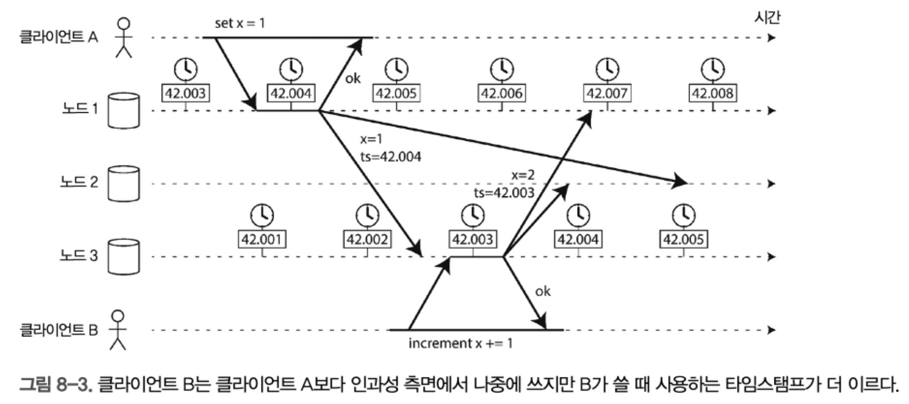
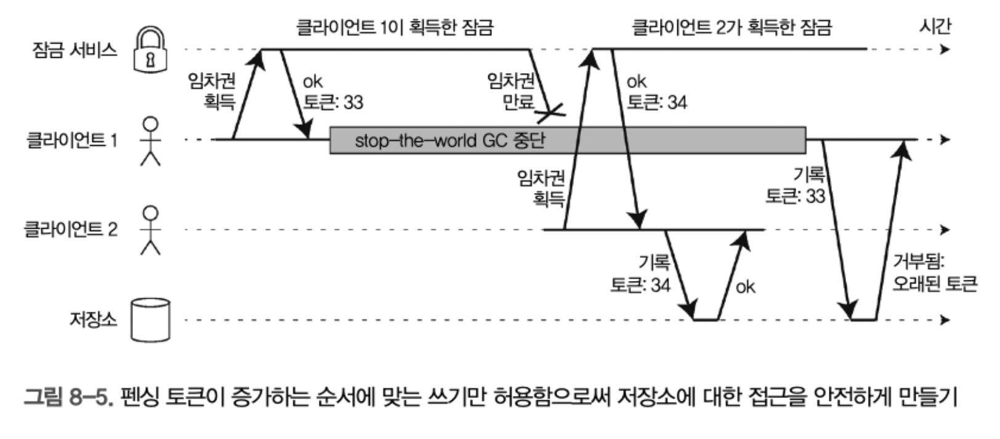

# 8장 분산 시스템의 골칫거리


## 결함과 부분 장애

단일 컴퓨터에서는 오류가 날 확률이 적지만, 네트워크로 연결된 분산시스템에서는 예측할 수 없는 방식으로 고장이 난다. 이것을 부분 장애 라고 한다 (partial failure).

### 클라우드 컴퓨팅과 슈퍼컴퓨팅

슈퍼컴퓨터는 단일장비에 수천개의 시피유가 있다. 단일 노드에 더 가깝다.

그러나 클라우드는 좀 다르다. 분산 시스템으로 여러 작은 컴퓨터가 연결되어있다.

분산 시스템은 부분 장애 가능성을 받아들이고, 소프트웨어에 내결함성 메커니즘을 넣어서 신뢰성을 구축해야 한다 

## 신뢰성 없는 네트워크

인터넷과 데이터 센터 내부 네트워크 대부분은 비동기 패킷 네트워크로 구현되어있다. 

노드는 다른 노드로 패킷을 보낼 수 있지만, 언제 도착할지 혹은 도착하기 할것인지 보장하지 못한다. 

이런 문제를 타임아웃으로 다뤄서 시간이 지나면 도착하지 않는다고 가정해버린다.

### 현실의 네트워크 결함

### 결함 감지

결함있는 노드를 자동 감지 할 수 있어야 한다

* 로드 밸런서는 죽은 노드로 요청을 보내면 안됌 
* 리더 복제 상황에서 리더 장애시 팔로워가 리더로 승격되어야 함

이런경우 헬스체크같은 자체 요청 응답 시스템을 통해 만료 시간이 지날동안 응답이 안오면 장애로 판단해야 한다.

### 타임아웃과 기약 없는 지연

그렇다면 타임아웃이 길면 노드가 죽었다고 선언될 떄까지 기다리는 시간이 길어진다

짧으면 빨리 발견하지만, 일시적인 느려짐인데 장애로 판별하는 문제가 생긴다 

* 노드가 죽지 않았는데 과부하로 인해 응답이 느릴수도 있음
* 이 노드의 부하를 다른 노드로 전달하면 연쇄 장애도 유발 가능함

그래서 아래의 계산식을 이용하는게 좋다

* 모든 패킷은 어떤 시간 d 내에 전송되거나 손실되지만 결코 d보다 더 걸리지 않음
* 장애가 없는 정상 노드는 항상 요청을 r 시간 내에 처리함
* 그렇다면 성공한 노드는 2d + r 시간 내 응답을 받음 => 2d + r = 타임아웃 시간

### 네트워크 혼잡과 큐 대기

네트워크에서 패킷 지연은 큐 대기 때문인 경우가 많음.

* 여러 노드가 동시에 같은 목적지로 패킷을 보내려고 하면, 스위치는 패킷을 큐에 넣고 한번에 하나씩 목적지 링크로 넘김. 네트워크가 붐비면 패킷은 슬롯을 얻을때까지 대기함. 그러나 스위치 큐를 꽉 채우면 패킷 유실이 발생할 수 있어 재전송 해야하는 케이스도 존재
* 패킷이 장비에 도착해도 CPU가 바쁘다면 네트워크에서 들어온 요청은 애플리케이션에서 처리할 준비가 될때까지 os가 큐에 넣어둠.
* TCP는 흐름제어를 수행하는데, 노드가 부하가 걸리지 않도록 자신의 송신율을 제한함.

> tcp vs udp
>
> 화상 회의, 인터넷 전화 같은 지연 시간에 민감한 애플리케이션은 UDP를 사용한다.
>
> UDP는 흐름 제어를 하지 않고 손실된 패킷을 재전송하지 않아서 지연 시간을 크게 감축한다
>
> UDP는 지연된 데이터 가치가 없는 상황에서 선택하면 좋다. 

어찌저찌해서 타임아웃값을 결정해도 지정한 값보다 지연되는 케이스도 있다.

이런 것들을 더 낫게 하기 위해 고정 타임아웃 대신 jitter값을 추가해서 타임아웃을 조정하는것이 좋다 

### 동기 네트워크 대 비동기 네트워크

전화 통화시 네트워크에서는 circuit(회선)이 만들어지는데, 그 통화에 대해 고정되고 보장된 양의 대역폭이 할당된다.

이런 방식은 동기식이다. 큐 대기가 없다. 이를 제한 있는 지연이라고 한다


#### 네트워크 지연을 예측가능하게 하는법

전화와 다르게 TCP는 할당된 대역폭이 아니고, TCP 네트워크 대역폭을 기회주의적으로 사용한다.

전송할때 가능한 한 빨리 패킷을 보내기 위해 서로 경쟁한다. 네트워크 혼잡, 큐 대기, 기약 없는 지연이 발생할 것이라고 가정해야 한다. 결과적으로 타임아웃에 "올바른" 값은 없으며 실험을 통해 결정해야 한다.

## 신뢰성 없는 시계

### 단조 시계 대 일 기준 시계

컴퓨터는 최소 2가지 시계를 갖고있음.

time-of-day 일 기준 시계와 monotonic clock - 단조 시계

#### 일 기준 시계

일 기준 시계는 어떤 달력에 따라 현재 날짜와 시간을 반환함.

linux의 clock_gettime과 자바의 System.currentTimeMills(). epoch 이래로 흐른 초 수를 반환함

* 에포크는 UTC 1970년 1월1 일 자정

Netowrk Time Protocol 이라는 NTP로 서로 동기화 됌.

* 앞으로도, 뒤로도 바뀔 수 있음.
* 시간 조정때문에 시간 흐름이 왜곡될 수 있어 경과 시간 측정용으로 부적절.

#### 단조 시계

시작 이후부터 단조롭게 증가하는 시간값을 나타냄.

* 절대 뒤로 되돌아 가지 않음. 

타임아웃이나 서비스 응답시간 같은 지속 시간을 재는데 적합함.

자바의 System.nanoTime. 단조 시간은 항상 앞으로 흐른다. 

```kotlin
// 단조 시계: 성능 측정용
val start = System.nanoTime()
// 작업 수행
val elapsed = System.nanoTime() - start

// 일 기준 시계: 현재 날짜/시간
val now = LocalDateTime.now()
```

### 이벤트 순서화용 타임스탬프.

여러 노드에 걸친 이벤트들의 순서를 정할 때, 누가 먼저 쓰게 될까? 누가 쓴게 최근 것이 될까?



* x = 1을 쓰는 타임스탬프는 42.004초, x =2를 쓰는 타임스탬프는 42.003초 이므로, x = 1이 더 최신이여서 x =2를 하는 값은 버려질 수 있다. 

이런 문제는 순서가 꼬여버린 문제이다. 네트워크 혼잡이 있을시 오차는 무조건 발생할 수 밖에 없다.

구글은 각 데이터센터에 gps 수신기나 원자 시계를 배치해서 시계가 약 7밀리초 이내로 동기화 되게 한다고 한다.

## 지식, 진실, 그리고 거짓말

### 진실은 다수결로 결정된다

장애가 난 노드를 판별하는것은 쉽지 않음.

* 자신에게 보내는 메시지는 모두 받지만 내보내는 메시지는 유실되거나 지연된다면 그 노드는 장애라고 보여짐
* 긴 stop-the-world 가비지 컬렉션이 생기게된다면 노드는 장애는 아니지만 타임아웃 때문에 장애라고 보여짐

여러 분산 알고리즘은 정족수(quorum)인 노드들 사이의투표에 의존한다.

여기에는 노드가 죽었다고 선언하는 것에 관한 결정도 포함된다. 

정족수를 이룬 노드들이 다른 노드를 죽었다고 선언하면 그 노드는 여전히 살아 있다고 매우 확실히 느낄지라도 죽은 것으로 간주돼야 한다. 그 개인 노드는 정족수를 이룬 결정에 따라서 물러나야 한다.

노드의 과반 수 이상을 정족수로 삼는게 흔하다.  과반수 정족수 사용시 특정 노드들에 장애가 나도 계속 동작 가능하다.

* 노드가 3대면 한대 장애여도 ok, 5대면 2대 장애여도 ok

#### 리더와 잠금

오직 하나만 필요한 경우?

* 한 노드만 db 파티션의 리더
* 동시 쓰기 방지 위해 락 사용
* 유일 식별자를 사용해야 해서 한명의 사용자만 특정 사용자명으로 등록

어떤 노드가 잠금을 획득했더라도, 다른 노드들이 그 노드가 죽었다고 선언하면 그 노드는 강등되고 리더는 바뀐다

#### 펜싱 토큰

이 잘못된 것이라도 판단되는 노드가 나머지 시스템을 방해할 수 없도록 보장하는 방법으로 펜싱이 있다.



잠금 서버가 잠금이나 임차권 승인시마다 펜싱 토큰도 반환한다고 가정한다.

펜싱 토큰은 잠금이 승인시마다 증가하는 숫자다. 

이 토큰이 잠금 서버가 가지고 있는 토큰 값보다 요청온 토큰 값이 작다면 이 요청을 거부한다.

* 이미 처리되었기 때문

* 잠금 서비스로 주키퍼를 사용하면 트랜잭션 ID zxid나 노드 버전 cversion을 펜싱 토큰으로 사용할 수 있다.

### 비잔틴 결함

펜싱 토큰은 부주의에 대한 오류 (자신의 락 만료시간이 지난 경우)에 빠진 노드를 감지하고 차단 가능하다.

그러나, 노드가 받지 않은 특정 메시지를 받았다고 주장하는 거짓말 문제가 발생하면 큰 오류가 발생한다.

이것을 비잔틴 결함이라고 한다. 

일부 노드가 오작동하고 프로토콜을 준수하기 않거나, 악의적인 공격자가 네트워크를 방해하더라도 시스템이 올바르게 동작한다면 이 시스템은 비잔틴 내결함성을 지닌다고 한다.


## 정리

이번 장에서는 분산 시스템에서 나타날 수 있는 광범위한 문제를 설명했다. 몇 가지를 뽑아보면

- 네트워크로 패킷을 보내려고 할 때는 언제나 패킷이 손실되거나 임의대로 지연될 수 있다. 마찬가지로 응답도 손실되거나 지연될 수 있으므로 응답을 받지 못하면 메시지가 전달됐는지 아닌지를 알 수 없다.
- 노드의 시계는 다른 노드와 심하게 맞지 않을 수 있고(최선을 다해 NTP를 설정하더라도) 시간이 갑자기 앞뒤로 뛸 수도 있 다. 그리고 시계의 오차 구간을 측정할 좋은 수단이 없을 가능성이 크므로 시계에 의존하는 것은 위험하다.
- 프로세스는 실행 도중 어느 시점에서 (아마도 stop-the-world 가비지 컬렉션 때문에) 상당한 시간 동안 멈출 수 있고 다른 노드에 의해 죽었다고 선언될 수 있으며 되살아났을 때 멈췄다는 사실을 알지 못할 수도 있다.


분산시스템에서 네트워크 패킷 손실이나 시간문제로 인해 반드시 장애가 발생한다는 것을 인지하고 개발해야 한다. 

