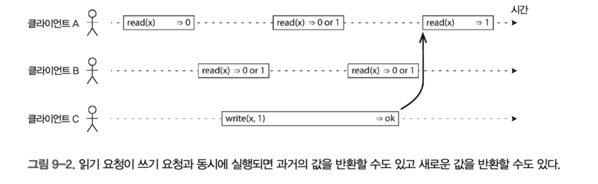
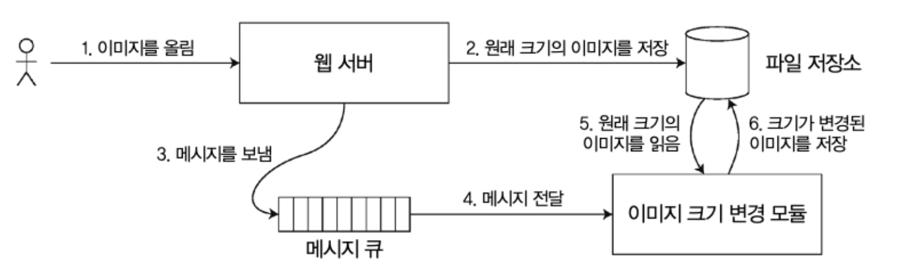

# 9장: 일관성과 합의

내결함성을 견뎌낼 수 있는 분산 시스템을 구축하는데 쓰이는 알고리즘과 프로토콜의 몇가지 예를 소개한다.

내결함성을 지닌 시스템을 구축하는 방법은, 애플리케이션에서 특정 범용 추상화를 찾아 이것에 의존하게 하는것

* 분산 트랜잭션처럼


또한 분한 시스템에 중요한 추상화는 합의이다. 모든 노드가 어떤것에 동의하게 만드는것. 

* 디비 리더 죽었을 시, 리더를 선출하는것 등

## 일관성 보장

복제 디비는 최소한 최종 일관성을 제공함. 어쩌다 타이밍에 의해 불일치가 발생할 수 있음.

데이터 시스템은 더 강한 일관성 모델을 제공할 수 있는데, 이것은 성능이 나쁘거나 약한 보장을 제공하는 시스템보다 내결함성이 약할 수 있음. 

## 선형성

데이터 복제본이 하나만 있다면 모든 클라이언트는 복제 지연을 걱정할 필요가 없다는 것에서 나온 방법

이것이 선형성을 뒷바침하는 아이디어

* 원자적 일관성, 강한 일관성, 즉각 일관성, 외부 일관성 이라고도 함

선형 시스템에서는 클라이언트가 쓰기성공하자마자 그 데이터베이스를 읽는 모든 클라이언트는 방금 쓰여진 값을 볼 수 있어야함.

### 시스템에 선형성을 부여하는 것은 무엇인가?



그림 9-2에서 x의 값은 처음에 0이고 클라이언트 C가 그 값을 1로 설정하는 쓰기 요청을 실행한다.

이게 실행되는 동안 클라이언트 A와 B는 최신 값을 읽기 위해 반복적으로 데이터베이스를 폴링한다. A와 B는 자신의 읽기 요청에 대해 어떤 응답을 받을 수 있을까?

- 클라이언트 A가 실행한 첫 번째 읽기 연산은 쓰기가 시작하기 전에 완료되므로 이전 값인 0을 반환해야 하는 게 명백하다.
- 클라이언트 A가 실행한 마지막 읽기는 쓰기가 완료된 후 시작하므로 데이터베이스가 선형적이라면 명백히 새로운 값 1을 반환해야 한다. 쓰기는 쓰기 연산의 시작과 끝 사이의 어느 시점에선가 처리됐어야 하고 읽기는 읽기 연산의 시작과 끝 사 이의 어느 시점에선가 처리됐어야 한다. 만약 쓰기가 끝난 후에 읽기가 시작하면 그 읽기는 쓰기 후에 처리됐어야 하고 따 라서 새로 쓰여진 값을 볼 수 있어야 한다.

이것만으로는 부족하고,  선형 시스템에서는, 한 클라이언트의 읽기가 새로운 값을 반환한다면 이후의 모든 읽기도 새로운 값을 반환해야 한다. 쓰기 연산이 완료되지 않았더라도.

* 즉 쓰기시간이 읽기시간과 겹치면 그 시간 포함 이후는 반드시 같은 결과가 나와야 함

책에서는 compare-and-set 연산처럼 특정 어떤 레지스터를 두고 그 값을 계속 비교하면서 조회핸다고 말함.. 이걸 어떻게 구현하지?

### 선형성에 기대기

#### 잠금과 리더 선출

단일 리더 복제시, 리더 선출하는 한 방법은 잠금 이용. 잠금 획득 시도 후 성공한 노드가 리더. 

보통 이를 위해 아파치 주키퍼나 etc같은 코디네이션 서비스가 사용됌. 

#### 제약조건과 유일성보장

데이터 기록시, 분산 디비에서 강제하고싶으면 선형성이 필요함.

사용자명을 기록시 잠금을 획득해서 처리해야함. 

유니크 키가 분산 RDB이면 동작할까?

#### 채널간 타이밍 의존성

컴퓨터 시스템에서 새로고침 안하면 점수조회시 점수가 제대로 안나올 수 있음.



위 시스템처럼, 파일 저장 서비스가 선형적이면 잘 동작하지만, 비선형적이면 이미지 변경 모듈이 메시지 읽을시, 이미지가 저장되지 않았을 수도 있음.

이 문제는 웹 서버와 크기 변경 모둘사이에 두가지 다른 통신 채널이 있기 때문임. 

그러므로 타이밍을 잘 맞추도록 설계해야 함 

### 선형성 시스템 구현하기

선형의 근본 : 복사본이 하나만 있는것처럼 동작하고, 데이터에 실행되는 모든 연산은 원자적으로 동작한다. 

#### 선형성과 정족수

다이나모 스타일 리더 없는 복제는 선형성(linearizability)을 보장하지 못한다.

왜? 왜 이런 일이 일어날까?

- **비동기 복제**: 쓰기 완료 후에도 네트워크 지연·장애로 일부 노드에 새 값 전파가 늦어질 수 있음
- **읽기 경로 상의 노드 불일치**: 서로 다른 정족수(r=2)가 겹치더라도, “최신 상태”를 모두 보장하진 않음

이 때문에 **W + R > n** 조건만으로는 선형성을 담보할 수 없다.

보장하려면

1. **동기식 읽기 복구(Read Repair)**
   - 읽기할 때, 서로 다른 복제본들의 값을 비교·병합하고—
   - 읽기 클라이언트가 반환 전에 “모든 정족수 노드에 최신값으로 고쳐쓰기”를 동기적으로 수행
2. **선(先) 읽기 후(後) 쓰기**
   - 쓰기 클라이언트가 쓰기 요청을 보내기 전에 미리 정족수 노드에서 최신값을 읽고,
   - 그 값을 바탕으로 다시 쓰기(버전 충돌 방지)

하지만 둘 다 **성능 저하**가 크기 때문에 대부분의 다이나모 계열 시스템은 **비동기식(read repair 지연)** 방식을 택해 “최종 일관성(eventual consistency)”을 우선한다.

즉

**Leader 없는 Dynamo 스타일 복제**는 높은 가용성과 확장성을 주지만

**동시성(anomaly)** 상황에서 **선형성(linearizability)** 은 보장하지 않음

보장하려면 **읽기 복구**나 **사전 읽기** 같은 추가 작업이 필요하고, 이로 인해 성능이 크게 떨어진다

#### 선형성의 비용

1. **지연(latency) 증가**
   - 모든 쓰기/읽기가 리더나 다수 노드의 승인을 기다림
   - 지리적으로 멀리 떨어진 데이터센터 간 동기화 시 왕복 시간(RTT)이 크게 늘어남
     *예: 서울→미국 데이터센터 왕복 시 100ms 이상 지연*
2. **가용성(availability) 저하**
   - 네트워크 분할(partition) 시
     - **단일 리더**: 팔로워만 접속하는 클라이언트는 리더와 연결 불가 → 읽기·쓰기 중단
     - **분산 합의**: 과반수 노드가 살아 있어야만 작동 → 3노드 클러스터 중 2개만 가용해도 OK, 하지만 그 미만일 경우 서비스 정지
       *예: 지점 A와 B 간 연결 끊기면, 지점 B 로컬에서 동작하던 앱이 먹통이 될 수 있음*
3. **처리량(throug­hput) 감소**
   - 쓰기 승인을 받기 위해 여러 노드에 동시 요청 → 스루풋이 순수 비동기 시스템보다 낮음
   - 동시성 제약이 강해 핫스팟(데이터 집중) 구간에서 병목 가능
4. **운영 복잡도 증가**
   - 장애 조치(failover), 리더 선출(election), 타임아웃 튜닝 필요
   - 네트워크 지연·비정상 노드 탐지·재동기화 로직 복잡

따라서

- **일관성 우선** → 금융 거래, 결제 시스템 등
  단일 리더 동기 복제나 분산 합의 적용
- **가용성·응답성 우선** → 소셜 피드, 로그 수집 등
  비동기 복제(다이나모 스타일) 사용

**항상 “성능 vs 일관성 vs 가용성”** 세 요소의 균형을 고민하며 설계해야 한다.

#### Cap 정리

- **C(Consistency, 일관성)**
  모든 클라이언트가 항상 같은 최신 데이터를 볼 수 있는 성질. 선형성(linearizability)이 대표적 예.
- **A(Availability, 가용성)**
  모든 요청에 대해 오류가 아닌 응답(성공 또는 실패 메시지)을 항상 반환하는 성질.
- **P(Partition tolerance, 분단 내성)**
  네트워크 분할(서로 연결이 끊긴 노드 그룹)이 발생해도 시스템이 계속 동작하는 능력.

Eric Brewer가 2000년경 제안한 경험 법칙으로,

> “네트워크 분할이 일어날 때는 일관성과 가용성 중 하나만 온전히 선택할 수 있다”
> 라는 트레이드오프를 강조한 것이 CAP 정리의 핵심

## 트레이드오프

| 상황               | 가능한 선택지        | 결과                                                     |
| ------------------ | -------------------- | -------------------------------------------------------- |
| 네트워크 정상      | C와 A 모두 만족 가능 | 선형성 읽기·쓰기 + 항상 응답                             |
| 네트워크 분할 발생 | C 우선 선택 → A 희생 | 중단 없이 최신 데이터 보장, 일부 노드에선 응답 지연/거부 |
| 〃                 | A 우선 선택 → C 희생 | 항상 응답 가능, 일부 요청은 구식 데이터 반환             |

- **C 우선**: 금융 결제, 송금 시스템 등 “정확한 최신 상태”가 필수인 애플리케이션
- **A 우선**: 소셜 피드, 로깅, 분석 시스템 등 “지연 없이 계속 동작”이 중요한 애플리케이션

**CAP 정리의 한계와 오해**

1. **P(분단 내성)는 결함이지 선택지가 아니다**
   - 네트워크 분단은 피할 수 없는 현실이므로, “C·A·P 중 둘만 선택”이라는 표현은 부정확
   - 올바르게는 “분단 시 C와 A 중 하나를 희생해야 한다”는 의미로 이해해야 함
2. **정의의 모호성**
   - 일관성(Consistency) 정의가 여러 가지 (선형성, 일관된 뷰, 원자성 등)
   - 가용성(Availability)도 “응답을 보장” vs “서비스 수준(응답 시간) 보장”으로 혼동
3. **범위가 너무 좁음**
   - 오직 “선형성”＋“네트워크 분단”만 다루고, 네트워크 지연, 서버 실패, 장애 회복, 성능 등의 현실적 변수는 제외
   - 동시성, 복제 지연, 충돌 해소, 일관성 모델 다양화 등 복잡한 분산 시스템 디자인을 포괄하지 못함
4. **현대 시스템에서는 더 정교한 이론으로 대체됨**
   - **CAP** 이후에 나온 **PACELC**, **CALM**, **WARS** 같은 모델들이
     - 분할 시 트레이드오프뿐 아니라
     - 분할 “외”(Else) 상황에서도 지연(Latency) vs 일관성(Consistency)을 함께 고민하도록 확장함


**CAP 정리는 분산 시스템 설계의 출발점**으로 유용하지만, 실제 시스템을 선택·설계할 때는

- 분할 외에도 “지연, 장애 회복, 충돌 해소, 일관성 강도 등” 다양한 요소와
- 애플리케이션 요구사항(트래픽 패턴, 지연 허용치, 데이터 민감도 등)을 함께 고려해야 함.

최신 분산 데이터베이스나 캐시 시스템은 대부분 CAP보다 세밀한 **다중 수준의 일관성 모델**을 제공하므로,

- 반드시 “CAP 중 둘만”이 아니라
- “운영 환경과 요구에 맞는 일관성·지연·가용성의 균형”을 찾아야 함

잠깐 파셀 이론좀 이야기해볼까?

*  CAP 정리의 한계를 보완하기 위해 나온 PACELC 이론

```
P  – Partition tolerance (분단 내성)
A  – Availability     (가용성)
C  – Consistency      (일관성)
E  – Else             (분단이 없을 때)
L  – Latency          (지연)
C  – Consistency      (일관성)
```

- **분단(Partition) 시**: CAP와 마찬가지로
  - **P vs AC** → “Partition 시 A(가용성) 우선” vs “C(일관성) 우선”
- **분단이 없을 때(Else)**:
  - **EL vs EC** → “지연(Latency)을 줄이기 위해 A 쪽(분산 비동기 복제)을 택할지” vs “강한 일관성(C)을 위해 동기 복제·합의를 택할지”

즉,

> **PACELC**:
>
> - 분단될 때( P )는 A vs C
> - 분단이 없을 때( E )는 L vs C

를 선택해야 한다는 모델

| 상황               | 옵션 1 (지연 우선)   | 옵션 2 (일관성 우선)    |
| ------------------ | -------------------- | ----------------------- |
| **분단 시 (P)**    | A: 계속 응답         | C: 오류 반환하거나 대기 |
| **정상 시 (Else)** | L: 비동기 복제, 캐시 | C: 동기 복제, 합의      |

#### 선형성과 네트워크 지연

 Attiya–Welch의 정리: 선형성의 불가피한 지연

- **주장**: 선형성을 보장하는 읽기·쓰기의 **응답 시간**은
  네트워크 지연의 **불확실성(variability)** 이상이어야 한다

- 즉,

  > *“어떤 알고리즘을 써도, 네트워크 왕복 시간(RTT) 불확실성만큼의 지연을 넘어서지 못한다.”*

- **결과**:

  - 지연이 심한(높거나 변동이 큰) 환경에서는 선형성 오버헤드가 더욱 커진다
  - 반면 **완화된 일관성**(eventual, causal, session 등)은 RTT를 기다리지 않으므로 훨씬 빠름

| 구분                 | 선형성(linearizability)                        | 완화된 일관성(relaxed)               |
| -------------------- | ---------------------------------------------- | ------------------------------------ |
| 지연(latency)        | 네트워크 RTT 불확실성만큼 **반드시** 지연 발생 | 로컬 응답만으로 가능 → **낮은** 지연 |
| 성능(performance)    | **낮음** (동기화·합의 오버헤드)                | **높음** (비동기 처리)               |
| 가용성(availability) | 네트워크 지연·분단 시 **중단**                 | 계속 응답 가능                       |


- **지연에 민감한 서비스**(실시간 피드, 게임, IoT 등)는
  → 선형성보다 **완화된 일관성**을 선택하는 것이 실용적
- **정확한 최신 상태**가 절대적으로 필요한 서비스(금융 트랜잭션 등)는
  → 선형성을 선택하되, **응답 지연**과 **가용성 제한**을 감수