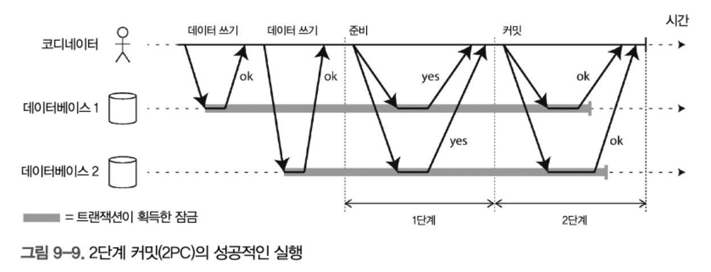

# 9장: 일관성과 합의

내결함성을 견뎌낼 수 있는 분산 시스템을 구축하는데 쓰이는 알고리즘과 프로토콜의 몇가지 예를 소개한다.

내결함성을 지닌 시스템을 구축하는 방법은, 애플리케이션에서 특정 범용 추상화를 찾아 이것에 의존하게 하는것

* 분산 트랜잭션처럼


또한 분한 시스템에 중요한 추상화는 합의이다. 모든 노드가 어떤것에 동의하게 만드는것. 

* 디비 리더 죽었을 시, 리더를 선출하는것 등

## 일관성 보장

복제 디비는 최소한 최종 일관성을 제공함. 어쩌다 타이밍에 의해 불일치가 발생할 수 있음.

데이터 시스템은 더 강한 일관성 모델을 제공할 수 있는데, 이것은 성능이 나쁘거나 약한 보장을 제공하는 시스템보다 내결함성이 약할 수 있음. 

## 선형성

데이터 복제본이 하나만 있다면 모든 클라이언트는 복제 지연을 걱정할 필요가 없다는 것에서 나온 방법

이것이 선형성을 뒷바침하는 아이디어

* 원자적 일관성, 강한 일관성, 즉각 일관성, 외부 일관성 이라고도 함

선형 시스템에서는 클라이언트가 쓰기성공하자마자 그 데이터베이스를 읽는 모든 클라이언트는 방금 쓰여진 값을 볼 수 있어야함.

### 시스템에 선형성을 부여하는 것은 무엇인가?


그림 9-2에서 x의 값은 처음에 0이고 클라이언트 C가 그 값을 1로 설정하는 쓰기 요청을 실행한다.

이게 실행되는 동안 클라이언트 A와 B는 최신 값을 읽기 위해 반복적으로 데이터베이스를 폴링한다. A와 B는 자신의 읽기 요청에 대해 어떤 응답을 받을 수 있을까?

- 클라이언트 A가 실행한 첫 번째 읽기 연산은 쓰기가 시작하기 전에 완료되므로 이전 값인 0을 반환해야 하는 게 명백하다.
- 클라이언트 A가 실행한 마지막 읽기는 쓰기가 완료된 후 시작하므로 데이터베이스가 선형적이라면 명백히 새로운 값 1을 반환해야 한다. 쓰기는 쓰기 연산의 시작과 끝 사이의 어느 시점에선가 처리됐어야 하고 읽기는 읽기 연산의 시작과 끝 사 이의 어느 시점에선가 처리됐어야 한다. 만약 쓰기가 끝난 후에 읽기가 시작하면 그 읽기는 쓰기 후에 처리됐어야 하고 따 라서 새로 쓰여진 값을 볼 수 있어야 한다.

이것만으로는 부족하고,  선형 시스템에서는, 한 클라이언트의 읽기가 새로운 값을 반환한다면 이후의 모든 읽기도 새로운 값을 반환해야 한다. 쓰기 연산이 완료되지 않았더라도.

* 즉 쓰기시간이 읽기시간과 겹치면 그 시간 포함 이후는 반드시 같은 결과가 나와야 함

책에서는 compare-and-set 연산처럼 특정 어떤 레지스터를 두고 그 값을 계속 비교하면서 조회핸다고 말함.. 이걸 어떻게 구현하지?

### 선형성에 기대기

#### 잠금과 리더 선출

단일 리더 복제시, 리더 선출하는 한 방법은 잠금 이용. 잠금 획득 시도 후 성공한 노드가 리더. 

보통 이를 위해 아파치 주키퍼나 etc같은 코디네이션 서비스가 사용됌. 

#### 제약조건과 유일성보장

데이터 기록시, 분산 디비에서 강제하고싶으면 선형성이 필요함.

사용자명을 기록시 잠금을 획득해서 처리해야함. 

유니크 키가 분산 RDB이면 동작할까?

#### 채널간 타이밍 의존성

컴퓨터 시스템에서 새로고침 안하면 점수조회시 점수가 제대로 안나올 수 있음.


위 시스템처럼, 파일 저장 서비스가 선형적이면 잘 동작하지만, 비선형적이면 이미지 변경 모듈이 메시지 읽을시, 이미지가 저장되지 않았을 수도 있음.

이 문제는 웹 서버와 크기 변경 모둘사이에 두가지 다른 통신 채널이 있기 때문임. 

그러므로 타이밍을 잘 맞추도록 설계해야 함 

### 선형성 시스템 구현하기

선형의 근본 : 복사본이 하나만 있는것처럼 동작하고, 데이터에 실행되는 모든 연산은 원자적으로 동작한다. 

#### 선형성과 정족수

다이나모 스타일 리더 없는 복제는 선형성(linearizability)을 보장하지 못한다.

왜? 왜 이런 일이 일어날까?

- **비동기 복제**: 쓰기 완료 후에도 네트워크 지연·장애로 일부 노드에 새 값 전파가 늦어질 수 있음
- **읽기 경로 상의 노드 불일치**: 서로 다른 정족수(r=2)가 겹치더라도, “최신 상태”를 모두 보장하진 않음

이 때문에 **W + R > n** 조건만으로는 선형성을 담보할 수 없다.

보장하려면

1. **동기식 읽기 복구(Read Repair)**
   - 읽기할 때, 서로 다른 복제본들의 값을 비교·병합하고—
   - 읽기 클라이언트가 반환 전에 “모든 정족수 노드에 최신값으로 고쳐쓰기”를 동기적으로 수행
2. **선(先) 읽기 후(後) 쓰기**
   - 쓰기 클라이언트가 쓰기 요청을 보내기 전에 미리 정족수 노드에서 최신값을 읽고,
   - 그 값을 바탕으로 다시 쓰기(버전 충돌 방지)

하지만 둘 다 **성능 저하**가 크기 때문에 대부분의 다이나모 계열 시스템은 **비동기식(read repair 지연)** 방식을 택해 “최종 일관성(eventual consistency)”을 우선한다.

즉

**Leader 없는 Dynamo 스타일 복제**는 높은 가용성과 확장성을 주지만

**동시성(anomaly)** 상황에서 **선형성(linearizability)** 은 보장하지 않음

보장하려면 **읽기 복구**나 **사전 읽기** 같은 추가 작업이 필요하고, 이로 인해 성능이 크게 떨어진다

#### 선형성의 비용

1. **지연(latency) 증가**
   - 모든 쓰기/읽기가 리더나 다수 노드의 승인을 기다림
   - 지리적으로 멀리 떨어진 데이터센터 간 동기화 시 왕복 시간(RTT)이 크게 늘어남
     *예: 서울→미국 데이터센터 왕복 시 100ms 이상 지연*
2. **가용성(availability) 저하**
   - 네트워크 분할(partition) 시
     - **단일 리더**: 팔로워만 접속하는 클라이언트는 리더와 연결 불가 → 읽기·쓰기 중단
     - **분산 합의**: 과반수 노드가 살아 있어야만 작동 → 3노드 클러스터 중 2개만 가용해도 OK, 하지만 그 미만일 경우 서비스 정지
       *예: 지점 A와 B 간 연결 끊기면, 지점 B 로컬에서 동작하던 앱이 먹통이 될 수 있음*
3. **처리량(throug­hput) 감소**
   - 쓰기 승인을 받기 위해 여러 노드에 동시 요청 → 스루풋이 순수 비동기 시스템보다 낮음
   - 동시성 제약이 강해 핫스팟(데이터 집중) 구간에서 병목 가능
4. **운영 복잡도 증가**
   - 장애 조치(failover), 리더 선출(election), 타임아웃 튜닝 필요
   - 네트워크 지연·비정상 노드 탐지·재동기화 로직 복잡

따라서

- **일관성 우선** → 금융 거래, 결제 시스템 등
  단일 리더 동기 복제나 분산 합의 적용
- **가용성·응답성 우선** → 소셜 피드, 로그 수집 등
  비동기 복제(다이나모 스타일) 사용

**항상 “성능 vs 일관성 vs 가용성”** 세 요소의 균형을 고민하며 설계해야 한다.

#### Cap 정리

- **C(Consistency, 일관성)**
  모든 클라이언트가 항상 같은 최신 데이터를 볼 수 있는 성질. 선형성(linearizability)이 대표적 예.
- **A(Availability, 가용성)**
  모든 요청에 대해 오류가 아닌 응답(성공 또는 실패 메시지)을 항상 반환하는 성질.
- **P(Partition tolerance, 분단 내성)**
  네트워크 분할(서로 연결이 끊긴 노드 그룹)이 발생해도 시스템이 계속 동작하는 능력.

Eric Brewer가 2000년경 제안한 경험 법칙으로,

> “네트워크 분할이 일어날 때는 일관성과 가용성 중 하나만 온전히 선택할 수 있다”
> 라는 트레이드오프를 강조한 것이 CAP 정리의 핵심

## 트레이드오프

| 상황               | 가능한 선택지        | 결과                                                     |
| ------------------ | -------------------- | -------------------------------------------------------- |
| 네트워크 정상      | C와 A 모두 만족 가능 | 선형성 읽기·쓰기 + 항상 응답                             |
| 네트워크 분할 발생 | C 우선 선택 → A 희생 | 중단 없이 최신 데이터 보장, 일부 노드에선 응답 지연/거부 |
| 〃                 | A 우선 선택 → C 희생 | 항상 응답 가능, 일부 요청은 구식 데이터 반환             |

- **C 우선**: 금융 결제, 송금 시스템 등 “정확한 최신 상태”가 필수인 애플리케이션
- **A 우선**: 소셜 피드, 로깅, 분석 시스템 등 “지연 없이 계속 동작”이 중요한 애플리케이션

**CAP 정리의 한계와 오해**

1. **P(분단 내성)는 결함이지 선택지가 아니다**
   - 네트워크 분단은 피할 수 없는 현실이므로, “C·A·P 중 둘만 선택”이라는 표현은 부정확
   - 올바르게는 “분단 시 C와 A 중 하나를 희생해야 한다”는 의미로 이해해야 함
2. **정의의 모호성**
   - 일관성(Consistency) 정의가 여러 가지 (선형성, 일관된 뷰, 원자성 등)
   - 가용성(Availability)도 “응답을 보장” vs “서비스 수준(응답 시간) 보장”으로 혼동
3. **범위가 너무 좁음**
   - 오직 “선형성”＋“네트워크 분단”만 다루고, 네트워크 지연, 서버 실패, 장애 회복, 성능 등의 현실적 변수는 제외
   - 동시성, 복제 지연, 충돌 해소, 일관성 모델 다양화 등 복잡한 분산 시스템 디자인을 포괄하지 못함
4. **현대 시스템에서는 더 정교한 이론으로 대체됨**
   - **CAP** 이후에 나온 **PACELC**, **CALM**, **WARS** 같은 모델들이
     - 분할 시 트레이드오프뿐 아니라
     - 분할 “외”(Else) 상황에서도 지연(Latency) vs 일관성(Consistency)을 함께 고민하도록 확장함


**CAP 정리는 분산 시스템 설계의 출발점**으로 유용하지만, 실제 시스템을 선택·설계할 때는

- 분할 외에도 “지연, 장애 회복, 충돌 해소, 일관성 강도 등” 다양한 요소와
- 애플리케이션 요구사항(트래픽 패턴, 지연 허용치, 데이터 민감도 등)을 함께 고려해야 함.

최신 분산 데이터베이스나 캐시 시스템은 대부분 CAP보다 세밀한 **다중 수준의 일관성 모델**을 제공하므로,

- 반드시 “CAP 중 둘만”이 아니라
- “운영 환경과 요구에 맞는 일관성·지연·가용성의 균형”을 찾아야 함

잠깐 파셀 이론좀 이야기해볼까?

*  CAP 정리의 한계를 보완하기 위해 나온 PACELC 이론

```
P  – Partition tolerance (분단 내성)
A  – Availability     (가용성)
C  – Consistency      (일관성)
E  – Else             (분단이 없을 때)
L  – Latency          (지연)
C  – Consistency      (일관성)
```

- **분단(Partition) 시**: CAP와 마찬가지로
  - **P vs AC** → “Partition 시 A(가용성) 우선” vs “C(일관성) 우선”
- **분단이 없을 때(Else)**:
  - **EL vs EC** → “지연(Latency)을 줄이기 위해 A 쪽(분산 비동기 복제)을 택할지” vs “강한 일관성(C)을 위해 동기 복제·합의를 택할지”

즉,

> **PACELC**:
>
> - 분단될 때( P )는 A vs C
> - 분단이 없을 때( E )는 L vs C

를 선택해야 한다는 모델

| 상황               | 옵션 1 (지연 우선)   | 옵션 2 (일관성 우선)    |
| ------------------ | -------------------- | ----------------------- |
| **분단 시 (P)**    | A: 계속 응답         | C: 오류 반환하거나 대기 |
| **정상 시 (Else)** | L: 비동기 복제, 캐시 | C: 동기 복제, 합의      |

#### 선형성과 네트워크 지연

 Attiya–Welch의 정리: 선형성의 불가피한 지연

- **주장**: 선형성을 보장하는 읽기·쓰기의 **응답 시간**은
  네트워크 지연의 **불확실성(variability)** 이상이어야 한다

- 즉,

  > *“어떤 알고리즘을 써도, 네트워크 왕복 시간(RTT) 불확실성만큼의 지연을 넘어서지 못한다.”*

- **결과**:

  - 지연이 심한(높거나 변동이 큰) 환경에서는 선형성 오버헤드가 더욱 커진다
  - 반면 **완화된 일관성**(eventual, causal, session 등)은 RTT를 기다리지 않으므로 훨씬 빠름

| 구분                 | 선형성(linearizability)                        | 완화된 일관성(relaxed)               |
| -------------------- | ---------------------------------------------- | ------------------------------------ |
| 지연(latency)        | 네트워크 RTT 불확실성만큼 **반드시** 지연 발생 | 로컬 응답만으로 가능 → **낮은** 지연 |
| 성능(performance)    | **낮음** (동기화·합의 오버헤드)                | **높음** (비동기 처리)               |
| 가용성(availability) | 네트워크 지연·분단 시 **중단**                 | 계속 응답 가능                       |


- **지연에 민감한 서비스**(실시간 피드, 게임, IoT 등)는
  → 선형성보다 **완화된 일관성**을 선택하는 것이 실용적
- **정확한 최신 상태**가 절대적으로 필요한 서비스(금융 트랜잭션 등)는
  → 선형성을 선택하되, **응답 지연**과 **가용성 제한**을 감수

  ## 순서화 보장

순서화란   연산들이 “잘 정의된 한 줄”로 늘어서 실행된 것처럼 보이도록 보장하는 것

- **왜 중요한가?**
  - 개발자가 시스템 상태 변화를 직관적으로 이해하고 예측 가능
  - 동시성으로 인한 충돌·불일치(race, stale read)를 막아 안정성 향상

순서화의 세 가지 구현 방식 예시

| 방식                                   | 목적                                                       | 예시                                            |
| -------------------------------------- | ---------------------------------------------------------- | ----------------------------------------------- |
| ① **단일 리더 복제**                   | 모든 쓰기는 리더가 복제 로그에 순서대로 기록하도록 강제    | MySQL Primary–Replica, MongoDB Primary          |
| ② **트랜잭션 직렬화(Serializability)** | 동시 실행 트랜잭션을 어떤 순서에 “직렬 실행”한 것처럼 보장 | 관계형 DB의 2PL(이중 잠금), 낙관적 동시성 제어  |
| ③ **합의(consensus)**                  | 여러 복제본이 동일한 순서로 상태 변경을 적용하도록 합의    | Raft, Paxos, Google Spanner의 TrueTime 기반 2PC |

 “순서화” vs “선형성” vs “합의”

- **순서화(ordering)**: 연산들이 어떤 순서에 따라 실행된 것처럼 보이게 하는 **추상적 개념**
- **선형성(linearizability)**: 그 순서가 “실제 시간”과 일치하도록 더 엄격히 보장하는 **일관성 모델**
- **합의(consensus)**: 노드 간에 그 순서를 **합의**하기 위한 **프로토콜·알고리즘**

> 요약하자면,
>
> 1. **순서화**는 “한 줄 순서”를,
> 2. **선형성**은 “실제 일어난 순서와 일치하는 한 줄 순서”를,
> 3. **합의**는 “분산 환경에서 그 한 줄 순서를 정하기 위한 절차”를 의미

### 순서화와 인과성

인과적 의존성(causal dependency)이란 **원인→결과 관계**

- 어떤 이벤트 A가 이벤트 B의 원인이라면, A가 반드시 B보다 “먼저” 발생해야 한다는 관계

- 람포트의 happened-before (→) 정의:
  1. 같은 프로세스 내부의 순차적 이벤트: A → B
  2. 메시지 송신(send) → 메시지 수신(receive)
  3. 전단계 관계의 추이적 합성: A → B, B → C ⇒ A → C
- “동시(concurrent)”인 이벤트는 인과 관계가 없음

**분산 시스템에서 인과성 위반 예**

1. **다중 리더 복제 지연**
   - 노드 A에서 쓰기 W1 발생 → 노드 B, C에 전파 지연
   - 같은 키에 대한 다른 쓰기 W2가 C에 먼저 반영 → C 관점에서 “U on non-existent row”처럼 보임
2. **스냅숏 격리(예: Snapshot Isolation)**
   - 트랜잭션이 스냅숏에서 읽을 때, 답변이 포함돼 있으면 질문도 포함돼야 함
   - “답변→질문” 순서의 스냅숏은 인과성-불일치

선형성은 인과성뿐 아니라 동시적 이벤트 간 전체 순서를 보장하지만 비용이 크고 지연이 높음

인과적 일관성은 **인과적 순서만** 보장해, 대부분의 실제 애플리케이션 요구(질문→응답, 생성→갱신)를 만족시키면서도 성능과 가용성을 크게 개선할 수 있습니다.

#### 인과적 순서가 전체 순서는 아니다.

전체 순서(total order)란?

- **정의**: 집합의 어떤 두 원소를 언제나 비교할 수 있어야 하는 순서
  - 예: 자연수 집합 ℕ 에서 임의의 두 수 5와 13을 비교하면 “5 < 13” 이라고 말할 수 있음

부분 순서(partial order)란?

**정의**: 모든 원소 쌍을 비교할 수 있는 것은 아니고,

- 어떤 경우엔 A < B, 또는 B < A 를 말할 수 있지만
- 어떤 쌍은 “비교 불가(incomparable)”

**예시**: 집합 집합 (power set)

- A = {1,2}, B = {3,4} 에 대해
  - A⊆B 도 B⊆A 도 아니어서 “A < B” 또는 “B < A” 를 말할 수 없음

인과적 순서(causal order)

- **정의**: “원인→결과” 관계가 있는 연산 쌍에 대해서만 순서를 매기는 것
  - A가 B의 원인(causal dependency)이면 A → B (A가 먼저)
  - A와 B가 동시적(concurrent)이면 순서가 **정해지지 않음** (비교 불가)
- **특징**:
  1. **인과 관계가 있는** 연산에는 순서를 강제
  2. **동시성** 이벤트 쌍에는 아무 순서도 강제하지 않음

**전체 순서**: 모든 연산들이 하나의 단일 타임라인에 완전히 정렬되어야 함

**인과적 순서**:

- **원인→결과** 만 순서화
- 동시적(인과 관계 없는) 이벤트는 자유롭게 섞여도 무방

선형적 데이터 스토어에는 동시적 연산이 없다. 순서가 정해져야 한다. 

따라서 **인과적 순서**는 “부분 순서(partial order)”이며,
 **전체 순서(total order)** 를 요구하는 선형성보다 느슨한 모델.


어떤 연산이 다른 연산보다 먼저 실행됐는지 결정하는 기법은 과거, 버전 벡터를 이용했다.

### 일련번호 순서화

“일련번호(sequence number)”를 이용해 이벤트를 전체 순서화하면서도 인과성을 보존하는 방법

인과추적은, 모든 읽기 쓰기간의 인과 관계를 일일이 기록해야 해서 비용이 너무큼 < 큰 단점 

**논리적 시계(일련번호) 개념**

- **논리적 시계**란 물리 시간이 아니라 “연산마다 증가하는 카운터”를 쓰는 것
- 모든 연산에 **고유한 일련번호**(또는 타임스탬프)를 부여 → 전체 순서(total order) 생성

단일 리더 복제개념

- **리더(Primary)** 가 매 쓰기마다 내부 카운터를 ++
- 복제 로그(log)에 `⟨seq, 연산 내용⟩` 형태로 기록
- **팔로워(replicas)** 는 로그에 나온 순서대로(증가하는 seq 순서) 연산 적용
  - 팔로워가 뒤쳐져 있어도,
  - 항상 “리더가 보장한 인과 순서”를 지켜 실행 → 인과적 일관성 확보

분산환경에서는 어떻게?

* 중앙 카운터 방식

  - **장점**: 구현 단순, 항상 전역 순서 보장

  - **단점**: 카운터 병목, 단일 장애점(SPOF)

* Lamport 클록

  - 각 노드가 로컬 카운터 유지

  - **이벤트 발생** 시 `C_local++`

  - **메시지 전송** 시 `ts = C_local`, 메시지에 붙여 보냄

  - **메시지 수신** 시 `C_local = max(C_local, ts)+1`

  - → **인과성 보존** (A→B이면 ts(A)<ts(B)) + **전체 비교 가능**

#### 비인과적 일련번호 생성기

노드별 독립 카운터 방법

**방법**

- 노드마다 고유한 식별자 비트를 포함한 카운터를 독립 증가
- 예: 노드 A는 2k+0, 노드 B는 2k+1 형태로 seq 생성

**인과성 실패 예**

- 노드 A가 짝수 `100`을 발급한 뒤 그 값을 기반으로 작업 B 실행
- 노드 B가 홀수 `101`을 발급하기 전이라면 A→B 인과 관계인데도,
- 노드 B가 더 빠른 속도로 `103,105,…`를 발급해 `103`이 A의 `100`보다 **크지만**,
  실제론 B 작업이 A 이전에 일어났을 수도 있음 → 인과 순서 역전

물리적 타임스탬프 방법

**방법**

- 각 연산에 OS/하드웨어 시계 기준 타임스탬프 부착

**인과성 실패 예**

- 노드 A의 작업이 `t = 10:00:01.500` 에 실행 → ts=1.500s
- 노드 B의 작업이 네트워크 지연에도 불구하고 `t = 10:00:01.400` 로 클럭 스큐로 인해 낮은 ts 부여
- 실제론 A→B 인과 관계여도 ts(B)<ts(A) → 순서 오류

블록 할당 (번호 블록 선할당)

- **방법**
  - 노드 A: seq 1–1000, 노드 B: seq 1001–2000 … 블록별로 독립 사용
- **인과성 실패 예**
  - A가 블록 1–1000에서 `500` 발급 후 A→B 인과적 쓰기
  - B가 블록 1001–2000에서 이미 `1200` 사용 → B 작업은 `1200`으로 표시
  - 이후 A가 블록 소진 시 새 블록(예: 2001–3000) 할당 받아 `2001` 발급 →
    B 작업(`1200`)보다 seq가 **크지만**, 실제론 B→A 순서일 수도 있음

위 세가지 방법의 공통 원인은 무엇일까/

1. **발급 속도 차이**
   - 노드별 처리량·부하가 달라, 순번 간 “실제 발생 순서”와 일치하지 않음
2. **시계 불일치(스큐)**
   - 물리 클럭 오차로 causal 순서 역전
3. **블록 경계 이슈**
   - 블록 재할당 타이밍이 인과 관계와 무관


**비인과적 시퀀스**는 확장성·가용성을 높여주지만,

**인과적 일관성**을 보장하지 못한다(→ causal consistency 위반).

인과성 보존이 필요하다면 **Lamport 클록**이나 **벡터 클록** 같은 논리적 시계를 도입해야 한다.

#### 램포트 타임스탬프

**램포트 타임스탬프(Lamport Timestamp)**는 분산 환경에서도 **인과적 일관성(causal consistency)** 을 보장하면서도, 모든 연산에 대해 “전체 순서(total order)”를 부여하는 간단한 논리적 시계 기법

기본 아이디어를 보자

**노드별 카운터 유지**한다

- 각 노드는 자신이 처리한 연산 수를 카운터(`C`)로 갖고 있다.
- 이 카운터에 **노드 ID**를 결합해 `(C, ID)` 쌍을 **유일한 타임스탬프**로 사용

**인과성 보존**된다

- 모든 메시지(요청/응답)에는 송신 시점의 **최대** 카운터 값을 포함
- 수신 노드는 “자신의 카운터 < 받은 최대값” 이면 **즉시** 카운터를 그 값으로 올림
- 그 뒤 연산을 실행할 때 `C++` 한 후 `(C, ID)`를 부여

**전체 순서화**한다

- 두 타임스탬프 `(C₁, ID₁)`와 `(C₂, ID₂)`를 비교할 때
  1. `C₁ < C₂` 이면 첫 번째가 “이전”
  2. `C₁ == C₂` 이면 `ID₁ < ID₂` 로 결정
- 결과적으로 모든 연산에 대해 **단일 타임라인**을 그릴 수 있음

그러나, 왜 Lamport TS만으로는 충분하지 않다. 

- **사후 정렬만 가능**: 모든 타임스탬프를 모아 보면 순서는 알 수 있지만,
  “지금 이 순간 이 연산이 순번 최종 위치에서 안전히 성공 처리될 수 있는가?” 는 알 수 없다.
- **예: 사용자명 중복 체크**
  1. 노드 A/B가 동시 요청을 받아 각각 ts(A)=10, ts(B)=11 부여
  2. 나중에 정렬해보면 A 먼저 성공, B 실패로 결정 가능
  3. 하지만 A 노드가 요청 즉시 “지금 성공해도 안전한가?” 판단하려면
     - B가 더 낮은 ts로 동일 연산을 처리할 가능성이 완전히 사라졌음을 확인해야 함
     - 즉, **다른 모든 노드가** 관련 연산을 처리하지 않았다는 걸 **보장**받아야 함 → 네트워크 체크·합의가 필요

이처럼 Lamport 타임스탬프는 “인과적 전체 순서”를 **사후적으로** 제공하지만,
 “**언제** 그 순서가 확정되는지”는 알려주지 않기 때문에,
 실시간으로 유일성·직렬성 제약을 강제하려면 **전체 순서 브로드캐스트(또는 합의 프로토콜)** 같은 추가 메커니즘이 필요하다.

### 전체 순서 브로드 캐스트

기존 두 환경의 차이와 문제점을 보자

**단일 CPU 환경**

- 한 코어에서 실행되는 프로그램은 명령 수행 순서가 곧 전체 연산 순서
- 별도의 순서 합의 작업이 필요하지 않음

**분산 시스템 환경**

- 여러 대의 서버(노드)가 병렬로 연산을 수행
- “A 연산” → “B 연산” 순서가 모든 노드에서 일치해야 일관성 유지
- 여기서의 **문제**: 타임스탬프나 메시지 일련번호만으로는 네트워크 지연·장애 상황에서 순서 일치를 완벽히 보장하기 어려움

전체 순서 브로드캐스트는 모든 노드가 **같은 메시지**를 **같은 순서**로 받아 처리하도록 보장하는 프로토콜로, 두가지 핵심 속성이 있다 

1. **신뢰성 있는 전달 (Reliable Delivery)**
   - 노드 A가 브로드캐스트한 메시지는 결코 사라지지 않고,
   - 결국 네트워크가 복구되면 모든 정상 노드가 그 메시지를 수신함
2. **전체 순서 정해진 전달 (Totally Ordered Delivery)**
   - 메시지 M₁, M₂, … 에 대해,
   - 모든 노드가 같은 순서(예: M₂ → M₁ → M₃)가 되도록 수신함

왜 이게 필요한지 보자.

**데이터베이스 복제 (State Machine Replication)**
 모든 쓰기 연산을 메시지로 보고, 같은 순서로 처리하면 복제본 상태 일관성 유지

**직렬성 트랜잭션**
 결정적 트랜잭션 호출(스토어드 프로시저 등)을 메시지로 보고, 순서대로 실행

**펜싱 토큰(fencing token)**
 잠금 요청을 로그에 메시지로 추가하고, 순번을 토큰으로 활용

구현 방법은?

**장애 허용(가용성)**

- 네트워크 단절 또는 노드 고장 시에도
  - 재시도 로직을 통해 메시지 누락 방지
  - 복구 후에도 원래 순서대로 전달

**합의 서비스 활용**

- ZooKeeper, etcd, Consul 등은 내부적으로 이 프로토콜을 이용
- Raft·Paxos 기반 합의 알고리즘과 밀접한 관계

**성능과 확장성**

- 단일 리더(Leader)가 모든 메시지 순서를 매기는 구조 → 처리량 한계
- 리더 장애 시 빠른 리더 전환(Leader Election) 필요

동작 원리 예시

1. **리더 기반 브로드캐스트**
   - 노드 중 하나를 리더로 선출
   - 클라이언트 요청은 모두 리더에게 전송
   - 리더가 순서를 매겨 다른 팔로워에게 순차 전파
2. **로그 복제**
   - 리더 로그에 메시지 저장 → 팔로워에 복제 → 커밋 순서 보장
   - 커밋된 로그의 순서가 전체 순서

### 전체 순서 브로드 캐스트를 사용해 선형성 저장소 구현하기

용어 다시 정리 : 선형성 vs 전체 순서 브로드캐스트(Total Order Broadcast; TOB))

| 구분            | 선형성(linearizability)                                      | 전체 순서 브로드캐스트(TOB)                                  |
| --------------- | ------------------------------------------------------------ | ------------------------------------------------------------ |
| 무엇을 보장하나 | 각 연산이 일어난 실제 시간 순서에 부합하여 읽기/쓰기 모두 최신성을 보장 | 메시지(연산)가 모든 노드에 **동일한 순서**로 **손실 없이** 전달됨(신뢰성+순서화) – **언제** 전달될지는 미정 |
| 동기 vs 비동기  | 읽기/쓰기 모두 동기적: *“지금” 쓰여진 내용이 곧바로 보임*    | 비동기적: 순서는 보장하지만, 특정 노드가 메시지를 받을 **시점**은 지연될 수 있음 |
| 강도 비교       | TOB가 제공하는 순서 보장 위에 읽기 최신성까지 더해야 선형성 달성 | TOB만으로는 읽기 최신성 보장 불가 → *TOB + 추가 메커니즘*으로 선형성 구현 가능 |

예시로

> **목표**: “alice” 같은 사용자명(username)을 **오직 한 계정만** 가질 수 있게, 분산 환경에서 **원자적 compare-and-set** 연산을 구현

1. **시험적 점유 메시지 추가**
   - “alice”를 점유하고 싶다는 내용의 메시지를 TOB 로그에 append
2. **로그 순서 확인 대기**
   - 자신이 추가한 메시지가 TOB 통해 **모든 노드에 같은 순서**로 확정될 때까지 대기
3. **우선순위 검사**
   - 해당 username이 걸린 메시지 중 **첫 번째**가 내 메시지면 → **성공**
   - 아니면 → **어보트(실패)**
4. **커밋 또는 롤백**
   - 성공 시 → (추가 메시지 형태로) 커밋 의사 남기고 클라이언트에 성공 응답
   - 실패 시 → 클라이언트에 실패 응답

> 이 과정을 거치면, 여러 클라이언트가 동시에 “alice”를 CAS해도
>
> - 로그의 전역 순서에 따라 “먼저 append된” 메시지만 통과
> - 뒤따른 메시지들은 (NULL→ID) 조건 불만족으로 실패

하지만 위 절차는 쓰기의 선형성을 보장하지, 읽기까지 보장은 못함. 읽기 최신성은 그러면 어떻게 보장할까/

1. **로그 기반 순차 읽기**

- 읽기 연산을 TOB 로그에 “읽기 요청” 메시지로 추가
- 그 메시지가 전역 순서에 반영된 뒤에 실제 레지스터 조회
- (etcd의 쿼orum read 방식과 유사)

2. **최신 로그 오프셋 확인 → 동기 대기**

- “현재까지 커밋된 로그의 마지막 인덱스”를 얻는 선형적 방법으로(offset)
- 그 인덱스까지 모두 전파 완료될 때까지 대기 → 이후 읽기
- (ZooKeeper의 sync() 연산 아이디어)

3. **동기식 복제 서버에서 직접 읽기**

- 쓰기 시점에 leader/follower 중 하나를 **동기**로 업데이트하도록 설계
- 항상 최신 복제 지점에서 읽기를 수행
- (체인 복제(chain replication) 기법에서 사용)

## 분산 트랜잭션과 합의

합의의 목적 : 여러 노드들의 무언가에 동의하게 만드는것. 

노드가 동의하는 것이 중요한 상황 예시

* 리더 선출 : 어떤 노드가 네트워크 문제로 통신을 못하면 리더 자리를 놓고 경쟁해야 함. 이경우 합의는 두 노드가 자신이 리더라고 생각하는 스플릿 브레인을 유발할 수 있는 잘못된 장애 복구를 피하는데 중요함. 
  * 리더가 두대면 왜 문제? => 둘다 쓰기를 받아들여 데이터가 서로 달라짐. 
  * 스플릿 브레인? 스플릿 브레인은 네트워크 분할로 클러스터가 여러 파티션으로 나뉘면서 각 파티션이 독립적으로 리더를 선출해 **다중 리더**가 발생하는 현상

* 원자적 커밋 : 여러 노드에 걸쳐 트랜잭션을 진행하는데, 어떤 노드는 성공하고 어떤 노드는 실패하지만 데이터가 롤백되지 않는 문제.

### 원자적 커밋과 2단계 커밋(2PC)

원자성은 실패한 트랜잭션이 절만만 완료되거나 갱신되는 문제를 막아준다. 

단일 트랜잭션의 커밋은 쉽지만, 여러 노드의 트랜잭션은 커밋이 어렵다. 

예를들어

* 어떤 노드는 어보트, 어떤 노드는 성공
* 어떤 커밋 요청은 네트워크에서 손실되어 타임아웃때문에 어보트 
* 어떤 노드는 커밋 레코드가 완전히 쓰여지기 전 죽어서 복구할때 롤백, 다른 노드는 성공

이러면 결국 일관성이 깨지게 된다.

#### 2단계 커밋 소개

2단계 커밋은 여러 노드에 걸친 원자적 트랜잭션 커밋을 지원하는 알고리즘이다.

일부 디비에서는 2PC가 내부적으로 사용되고, XA트랜잭션을 지원한다

* XA 트랜잭션은 분산 환경에서 여러 자원(Resource Manager; DB, 메시지 큐 등)에 걸쳐 한 개의 논리적 트랜잭션을 보장하기 위한 표준 프로토콜. 
* “eXtended Architecture”의 약자로, X/Open 그룹에서 제정한 분산 트랜잭션 처리 표준
  * 2단계 잠금인 2PL과는 다름.



단일 노드 트랜잭션에서 존재하지 않는 코디네이터를 사용한다

* 코디네이터는 트랜잭션을 요청하는 애플리케이션 프로세스 내에서 라이브러리 형태로 구현되거나, 분리된 프로세스나 서비스가 될 수도 있음.

참여하는 여러 데이터베이스는 트랜잭션 참여자 라고 한다.

* Transaction Manager = TM = coodinater
* ResourceMAnager = RM = 실제 DB 등
* TXI : Transaction Identifier = 분산 트랜잭션을 식별하기 위한 고유 키 

**2단계 커밋 프로토콜**

1. **Prepare 단계**
   1. TM → 각 RM : `xa_prepare(XID)`
   2. 각 RM : 내부 로컬 트랜잭션을 지속(prepared state) 상태로 유지하고, “준비 완료”(vote-yes) 또는 “준비 실패”(vote-no) 회신
2. **Commit 단계**
   - 모든 RM이 “준비 완료” 응답 시 -> 커밋
     1. TM → 각 RM : `xa_commit(XID)`
     2. 각 RM : 실제 커밋 수행 후 확인 회신
   - 하나라도 “준비 실패” 응답 시 -> 어보트
     1. TM → 각 RM : `xa_rollback(XID)`
     2. 각 RM : 로컬 트랜잭션 롤백

과정을 더 자세히 보자

1. 애플리케이션이 분산트랜잭션 시작시 코디네이터한테 트랜잭션 id 요청(XID)
2. 각 참여 디비에게 단일 노드 트랜잭션을 시작하고, 전역적으로 유일한 XID를 붙임. 
3. 커밋할 준비가 되면 코디네이터는 모든 참여 디비에게 전역 XID로 태깅된 준비 요청을 보냄. 요청 중 실패하거나 타임아웃되면, 코디네이터는 모든 참여자에게 해당 XID로 어보트 요청을 보냄
4. 참여 디비가 준비 요청을 받으면 트랜잭션 커밋할수 있는지 확인 
5. 코디네이터가 보낸 모든 준비 요청에 응답을 받으면 커밋할것인지 어보트할것인지 결정을 함. 이후 어떻게 결정되었는지 결정되었던 기록을 트랜잭션 로그에 기록하며 이것을 커밋 포인트라고 한다 


이 프로토콜에게는 2개의 중대한 돌아갈 수 없는 지점이 있따. 

1. 참가자가 “YES”에 투표하는 시점

   - **어떨 때 발생하나?**
      코디네이터가 `PREPARE` 요청을 보내고, 각 RM(Resource Manager)이 트랜잭션을 디스크에 모두 기록하고(장애가 와도 나중에 커밋을 거부할 수 없는 상태로 만든 뒤)
      “커밋해도 괜찮다”라는 응답(`vote = YES`)을 보낼 때

   - **왜 돌이킬 수 없나?**
      이 단계 이후엔 RM이 “실제로 커밋 요청이 오면 무조건 커밋”해야 한다는 약속을 한 것이기 때문에, 나중에 “사실 준비가 안 됐으니 abort(롤백)해달라”는 요청을 거부해야 합니다.

2. 코디네이터가 최종 결정을 로그에 확정(Commit Point)하는 시점

   * 어떨 때 발생하나?**
      모든 참가자로부터 “YES”를 받았거나(→ 전원 동의 시 커밋), 혹은 하나라도 “NO”를 받았을 때(→ 전원 중 하나라도 부정 시 전체 롤백)
      그 결정을 디스크에 기록(트랜잭션 로그에 “이 TX는 커밋” 또는 “이 TX는 롤백”이라고 씀)하고

   * 왜 돌이킬 수 없나?**
      코디네이터가 로컬 로그에 결정 결과를 쓴 순간, “이제 이 결정은 바뀔 수 없다”는 불변의 상태가 되며, 이후 참가자에게 해당 명령(`COMMIT` 또는 `ROLLBACK`)을 반드시 실행하도록 강제합니다.

“돌아갈 수 없는 지점”이 문제라는 건, 이 지점들이 **프로토콜의 진행을 막고(liveness 저해)**, **자원을 장시간 잠그며(resource blocking)**, **복구를 복잡하게(recovery complexity)** 만든다는 뜻. 

구체적으로

1. **Blocking 문제**

   - **한 번 “YES”를 보내면** RM(참가자)은 롤백 권한을 포기한 채 ‘준비(prepared)’ 상태로 머뭄.
   - 이 상태에서 코디네이터가 죽거나 네트워크 단절이 발생하면 RM은 **무한정 대기**.
   - 즉, “돌아갈 길”이 사라진 순간부터, 최종 COMMIT/ROLLBACK 신호를 받을 때까지 아무 것도 못 하고 멈춰 있게 됌.

2. **자원 잠금(Resource Locking)**

   - PREPARE 단계에서 RM은 모든 변경 내용을 안전하게 디스크에 기록하되, **해당 트랜잭션의 잠금(lock)을 해제하지 않는다**.
   - 이후 커밋 또는 롤백이 확정될 때까지 레코드 락, 인덱스 락 등이 풀리지 않아 **다른 트랜잭션의 진행을 방해**

3. **단일 장애점(Single Point of Failure)**

   - 코디네이터가 커밋 여부를 기록(commit point)에 남기고 난 뒤, 이 결정은 **절대 바꿀 수 없으므로**
   - 코디네이터가 죽으면 “결정”을 내렸는지 아닌지 RM이 스스로 판단할 길이 없다.
   - 복구 매니저를 돌려 이전 로그를 뒤져야만 하며, 이 과정이 제대로 되지 않으면 **전체 분산 트랜잭션이 교착 상태**에 빠질 수 있다.

4. **복구의 복잡성(Recovery Complexity)**

   - PREPARED(준비) 상태의 트랜잭션을 어떻게 처리할지,
   - COMMIT 결정이 로그에 남아 있는지,
   - RM과 TM 사이에 다시 통신이 제대로 이뤄졌는지

   를 일일이 확인하고 재시도 로직을 구현해야함.
    이 모든 게 “돌아갈 수 없는 지점” 때문에 추가되는 **운영·개발·테스트 비용**을 급격히 올립니다.

**결론적으로**, 두 번의 돌아갈 수 없는 포인트는 원자성을 보장하지만,

- 분산 트랜잭션 처리 중 **프로토콜이 멈추기 쉽고**,
- **자원을 장시간 묶어두며**,
- **복구가 매우 까다로워지는** 심각한 단점을 만들어냄. 


#### 코디네이터 장애

준비 요청 중 어떤 게 실패하거나 타임아웃이 되면 코디네이터는 트랜잭션을 어보트한다. 커밋이나 어보트 요청 이 실패하면 코디네이터는 무한히 재시도한다. 그러나 코디네이터가 죽으면 어떻게 되는지는 분명 하지 않다.

코디네이터가 준비 요청을 보내기 전 장애 나면 어보트 가능,

참여자가 준비 요청을 받고 yes에 투표하면, 참여자 디비 혼자 스스로 어보트 할 수 없음. 즉 계속 대기하게 됌

이것을 어보트하거나 완료할 수 있는 유일한 방법은 코디네이터의 복구를 기다려야 하는것임. 

### 3단계 커밋

2PC는 코디네이터가 복구하기를 기다리느라 멈춰야해서 블로킹 원자적 커밋 프로토콜이라 함. 

이 문제의 대안으로 3단계 커밋 알고리즘이 제안됌.

그러나 3단계 커밋은 원자성을 보장하지 못함

* **3PC의 목표**: 장애 시에도 블로킹 상황을 줄이고, 타임아웃을 활용해 복구(recovery)할 수 있도록 메시지 교환 단계를 세분화
* 3PC는 크게 **CanCommit → PreCommit → DoCommit** 세 단계로 진행
  * **CanCommit?**: 2PC의 `prepare`와 유사. “커밋 가능한 상태인가?” 묻고, 참여자는 로컬 조건(예: 디스크 여유, 트랜잭션 유효성) 확인 후 응답
  * **PreCommit**: 모든 참여자가 `Yes` 응답 시 “커밋 직전” 상태로 전환. 이때 잠금을 강화해 롤백·커밋 의사 불일치 방지
  * **DoCommit**: PreCommit 단계 성공 시 최종 커밋 명령. 만약 중간에 실패나 타임아웃이 발생하면 모두 **Rollback** 처리

2PC로 구현된 분산 트랜잭션은 평판이 엇갈림. 운영 문제 때문에 결국 이것을 구현하지 않음. 

* 문제점
  * 1. 블로킹 : 코디네이터 미응답 및 장애시 영원한 문제
    2. 락 문제 : db 트랜잭션은 더티 쓰기를 막기 위해 로우 수준의 독점적인 락을 유지하는데, 커밋 및 어보트 전까지는 이것을 해제할 수 없음... 코디네이터 복구가 20분걸린다면 락은 20분 유지됌 
    3. 단일 장애점
    4. 리소스 장시간 보유, 성능 오버헤드, 복구 복잡성 등

코디네이터 장애시 빠져나가는 유일한 방법은 관리자가 수동으로 트랜잭션을 커밋하거나 롤백해야 함.

결과적으로 시스템의 어떤 부분 이라도 고장 나면 트랜잭션도 실패한다. 따라서 분산 트랜잭션은 장애를 증폭시키는 경향이 있으며 이는 내결함성을 지닌 시스템을 구축하려는 목적에 어긋난다.

## 내결함성을 지닌 합의

하나 이상의 노드들이 값을 제안하고, 알고리즘이 그 값 중 하나를 결정한다.

합의 알고리즘은 다음 속성을 만족해야 한다. 

* 균일한 동의 : 어떤 두 노드도 다르게 결정하지 않는다.
* 무결성 : 어떤 노드도 두 번 결정하지 않는다.
* 유효성 한 노드가 값 v를 결정한다면 v는 어떤 노드에서 제안된 것이다.
* 종료 : 죽지 않은 모든 노드는 결국 어떤 값을 결정한다.


**안전성(safety)**과 관련된 속성: 1~3번 (결과의 일관성과 올바름 보장)
 **활동성(liveness)**과 관련된 속성: 4번 (항상 결정을 내리고 멈추지 않음 보장)

합의 모델은 노드가 죽으면 그 노드가 사라져서 돌아오지 않는다고 가정해서 블로킹 문제를 해결 가능하다. 

* 2PC는 이것을 가정하지 않아서 블로킹 문제가 생김 

또한  모든 합의 알고리즘은 **과반수 이상의 노드**가 살아 있어야만
안전성과 종료를 모두 보장할 수 있음

- 과반수만 모이면,
  - 노드 절반 이상 고장나도 안전성(safety)은 지킴
  - 과반수 이하 고장나면, 진행(termination)만 잠시 멈출 수 있지만 잘못된 결정은 절대 내리지 않음
  - 즉 합의로 이것을 정의한다면, 과반수 이상 고장난다면 합의는 불가능 하다 

그러므로 다시 정리하면

1. **합의 문제란** → 여러 노드가 하나의 값에 동의
2. 지켜야 할 속성은 **안전성 속성** (합의 결과의 일관성과 올바름) + **활동성 속성** (항상 결정)
3. **내결함성**을 위해 → 과반수 노드가 살아 있어야 한다는 조건
4. **2PC 한계** → 코디네이터 장애 시 결정 못 함 (종료 불만족)
5. → 과반수 기반 알고리즘(Paxos, Raft 등)을 사용하면
   - 소수 노드 장애 시에도 **안전성 유지**
   - 과반수 모이지 않을 때만 활동성(결정) 잠시 중단

#### 단일 리더 복제와 합의

단일 리더 복제란?

- **모든 쓰기 요청은 리더 노드가 처리**하고, 팔로워는 **같은 순서로 복제 로그를 적용**함.
- 기본적으로 **전체 순서 브로드캐스트**와 유사함.
- 하지만 **리더 선출은 수동(운영자 개입)**이므로, **합의 종료(termination)** 속성을 보장하지 않음.

자동 리더 선출 시 문제

- 일부 시스템은 **장애 발생 시 자동으로 팔로워를 리더로 승격**.
- 이 경우 **합의 알고리즘이 필요**:
  - 누가 리더인지 모든 노드가 **동의(agreement)** 해야 함.
  - 그렇지 않으면 **스플릿 브레인(split-brain)** 발생 → **데이터 일관성 손상**.


이때 사용할 수 있는 합의 알고리즘은 에포크 번호 붙이기와 정족수이다.

 에포크 번호

- 각 리더는 **에포크 번호(epoch number)**를 가짐.
  - Paxos: Ballot number
  - Viewstamped Replication: View number
  - Raft: Term number
- 리더 간 충돌 시 → **번호가 더 높은 리더가 승자**.

리더의 정당성 확인

- 리더가 되기 위해서는 **다수 노드(정족수)의 투표**를 받아야 함.
- 노드는 **더 높은 에포크 리더가 없을 때만 찬성**함.

두 번의 투표 과정

1. **리더 선출을 위한 투표**
2. **리더 제안(결정사항)에 대한 투표**

- 두 정족수는 반드시 **겹쳐야 함**.
  - → 그래야 **안정성과 일관성** 보장 가능.

2PC와의 차이점

| 항목        | 합의 알고리즘      | 2PC        |
| ----------- | ------------------ | ---------- |
| 코디네이터  | 선출 필요          | 필요 없음  |
| 응답 기준   | 과반수 "YES"       | 전원 "YES" |
| 내결함성    | O (과반수 생존 시) | X          |
| 안전성 보장 | 복구 과정 포함     | 없음       |

합의 알고리즘의 제약과 한계는 없을까? 

성능 비용

- **제안 확정 전 동기화 필요** → **지연 증가**
- 많은 DB는 **성능을 위해 비동기 복제 선택** → 일부 손실 감수

과반수 요구

- 1대 장애 허용 → 최소 **3개 노드**
- 2대 장애 허용 → 최소 **5개 노드**
- 일부 노드만 과반수와 연결 시 → **나머지 노드는 차단됨**

정적 멤버십

- 일반 합의 알고리즘은 **노드 집합이 고정됨**
- **동적 멤버십(노드 변경)** 지원은 구현이 훨씬 어려움

네트워크 환경 민감성

- 리더 감지는 일반적으로 **타임아웃** 기반
- 지연이 큰 환경에서는 **잘못된 리더 장애 판단** 잦음 → 리더 선출 반복 → **성능 저하**

알고리즘의 에지 케이스

- 예: **Raft의 불안정한 링크 문제**
  - 특정 링크 불안정 → 리더가 계속 바뀌어 **진행 불가 상태(liveness 문제)**

## 멤버십과 코디네이션 서비스

코디네이션 서비스란 분산 시스템을 구성하는 여러 노드 간에 “누가, 언제, 어떤 순서로” 작업을 수행할지 조정하는 서비스

**데이터베이스처럼** 키↔값 저장·조회 기능을 제공하지만, 실제 용도는 전체 시스템의 상태 동기화와 “조율”

**핵심 기능들**

- **강력한 합의(consensus)**
  - “어떤 연산이 먼저 일어났는지” 순서를 전 노드가 같은 순서로 결정
- **원자적(compare-and-set) 연산**
  - 여러 노드가 동시에 시도해도 단 한 번만 성공 → 분산 잠금(lock)·펜싱(fencing) 구현
- **세션과 임시 노드(ephemeral node)**
  - 클라이언트 세션이 끊기면 자동으로 노드 삭제 → 장애 감지·자동 해제
- **워치(watch)/알림(notify)**
  - 키에 변화가 생기면 구독한 클라이언트에게 즉시 알려 줌 → 폴링 불필요

**일반 DB와의 차이**

| 구분           | 일반 데이터베이스                 | 코디네이션 서비스 (ZK/etcd)                    |
| -------------- | --------------------------------- | ---------------------------------------------- |
| 저장 용량      | 수십 GB~TB, 대용량 지속적 저장    | 메모리에 올라갈 정도의 소량 설정만 저장        |
| 주 용도        | 대량의 트랜잭션, 복잡한 쿼리 처리 | 분산 잠금, 리더 선출, 설정 동기화, 서비스 발견 |
| 일관성 모델    | 다양한 수준(강/약)                | **강한 선형화(linearizability)** 보장          |
| 고가용성 전략  | 복제+샤딩, 파티션 등 복잡         | 소수(3~5개)의 노드에서 **과반수 합의** 수행    |
| 알림·세션 관리 | 없음 또는 외부 구현 필요          | 자체 세션·타임아웃·워치 메커니즘 제공          |


### 주키퍼란? etcd란?

**Zookeeper**와 **etcd**는 분산 시스템에서 **Configuration Management)**, **서비스 디스커버리(Service Discovery)**, Leader Election**, **분산 락(Distributed Lock)** 등을 위해 사용되는 **분산 키-값 저장소(distributed key-value store)**. 

둘 다 **합의(consensus)** 기반의 시스템이며, 고가용성과 일관성을 보장하기 위해 특정한 합의 알고리즘을 구현하고 있음. 

Apache Zookeeper

- **개발 주체**: Apache Software Foundation
- **합의 알고리즘**: **Zab** (Zookeeper Atomic Broadcast)
- **언어**: Java 기반
- **데이터 모델**: 트리 형태 (Znode 트리 구조)
- **주요 특징**:
  - **순차성 보장**: Zookeeper는 순차적 노드 생성을 지원하며, 이를 통해 분산 락 구현이 용이함
  - **Watch 기능**: 노드의 변경 사항을 클라이언트가 감지할 수 있도록 watch 메커니즘 제공
  - **강력한 일관성(Strong Consistency)** 보장
- **활용 사례**:
  - Hadoop, Kafka, HBase, Solr 등에서 메타데이터 관리 및 리더 선출 용도로 사용됨

etcd

- **개발 주체**: CoreOS (현재는 CNCF 산하, Kubernetes 핵심 구성요소)
- **합의 알고리즘**: **Raft**
- **언어**: Go 기반
- **데이터 모델**: 평면 키-값 구조 (JSON/YAML 기반 구성에 적합)
- **주요 특징**:
  - **Kubernetes에서 핵심적인 구성 저장소**로 사용됨 (`kube-apiserver`가 etcd에 모든 클러스터 상태 저장)
  - **gRPC API** 제공 및 HTTP/JSON API 지원
  - **TTL(시간 기반 키 만료)** 및 **감시(watch)** 기능 내장
  - **클러스터 재구성, 스냅샷, 롤백 등 관리 기능**이 풍부함
- **활용 사례**:
  - Kubernetes, Istio, CoreDNS, Prometheus Operator 등의 구성 저장소로 활용

### 🆚 Zookeeper vs etcd

| 항목          | Zookeeper               | etcd                       |
| ------------- | ----------------------- | -------------------------- |
| 합의 알고리즘 | Zab                     | Raft                       |
| 주요 언어     | Java                    | Go                         |
| 데이터 구조   | 트리형 (Znode)          | 평면 키-값                 |
| API 방식      | Custom Java API         | HTTP/gRPC API              |
| 주요 사용자   | Kafka, Hadoop           | Kubernetes                 |
| 트랜잭션 지원 | 제한적 multi support    | 트랜잭션 명령 제공         |
| 성숙도        | 오랜 기간 안정성 검증됨 | Kubernetes 생태계에 최적화 |


### 멤버십 서비스란

**정의**

- “지금 클러스터에 **누가** 살아 있고, **누가** 고장났는지”에 대해 모든 노드가 **같은 뷰(view)** 를 갖도록 해 주는 기능
- 분산 환경에서는 네트워크 지연 때문에 실제 고장 여부를 정확히 알 수 없지만, 합의 기반으로 ‘멤버십 뷰’를 결정

**왜 필요한가?**

- **리더 선출**: 과반수 투표를 수행할 때 누가 투표권이 있는지 알아야 함
- **부하 재배분**: 장애난 노드의 파티션·작업을 다른 노드로 넘길 때, 현재 살아 있는 멤버 그룹을 기준
- **장애 복구 자동화**: 사람이 개입하지 않아도, “OO 노드 죽음 → 뷰 변경 → 새 리더 선출 → 작업 재할당”을 순차 수행

**주키퍼의 멤버십 구현**

- 클라이언트는 **세션 유지** → 하트비트 중단 시 **ephemeral node** 자동 삭제
- 다른 클라이언트는 이 ephemeral node 존재 여부를 **워치** 걸고 지켜봄
- 노드 추가/제거(세션 시작·타임아웃) 시점에 워치 알림 → 각 노드는 동일한 순서로 뷰 변경


그러면, “합의만 구현한다고 다 같은 DB인가?” 차이점은 무엇인가? 

1. **범위**
   - 일반 DB는 “수많은 레코드·쿼리”를 처리하기 위한 풍부한 저장·인덱싱·트랜잭션 기능 제공
   - 코디네이션 서비스는 **소량의 메타데이터(설정·잠금·멤버십)**를 **강한 일관성**으로 공유하는 데 최적화
2. **추가 기능들의 조합**
   - 단순 키-값 저장 이상으로,
     - **원자적 CAS** → 분산 락
     - **펜싱 토큰(zxid)** → 노드 장애 후 stale 쓰기 방지
     - **워치** → 변경 즉시 알림
     - **세션/임시 노드** → 자동 장애 감지 및 리소스 해제

이 모든 기능을 “내결함성 있는 합의(전체 순서 브로드캐스트)” 위에 얹어 제공하기 때문에,
 **단순히 합의만 구현한 라이브러리**가 아니라 **분산 코디네이션을 위한 풀스택 플랫폼**이 되는 것


즉 

**코디네이션 서비스**는 “분산 환경에서 작은 메타데이터를 강하게 일관성 있게 공유·조정”하기 위해 태어남

**멤버십 서비스**는 그 안에서도 “누가 살아 있고 누가 죽었는지”에 대해 모든 노드가 합의한 뷰를 유지하는 역할

일반 데이터베이스와 달리 **원자적 연산, 세션·임시 노드, 알림, 펜싱 토큰** 등 분산 조율에 꼭 필요한 추가 기능을 제공